## DataStats - Data Comparison Statistics

The task here is simple, create a framework for data utility, similarity, and privacy comparison. On top of being used to measure the divergence between original and generated datasets, this package can also be used to measure the difference between development, train, and test sets. 

In the future, this framework would accept any numerical tabular format, including time-series and might be converted into an open source software package. If used within the machine learning pipeline, these metrics can also help to highlight potential anomalies in predictive maintenance.

It is also the hope that a number of trials can be generated and then compared post-model. This would probably done as part of developing a package, as opposed to this notebook, which is more of an exploration of what is possible. All these methods are model-agnostic, the framework largely consists of model-derived and data-derived techniques. 

**(A) Getting Started**

-------------
  1. Data Generation Model
  1. Data Cleaning
  1. Initial Model Performance.
  1. Helper Functions

**(1) Utility Measures (Model Derived)**

-------------
1.	Contribution Importance Measures (Shapley values)
  1.	Importance Ordering
            - Original vs. Generated Robust Bootstrap Rank Correlation
            - Original vs. Original Robust Bootstrap Rank Correlation
            - Bootstrapped Statistical Significance
  1.	Mean Absolute Difference with Bootstrapped Trials
  1.	Statistical Shapley Properties
            - Divergence Direction
            - Effect Size Signficance
            - Unitary Divergence Measure
4.	AUC Analytics
  1. Draw Curves
  1. Curve Metrics
            - Curve Length Difference
            - Partial Curve Mapping
            - Discrete Frechet Distance
            - Dynamic Time Warping
            - Area Between Curves
  1. Information Theory Divergence 
            - Jensen Shannon Divergence
            - KS Statistics
            - KL Divergence       
  1. Vector Hypotheses 
            - Pearson Correlation Test
            - Wilcoxon Rank-sum Test
            - Mood's Two Sample Test
            - Flinger-Killeen Test
            - Ansari-Bradley Test
            - Bartlett's Test
            - Levene Test
            - Mann-Whitney Rank Test
1.  Model Coverage
3.	Model Ordering Rank Correlation
5.  Prediction (Vector) Analytics 
  1. Cummulative Sum Curve    
  1. Vector Extraction PCA (VEPCA)
          - Statistical Significance
          - Most Divergent Characteristics
  1. Distance Metrics
          - Bray Curtis
          - Canberra
          - Chebyshev
          - ...and 10 others

**(2) Similarity Measures (Data Derived)**

--------

We synthetic data that allows researchers to do meaningful comparisons on the synthetic data. 

1. Input (Vector) Similarity:
  1.	Distribution (KDE)
      - Distance Metrics Map
      - Curve Metrics Map
      - Concatenated Distribution
1. Input (Matrix) Similarity:
  1.	 Square Matrix Similarity Tests
    -	Mantel Test
    -	Proscrustes Test
    -	RDA Analysis
  1.   Matrix Divergence Metrics
  4.	Dissimilarity Multiples Any Matrix (Experimental)
    - Frechet Inception Distance
    - Inception
    - KL Divergence
    - Mutual Information 
    - 2D Mutual Information 
    - Correlation Explanation
    - Entropy Divergence
    - Conditional Entropy 
  1.  Distance (Similarity) Measures (2D Hist) Any Matrix 
    - Correlation Distance
    - Intersection Distance
    - Renyi Divergence
    - Pearson Rho Distance
    - ...and 20 more. 
  1. 2D Histogram to Distance Matrix Similarity Tests
  1. Decomposition Metrics
    - Covariance Distance
    - SVD Distance
    - QR Descomposition Distance
    - Eigenvectors
    - Feature Kernels


**(2) Privacy Measures (Post-model)**

--------

1. Neighbouring Observation Removal
1. Predicting Data Source
1. Importance Ordering
1. Prototypical Examples
1. Observation Scaling for Privacy 


#### Libraries and Data

Install the requisite packages


```python
%%capture
!pip install ctgan
!pip install shap
!pip install pandasvault
!pip install deltapy
!pip install git+git://github.com/FirmAI-Research/ecopy.git
!pip install aix360
```

Mount the drive


```python
from google.colab import drive
drive.mount('/content/drive',force_remount=True)
%cd "/content/drive/My Drive/FirmAI/Datastat"
```

    Mounted at /content/drive
    /content/drive/My Drive/FirmAI/Datastat


Load the data


```python
import pandas as pd
import numpy as np
#from deltapy import transform, interact, mapper, extract 
import warnings
warnings.filterwarnings('ignore')
df_org = pd.read_csv("https://github.com/firmai/random-assets-two/blob/master/similarity/income.csv?raw=true")
```

Define the model


```python
from lightgbm import LGBMRegressor, LGBMClassifier
from sklearn.metrics import mean_squared_error, roc_auc_score

def model(df_final, target="Target"):
  model = LGBMClassifier()
  test =  df_final.head(int(len(df_final)*0.4))
  train = df_final[~df_final.isin(test)].dropna()
  model = model.fit(train.drop([target],axis=1),train[target])
  preds = model.predict_proba(test.drop([target],axis=1))[:,1]
  val = roc_auc_score(test[target],preds); 
  return val
```

Data Cleaning Operations


```python
import pandasvault as pv

df_org = pd.read_csv("https://github.com/firmai/random-assets-two/blob/master/similarity/income.csv?raw=true")

y_n = "Target"

def data_munge(df, target):
  y = df.pop(y_n)
  df_out = pv.replace_small_cat(df, ["Country", "Occupation"],thresh=0.01, term='other')
  df_out = pv.auto_dummy(df_out,15)
  df_out[y_n] = y
  return df_out

df_org_out = data_munge(df_org.copy(), y_n)
```

    Workclass
    Marital Status
    Occupation
    Relationship
    Race
    Sex
    Country


Data Generation Model

This only has to be run once, and then the model can be saved a loaded.


```python
import pickle
from ctgan import CTGANSynthesizer

# discrete_columns = df_org.columns[df_org.dtypes != 'float64'].to_list()
# ctgan = CTGANSynthesizer()
# ctgan.fit(df_org,epochs=15,discrete_columns=discrete_columns) #15

# pickle.dump( ctgan, open( "ctgan_2.p", "wb" ) )
```

Data Generators: ctgan was trained on 60 epochs, ctgan_2 on 15. Throughout these tests our expecation is that ctgan (df_gen, df_gen_out) will outperform ctgan_2 (df_gen_2, df_gen_out_2).


```python
ctgan = pickle.load( open( "ctgan.p", "rb" ) )
ctgan_2 = pickle.load( open( "ctgan_2.p", "rb" ) )
```

Define Generation Data


```python
def generate(df_org, generator):
  df_gen = generator.sample(len(df_org.copy())*1) #Same Sample Size
  for col in df_org.columns[df_org.dtypes == 'float64'].to_list():
    df_gen[col] = df_gen[col].astype('float64').apply(lambda x: 0 if x<0 else x).astype('int')

  df_gen["Target"] = df_gen["Target"].astype(bool)
  return df_gen

df_gen = generate(df_org,ctgan)
df_gen_2 = generate(df_org,ctgan_2)
```

Generated Data Cleaning


```python
def clean(df_gen,df_org_out, target):
  df_gen_out = data_munge(df_gen, target)
  ## You have to do this mmore carefully and replace columns with other
  ## remove dissimilar columns due to operation differences
  drops = set(df_gen_out.columns.to_list()) - set(df_org_out.columns.to_list())
  df_gen_out = df_gen_out.drop(list(drops),axis=1)
  drops = set(df_org_out.columns.to_list()) - set(df_gen_out.columns.to_list())
  df_gen_out = df_gen_out.assign(**dict.fromkeys(list(drops), 0))
  assert df_gen_out.shape == df_org_out.shape
  return df_gen_out

df_gen_out = clean(df_gen,df_org_out, y_n)
df_gen_out_2 = clean(df_gen_2,df_org_out, y_n)
```

    Workclass
    Marital Status
    Occupation
    Relationship
    Race
    Sex
    Country
    Workclass
    Marital Status
    Occupation
    Relationship
    Race
    Sex
    Country


Model Performance Difference


```python
## Original model
print("original model AUC: {}".format(model(df_org_out)))
print("generated model AUC: {}".format(model(df_gen_out)))
print("generated model AUC: {}".format(model(df_gen_out_2)))

```

    original model AUC: 0.9255633229573549
    generated model AUC: 0.8635625251157872
    generated model AUC: 0.6545541618960315


```python
X = df_org_out.drop(["Target"],axis=1).columns.to_list()
y = "Target"
```

#### Helper Functions


```python
############### CURVES #######################

from __future__ import division
import numpy as np
import numpy
from numba import jit
from scipy.spatial import distance, minkowski_distance
import matplotlib.pyplot as plt
from numpy import cov, trace, iscomplexobj, asarray, expand_dims, log, mean, exp, pi
from numpy  import array, shape, where, in1d
from numpy.random import random
import numpy.linalg as la
from scipy.linalg import sqrtm, det
import warnings
from scipy import ndimage
import math
import time
from scipy.special import gamma,psi, digamma
from sklearn.neighbors import NearestNeighbors
from sklearn.neighbors import BallTree, KDTree
from scipy.stats import kde
import os
from sklearn.feature_extraction.text import CountVectorizer
import gensim


# !pip install hoggorm
# SMI is a measure of the similarity between the dominant subspaces of two matrices.

# import hoggorm as ho
# smiOP = ho.SMI(hist_org,hist_gen, ncomp1=10, ncomp2=10) #"Procrustes"
# print(np.round(smiOP.smi, 2))

# print(np.round(smiOP.significance(), 3))

# np.clip(np.round(smiOP.significance(), 3).flatten(), 0.01, 0.99)

# scipy.stats.combine_pvalues(np.clip(np.round(smiOP.significance(), 3).flatten(), 0.01, 0.99))


def area_u_c(matrix_org_s,matrix_gen_s,):

  x = matrix_org_s[:, 0]
  z = matrix_org_s[:, 1]-matrix_gen_s[:, 1]
  dx = x[1:] - x[:-1]
  cross_test = np.sign(z[:-1] * z[1:])

  x_intersect = x[:-1] - dx / (z[1:] - z[:-1]) * z[:-1]
  dx_intersect = - dx / (z[1:] - z[:-1]) * z[:-1]

  areas_pos = abs(z[:-1] + z[1:]) * 0.5 * dx # signs of both z are same
  areas_neg = 0.5 * dx_intersect * abs(z[:-1]) + 0.5 * (dx - dx_intersect) * abs(z[1:])

  areas = np.where(cross_test < 0, areas_neg, areas_pos)
  total_area = np.sum(areas)
  return total_area


def poly_area(x, y):
    return 0.5*np.abs(np.dot(x, np.roll(y, 1))-np.dot(y, np.roll(x, 1)))


def is_simple_quad(ab, bc, cd, da):
    #   Compute all four cross products
    temp0 = np.cross(ab, bc)
    temp1 = np.cross(bc, cd)
    temp2 = np.cross(cd, da)
    temp3 = np.cross(da, ab)
    cross = np.array([temp0, temp1, temp2, temp3])
    #   See that cross products are greater than or equal to zero
    crossTF = cross >= 0
    #   if the cross products are majority false, re compute the cross products
    #   Because they don't necessarily need to lie in the same 'Z' direction
    if sum(crossTF) <= 1:
        crossTF = cross <= 0
    if sum(crossTF) > 2:
        return True
    else:
        return False


def makeQuad(x, y):
    AB = [x[1]-x[0], y[1]-y[0]]
    BC = [x[2]-x[1], y[2]-y[1]]
    CD = [x[3]-x[2], y[3]-y[2]]
    DA = [x[0]-x[3], y[0]-y[3]]

    isQuad = is_simple_quad(AB, BC, CD, DA)

    if isQuad is False:
        # attempt to rearrange the first two points
        x[1], x[0] = x[0], x[1]
        y[1], y[0] = y[0], y[1]
        AB = [x[1]-x[0], y[1]-y[0]]
        BC = [x[2]-x[1], y[2]-y[1]]
        CD = [x[3]-x[2], y[3]-y[2]]
        DA = [x[0]-x[3], y[0]-y[3]]

        isQuad = is_simple_quad(AB, BC, CD, DA)

        if isQuad is False:
            # place the second and first points back where they were, and
            # swap the second and third points
            x[2], x[0], x[1] = x[0], x[1], x[2]
            y[2], y[0], y[1] = y[0], y[1], y[2]
            AB = [x[1]-x[0], y[1]-y[0]]
            BC = [x[2]-x[1], y[2]-y[1]]
            CD = [x[3]-x[2], y[3]-y[2]]
            DA = [x[0]-x[3], y[0]-y[3]]

            isQuad = is_simple_quad(AB, BC, CD, DA)

    # calculate the area via shoelace formula
    area = poly_area(x, y)
    return area


def get_arc_length(dataset):
    #   split the dataset into two discrete datasets, each of length m-1
    m = len(dataset)
    a = dataset[0:m-1, :]
    b = dataset[1:m, :]
    #   use scipy.spatial to compute the euclidean distance
    dataDistance = distance.cdist(a, b, 'euclidean')
    #   this returns a matrix of the euclidean distance between all points
    #   the arc length is simply the sum of the diagonal of this matrix
    arcLengths = np.diagonal(dataDistance)
    arcLength = sum(arcLengths)
    return arcLength, arcLengths


def area_between_two_curves(exp_data, num_data):
    n_exp = len(exp_data)
    n_num = len(num_data)

    # the length of exp_data must be larger than the length of num_data
    if n_exp < n_num:
        temp = num_data.copy()
        num_data = exp_data.copy()
        exp_data = temp.copy()
        n_exp = len(exp_data)
        n_num = len(num_data)

    # get the arc length data of the curves
    # arcexp_data, _ = get_arc_length(exp_data)
    _, arcsnum_data = get_arc_length(num_data)

    # let's find the largest gap between point the num_data, and then
    # linearally interpolate between these points such that the num_data
    # becomes the same length as the exp_data
    for i in range(0, n_exp-n_num):
        a = num_data[0:n_num-1, 0]
        b = num_data[1:n_num, 0]
        nIndex = np.argmax(arcsnum_data)
        newX = (b[nIndex] + a[nIndex])/2.0
        #   the interpolation model messes up if x2 < x1 so we do a quick check
        if a[nIndex] < b[nIndex]:
            newY = np.interp(newX, [a[nIndex], b[nIndex]],
                             [num_data[nIndex, 1], num_data[nIndex+1, 1]])
        else:
            newY = np.interp(newX, [b[nIndex], a[nIndex]],
                             [num_data[nIndex+1, 1], num_data[nIndex, 1]])
        num_data = np.insert(num_data, nIndex+1, newX, axis=0)
        num_data[nIndex+1, 1] = newY

        _, arcsnum_data = get_arc_length(num_data)
        n_num = len(num_data)

    # Calculate the quadrilateral area, by looping through all of the quads
    area = []
    for i in range(1, n_exp):
        tempX = [exp_data[i-1, 0], exp_data[i, 0], num_data[i, 0],
                 num_data[i-1, 0]]
        tempY = [exp_data[i-1, 1], exp_data[i, 1], num_data[i, 1],
                 num_data[i-1, 1]]
        area.append(makeQuad(tempX, tempY))
    return np.sum(area)


def get_length(x, y):
    n = len(x)
    xmax = np.max(np.abs(x))
    ymax = np.max(np.abs(y))

    # if your max x or y value is zero... you'll get np.inf
    # as your curve length based measure
    if xmax == 0:
        xmax = 1e-15
    if ymax == 0:
        ymax = 1e-15

    le = np.zeros(n)
    le[0] = 0.0
    l_sum = np.zeros(n)
    l_sum[0] = 0.0
    for i in range(0, n-1):
        le[i+1] = np.sqrt((((x[i+1]-x[i])/xmax)**2)+(((y[i+1]-y[i])/ymax)**2))
        l_sum[i+1] = l_sum[i]+le[i+1]
    return le, np.sum(le), l_sum


def curve_length_measure(exp_data, num_data):
    x_e = exp_data[:, 0]
    y_e = exp_data[:, 1]
    x_c = num_data[:, 0]
    y_c = num_data[:, 1]

    _, le_nj, le_sum = get_length(x_e, y_e)
    _, lc_nj, lc_sum = get_length(x_c, y_c)

    xmean = np.mean(x_e)
    ymean = np.mean(y_e)

    n = len(x_e)

    r_sq = np.zeros(n)
    for i in range(0, n):
        lieq = le_sum[i]*(lc_nj/le_nj)
        xtemp = np.interp(lieq, lc_sum, x_c)
        ytemp = np.interp(lieq, lc_sum, y_c)

        r_sq[i] = np.log(1.0 + (np.abs(xtemp-x_e[i])/xmean))**2 + \
            np.log(1.0 + (np.abs(ytemp-y_e[i])/ymean))**2
    return np.sqrt(np.sum(r_sq))


def frechet_dist(exp_data, num_data, p=2):
    n = len(exp_data)
    m = len(num_data)
    ca = np.ones((n, m))
    ca = np.multiply(ca, -1)
    ca[0, 0] = minkowski_distance(exp_data[0], num_data[0], p=p)
    for i in range(1, n):
        ca[i, 0] = max(ca[i-1, 0], minkowski_distance(exp_data[i], num_data[0],
                                                      p=p))
    for j in range(1, m):
        ca[0, j] = max(ca[0, j-1], minkowski_distance(exp_data[0], num_data[j],
                                                      p=p))
    for i in range(1, n):
        for j in range(1, m):
            ca[i, j] = max(min(ca[i-1, j], ca[i, j-1], ca[i-1, j-1]),
                           minkowski_distance(exp_data[i], num_data[j], p=p))
    return ca[n-1, m-1]


def normalizeTwoCurves(x, y, w, z):

    minX = np.min(x)
    maxX = np.max(x)
    minY = np.min(y)
    maxY = np.max(y)

    xi = (x - minX) / (maxX - minX)
    eta = (y - minY) / (maxY - minY)
    xiP = (w - minX) / (maxX - minX)
    etaP = (z - minY) / (maxY - minY)
    return xi, eta, xiP, etaP


def pcm(exp_data, num_data):
    # normalize the curves to the experimental data
    xi1, eta1, xi2, eta2 = normalizeTwoCurves(exp_data[:, 0], exp_data[:, 1],
                                              num_data[:, 0], num_data[:, 1])
    # compute the arc lengths of each curve
    le, le_nj, le_sum = get_length(xi1, eta1)
    lc, lc_nj, lc_sum = get_length(xi2, eta2)
    # scale each segment to the total polygon length
    le = le / le_nj
    le_sum = le_sum / le_nj
    lc = lc / lc_nj
    lc_sum = lc_sum / lc_nj
    # right now exp_data is curve a, and num_data is curve b
    # make sure a is shorter than a', if not swap the defintion
    if lc_nj > le_nj:
        # compute the arc lengths of each curve
        le, le_nj, le_sum = get_length(xi2, eta2)
        lc, lc_nj, lc_sum = get_length(xi1, eta1)
        # scale each segment to the total polygon length
        le = le / le_nj
        le_sum = le_sum / le_nj
        lc = lc / lc_nj
        lc_sum = lc_sum / lc_nj
        # swap xi1, eta1 with xi2, eta2
        xi1OLD = xi1.copy()
        eta1OLD = eta1.copy()
        xi1 = xi2.copy()
        eta1 = eta2.copy()
        xi2 = xi1OLD.copy()
        eta2 = eta1OLD.copy()

    n_sum = len(le_sum)

    min_offset = 0.0
    max_offset = le_nj - lc_nj

    # make sure the curves aren't the same length
    # if they are the same length, don't loop 200 times
    if min_offset == max_offset:
        offsets = [min_offset]
        pcm_dists = np.zeros(1)
    else:
        offsets = np.linspace(min_offset, max_offset, 200)
        pcm_dists = np.zeros(200)

    for i, offset in enumerate(offsets):
        # create linear interpolation model for num_data based on arc length
        # evaluate linear interpolation model based on xi and eta of exp data
        xitemp = np.interp(le_sum+offset, lc_sum, xi2)
        etatemp = np.interp(le_sum+offset, lc_sum, eta2)

        d = np.sqrt((eta1-etatemp)**2 + (xi1-xitemp)**2)
        d1 = d[:-1]

        d2 = d[1:n_sum]

        v = 0.5*(d1+d2)*le_sum[1:n_sum]
        pcm_dists[i] = np.sum(v)
    return np.min(pcm_dists)


def dtw(exp_data, num_data, metric='euclidean', **kwargs):
    c = distance.cdist(exp_data, num_data, metric=metric, **kwargs)

    d = np.zeros(c.shape)
    d[0, 0] = c[0, 0]
    n, m = c.shape
    for i in range(1, n):
        d[i, 0] = d[i-1, 0] + c[i, 0]
    for j in range(1, m):
        d[0, j] = d[0, j-1] + c[0, j]
    for i in range(1, n):
        for j in range(1, m):
            d[i, j] = c[i, j] + min((d[i-1, j], d[i, j-1], d[i-1, j-1]))
    return d[-1, -1], d


def dtw_path(d):
    path = []
    i, j = d.shape
    i = i - 1
    j = j - 1
    # back propagation starts from the last point,
    # and ends at d[0, 0]
    path.append((i, j))
    while i > 0 or j > 0:
        if i == 0:
            j = j - 1
        elif j == 0:
            i = i - 1
        else:
            temp_step = min([d[i-1, j], d[i, j-1], d[i-1, j-1]])
            if d[i-1, j] == temp_step:
                i = i - 1
            elif d[i, j-1] == temp_step:
                j = j - 1
            else:
                i = i - 1
                j = j - 1
        path.append((i, j))
    path = np.array(path)
    # reverse the order of path, such that it starts with [0, 0]
    return path[::-1]


#################### INFORMATION MEASURES  ############################


__all__=['entropy', 'mutual_information', 'entropy_gaussian']


def nearest_distances(X, k=1):
    '''
    X = array(N,M)
    N = number of points
    M = number of dimensions
    returns the distance to the kth nearest neighbor for every point in X
    '''
    knn = NearestNeighbors(n_neighbors=k)
    knn.fit(X)
    d, _ = knn.kneighbors(X) # the first nearest neighbor is itself
    return d[:, -1] # returns the distance to the kth nearest neighbor


def entropy_gaussian(C):
    '''
    Entropy of a gaussian variable with covariance matrix C
    '''
    if np.isscalar(C): # C is the variance
        return .5*(1 + np.log(2*pi)) + .5*np.log(C)
    else:
        n = C.shape[0] # dimension
        return .5*n*(1 + np.log(2*pi)) + .5*np.log(abs(det(C)))


def entropy_nearest(X, k=1):
    ''' Returns the entropy of the X.
    Parameters
    ===========
    X : array-like, shape (n_samples, n_features)
        The data the entropy of which is computed
    k : int, optional
        number of nearest neighbors for density estimation
    Notes
    ======
    Kozachenko, L. F. & Leonenko, N. N. 1987 Sample estimate of entropy
    of a random vector. Probl. Inf. Transm. 23, 95-101.
    See also: Evans, D. 2008 A computationally efficient estimator for
    mutual information, Proc. R. Soc. A 464 (2093), 1203-1215.
    and:
    Kraskov A, Stogbauer H, Grassberger P. (2004). Estimating mutual
    information. Phys Rev E 69(6 Pt 2):066138.
    '''

    # Distance to kth nearest neighbor
    r = nearest_distances(X, k) # squared distances
    n, d = X.shape
    volume_unit_ball = (pi**(.5*d)) / gamma(.5*d + 1)
    '''
    F. Perez-Cruz, (2008). Estimation of Information Theoretic Measures
    for Continuous Random Variables. Advances in Neural Information
    Processing Systems 21 (NIPS). Vancouver (Canada), December.
    return d*mean(log(r))+log(volume_unit_ball)+log(n-1)-log(k)
    '''
    return (d*np.mean(np.log(r + np.finfo(X.dtype).eps))
            + np.log(volume_unit_ball) + psi(n) - psi(k))


def mutual_information(variables, k=1):
    '''
    Returns the mutual information between any number of variables.
    Each variable is a matrix X = array(n_samples, n_features)
    where
      n = number of samples
      dx,dy = number of dimensions
    Optionally, the following keyword argument can be specified:
      k = number of nearest neighbors for density estimation
    Example: mutual_information((X, Y)), mutual_information((X, Y, Z), k=5)
    '''
    if len(variables) < 2:
        raise AttributeError(
                "Mutual information must involve at least 2 variables")
    all_vars = np.hstack(variables)
    return (sum([entropy(X, k=k) for X in variables])
            - entropy(all_vars, k=k))


EPS = np.finfo(float).eps

def mutual_information_2d(x, y, sigma=1, normalized=False):
    """
    Computes (normalized) mutual information between two 1D variate from a
    joint histogram.
    Parameters
    ----------
    x : 1D array
        first variable
    y : 1D array
        second variable
    sigma: float
        sigma for Gaussian smoothing of the joint histogram
    Returns
    -------
    nmi: float
        the computed similariy measure
    """
    bins = (256, 256)

    jh = np.histogram2d(x, y, bins=bins)[0]

    # smooth the jh with a gaussian filter of given sigma
    ndimage.gaussian_filter(jh, sigma=sigma, mode='constant', output=jh)

    # compute marginal histograms
    jh = jh + EPS
    sh = np.sum(jh)
    jh = jh / sh
    s1 = np.sum(jh, axis=0).reshape((-1, jh.shape[0]))
    s2 = np.sum(jh, axis=1).reshape((jh.shape[1], -1))

    # Normalised Mutual Information of:
    # Studholme,  jhill & jhawkes (1998).
    # "A normalized entropy measure of 3-D medical image alignment".
    # in Proc. Medical Imaging 1998, vol. 3338, San Diego, CA, pp. 132-143.
    if normalized:
        mi = ((np.sum(s1 * np.log(s1)) + np.sum(s2 * np.log(s2))) /
              np.sum(jh * np.log(jh))) - 1
    else:
        mi = (np.sum(jh * np.log(jh)) - np.sum(s1 * np.log(s1)) -
              np.sum(s2 * np.log(s2)))

    return mi
    
 
def fid_1(act1, act2):
  # calculate mean and covariance statistics
  mu1, sigma1 = act1.mean(axis=0), cov(act1, rowvar=False)
  mu2, sigma2 = act2.mean(axis=0), cov(act2, rowvar=False)
  # calculate sum squared difference between means
  ssdiff = numpy.sum((mu1 - mu2)**2.0)
  # calculate sqrt of product between cov
  covmean = sqrtm(sigma1.dot(sigma2))
  # check and correct imaginary numbers from sqrt
  if iscomplexobj(covmean):
    covmean = covmean.real
  # calculate score
  fid = ssdiff + trace(sigma1 + sigma2 - 2.0 * covmean)
  return fid

def fid_2(X, Y):
    m = X.mean(0)
    m_w = Y.mean(0)
    X_np = X
    Y_np = Y

    C = np.cov(X_np.transpose())
    C_w = np.cov(Y_np.transpose())
    C_C_w_sqrt = sqrtm(C.dot(C_w), True).real

    score = m.dot(m) + m_w.dot(m_w) - 2 * m_w.dot(m) + \
        np.trace(C + C_w - 2 * C_C_w_sqrt)
    return np.sqrt(score)


# calculate the inception score for p(y|x)
def inception(p_yx, eps=1E-16):
	# calculate p(y)
	p_y = expand_dims(p_yx.mean(axis=0), 0)
	# kl divergence for each image
	kl_d = p_yx * (log(p_yx + eps) - log(p_y + eps))
	# sum over classes
	sum_kl_d = kl_d.sum(axis=1)
	# average over images
	avg_kl_d = mean(sum_kl_d)
	# undo the logs
	is_score = exp(avg_kl_d)
	return is_score


############ Non-Parametric Entropy Estimation


# CONTINUOUS ESTIMATORS


def entropy(x, k=3, base=2):
    """ The classic K-L k-nearest neighbor continuous entropy estimator
        x should be a list of vectors, e.g. x = [[1.3], [3.7], [5.1], [2.4]]
        if x is a one-dimensional scalar and we have four samples
    """
    assert k <= len(x) - 1, "Set k smaller than num. samples - 1"
    x = np.asarray(x)
    n_elements, n_features = x.shape
    x = add_noise(x)
    tree = build_tree(x)
    nn = query_neighbors(tree, x, k)
    const = digamma(n_elements) - digamma(k) + n_features * log(2)
    return (const + n_features * np.log(nn).mean()) / log(base)


def centropy(x, y, k=3, base=2):
    """ The classic K-L k-nearest neighbor continuous entropy estimator for the
        entropy of X conditioned on Y.
    """
    xy = np.c_[x, y]
    entropy_union_xy = entropy(xy, k=k, base=base)
    entropy_y = entropy(y, k=k, base=base)
    return entropy_union_xy - entropy_y


def tc(xs, k=3, base=2):
    xs_columns = np.expand_dims(xs, axis=0).T
    entropy_features = [entropy(col, k=k, base=base) for col in xs_columns]
    return np.sum(entropy_features) - entropy(xs, k, base)


def ctc(xs, y, k=3, base=2):
    xs_columns = np.expand_dims(xs, axis=0).T
    centropy_features = [centropy(col, y, k=k, base=base)
                         for col in xs_columns]
    return np.sum(centropy_features) - centropy(xs, y, k, base)


def corex(xs, ys, k=3, base=2):
    xs_columns = np.expand_dims(xs, axis=0).T
    cmi_features = [mi(col, ys, k=k, base=base) for col in xs_columns]
    return np.sum(cmi_features) - mi(xs, ys, k=k, base=base)


def mi(x, y, z=None, k=3, base=2, alpha=0):
    """ Mutual information of x and y (conditioned on z if z is not None)
        x, y should be a list of vectors, e.g. x = [[1.3], [3.7], [5.1], [2.4]]
        if x is a one-dimensional scalar and we have four samples
    """
    assert len(x) == len(y), "Arrays should have same length"
    assert k <= len(x) - 1, "Set k smaller than num. samples - 1"
    x, y = np.asarray(x), np.asarray(y)
    x, y = x.reshape(x.shape[0], -1), y.reshape(y.shape[0], -1)
    x = add_noise(x)
    y = add_noise(y)
    points = [x, y]
    if z is not None:
        z = np.asarray(z)
        z = z.reshape(z.shape[0], -1)
        points.append(z)
    points = np.hstack(points)
    # Find nearest neighbors in joint space, p=inf means max-norm
    tree = build_tree(points)
    dvec = query_neighbors(tree, points, k)
    if z is None:
        a, b, c, d = avgdigamma(x, dvec), avgdigamma(
            y, dvec), digamma(k), digamma(len(x))
        if alpha > 0:
            d += lnc_correction(tree, points, k, alpha)
    else:
        xz = np.c_[x, z]
        yz = np.c_[y, z]
        a, b, c, d = avgdigamma(xz, dvec), avgdigamma(
            yz, dvec), avgdigamma(z, dvec), digamma(k)
    return (-a - b + c + d) / log(base)


def cmi(x, y, z, k=3, base=2):
    """ Mutual information of x and y, conditioned on z
        Legacy function. Use mi(x, y, z) directly.
    """
    return mi(x, y, z=z, k=k, base=base)


def kldiv(x, xp, k=3, base=2):
    """ KL Divergence between p and q for x~p(x), xp~q(x)
        x, xp should be a list of vectors, e.g. x = [[1.3], [3.7], [5.1], [2.4]]
        if x is a one-dimensional scalar and we have four samples
    """
    assert k < min(len(x), len(xp)), "Set k smaller than num. samples - 1"
    assert len(x[0]) == len(xp[0]), "Two distributions must have same dim."
    x, xp = np.asarray(x), np.asarray(xp)
    x, xp = x.reshape(x.shape[0], -1), xp.reshape(xp.shape[0], -1)
    d = len(x[0])
    n = len(x)
    m = len(xp)
    const = log(m) - log(n - 1)
    tree = build_tree(x)
    treep = build_tree(xp)
    nn = query_neighbors(tree, x, k)
    nnp = query_neighbors(treep, x, k - 1)
    return (const + d * (np.log(nnp).mean() - np.log(nn).mean())) / log(base)


def lnc_correction(tree, points, k, alpha):
    e = 0
    n_sample = points.shape[0]
    for point in points:
        # Find k-nearest neighbors in joint space, p=inf means max norm
        knn = tree.query(point[None, :], k=k+1, return_distance=False)[0]
        knn_points = points[knn]
        # Substract mean of k-nearest neighbor points
        knn_points = knn_points - knn_points[0]
        # Calculate covariance matrix of k-nearest neighbor points, obtain eigen vectors
        covr = knn_points.T @ knn_points / k
        _, v = la.eig(covr)
        # Calculate PCA-bounding box using eigen vectors
        V_rect = np.log(np.abs(knn_points @ v).max(axis=0)).sum()
        # Calculate the volume of original box
        log_knn_dist = np.log(np.abs(knn_points).max(axis=0)).sum()

        # Perform local non-uniformity checking and update correction term
        if V_rect < log_knn_dist + np.log(alpha):
            e += (log_knn_dist - V_rect) / n_sample
    return e


# DISCRETE ESTIMATORS
def entropyd(sx, base=2):
    """ Discrete entropy estimator
        sx is a list of samples
    """
    unique, count = np.unique(sx, return_counts=True, axis=0)
    # Convert to float as otherwise integer division results in all 0 for proba.
    proba = count.astype(float) / len(sx)
    # Avoid 0 division; remove probabilities == 0.0 (removing them does not change the entropy estimate as 0 * log(1/0) = 0.
    proba = proba[proba > 0.0]
    return np.sum(proba * np.log(1. / proba)) / log(base)


def midd(x, y, base=2):
    """ Discrete mutual information estimator
        Given a list of samples which can be any hashable object
    """
    assert len(x) == len(y), "Arrays should have same length"
    return entropyd(x, base) - centropyd(x, y, base)


def cmidd(x, y, z, base=2):
    """ Discrete mutual information estimator
        Given a list of samples which can be any hashable object
    """
    assert len(x) == len(y) == len(z), "Arrays should have same length"
    xz = np.c_[x, z]
    yz = np.c_[y, z]
    xyz = np.c_[x, y, z]
    return entropyd(xz, base) + entropyd(yz, base) - entropyd(xyz, base) - entropyd(z, base)


def centropyd(x, y, base=2):
    """ The classic K-L k-nearest neighbor continuous entropy estimator for the
        entropy of X conditioned on Y.
    """
    xy = np.c_[x, y]
    return entropyd(xy, base) - entropyd(y, base)


def tcd(xs, base=2):
    xs_columns = np.expand_dims(xs, axis=0).T
    entropy_features = [entropyd(col, base=base) for col in xs_columns]
    return np.sum(entropy_features) - entropyd(xs, base)


def ctcd(xs, y, base=2):
    xs_columns = np.expand_dims(xs, axis=0).T
    centropy_features = [centropyd(col, y, base=base) for col in xs_columns]
    return np.sum(centropy_features) - centropyd(xs, y, base)


def corexd(xs, ys, base=2):
    xs_columns = np.expand_dims(xs, axis=0).T
    cmi_features = [midd(col, ys, base=base) for col in xs_columns]
    return np.sum(cmi_features) - midd(xs, ys, base)


# MIXED ESTIMATORS
def micd(x, y, k=3, base=2, warning=True):
    """ If x is continuous and y is discrete, compute mutual information
    """
    assert len(x) == len(y), "Arrays should have same length"
    entropy_x = entropy(x, k, base)

    y_unique, y_count = np.unique(y, return_counts=True, axis=0)
    y_proba = y_count / len(y)

    entropy_x_given_y = 0.
    for yval, py in zip(y_unique, y_proba):
        x_given_y = x[(y == yval).all(axis=1)]
        if k <= len(x_given_y) - 1:
            entropy_x_given_y += py * entropy(x_given_y, k, base)
        else:
            if warning:
                warnings.warn("Warning, after conditioning, on y={yval} insufficient data. "
                              "Assuming maximal entropy in this case.".format(yval=yval))
            entropy_x_given_y += py * entropy_x
    return abs(entropy_x - entropy_x_given_y)  # units already applied


def midc(x, y, k=3, base=2, warning=True):
    return micd(y, x, k, base, warning)


def centropycd(x, y, k=3, base=2, warning=True):
    return entropy(x, base) - micd(x, y, k, base, warning)


def centropydc(x, y, k=3, base=2, warning=True):
    return centropycd(y, x, k=k, base=base, warning=warning)


def ctcdc(xs, y, k=3, base=2, warning=True):
    xs_columns = np.expand_dims(xs, axis=0).T
    centropy_features = [centropydc(
        col, y, k=k, base=base, warning=warning) for col in xs_columns]
    return np.sum(centropy_features) - centropydc(xs, y, k, base, warning)


def ctccd(xs, y, k=3, base=2, warning=True):
    return ctcdc(y, xs, k=k, base=base, warning=warning)


def corexcd(xs, ys, k=3, base=2, warning=True):
    return corexdc(ys, xs, k=k, base=base, warning=warning)


def corexdc(xs, ys, k=3, base=2, warning=True):
    return tcd(xs, base) - ctcdc(xs, ys, k, base, warning)


# UTILITY FUNCTIONS

def add_noise(x, intens=1e-10):
    # small noise to break degeneracy, see doc.
    return x + intens * np.random.random_sample(x.shape)


def query_neighbors(tree, x, k):
    return tree.query(x, k=k + 1)[0][:, k]


def count_neighbors(tree, x, r):
    return tree.query_radius(x, r, count_only=True)


def avgdigamma(points, dvec):
    # This part finds number of neighbors in some radius in the marginal space
    # returns expectation value of <psi(nx)>
    tree = build_tree(points)
    dvec = dvec - 1e-15
    num_points = count_neighbors(tree, points, dvec)
    return np.mean(digamma(num_points))


def build_tree(points):
    if points.shape[1] >= 20:
        return BallTree(points, metric='chebyshev')
    return KDTree(points, metric='chebyshev')

# TESTS


def shuffle_test(measure, x, y, z=False, ns=200, ci=0.95, **kwargs):
    """ Shuffle test
        Repeatedly shuffle the x-values and then estimate measure(x, y, [z]).
        Returns the mean and conf. interval ('ci=0.95' default) over 'ns' runs.
        'measure' could me mi, cmi, e.g. Keyword arguments can be passed.
        Mutual information and CMI should have a mean near zero.
    """
    x_clone = np.copy(x)  # A copy that we can shuffle
    outputs = []
    for i in range(ns):
        np.random.shuffle(x_clone)
        if z:
            outputs.append(measure(x_clone, y, z, **kwargs))
        else:
            outputs.append(measure(x_clone, y, **kwargs))
    outputs.sort()
    return np.mean(outputs), (outputs[int((1. - ci) / 2 * ns)], outputs[int((1. + ci) / 2 * ns)])

## histogram comparison


def return_intersection(hist_1, hist_2):
    minima = np.minimum(hist_1, hist_2)
    intersection = np.true_divide(np.sum(minima), np.sum(hist_2))
    return intersection

# METHOD #3: ROLL YOUR OWN
def chi2_distance(histA, histB, eps = 1e-10):
	# compute the chi-squared distance
	d = 0.5 * np.sum([((a - b) ** 2) / (a + b + eps)
		for (a, b) in zip(histA, histB)])
	# return the chi-squared distance
	return d

# Percentage of Exact Discrete Similarity
# hist_org, _,_ = np.histogram2d(df_org_out_scaled["Age"], df_org_out_scaled["Hours per week"],bins=20, density=False)
# hist_gen, _,_ = np.histogram2d(df_gen_out_scaled["Age"], df_gen_out_scaled["Hours per week"],bins=20, density=False)

# number_of_equal_elements = np.sum(hist_org==hist_gen)
# total_elements = np.multiply(*hist_org.shape)
# percentage = number_of_equal_elements/total_elements


### Additional Metrics Contribution
### These statistics in fact compare distributions


## awesome combine pvalues https://github.com/luispedro/scipy/blob/master/scipy/stats/stats.py

## more shannons https://github.com/YeoLab/anchor/blob/master/anchor/infotheory.py

##mine

def jensen_shannon_divergence(a, b):
    """Compute Jensen-Shannon Divergence
    Parameters
    ----------
    a : array-like
        possibly unnormalized distribution.
    b : array-like
        possibly unnormalized distribution. Must be of same shape as ``a``.
    Returns
    -------
    j : float
    See Also
    --------
    jsd_matrix : function
        Computes all pair-wise distances for a set of measurements
    entropy : function
        Computes entropy and K-L divergence
    """
    a = np.asanyarray(a, dtype=float)
    b = np.asanyarray(b, dtype=float)
    a = a/a.sum(axis=0)
    b = b/b.sum(axis=0)
    m = (a + b)
    m /= 2.
    m = np.where(m, m, 1.)
    return 0.5*np.sum(special.xlogy(a, a/m) + special.xlogy(b, b/m), axis=0)

def ks_statistic(data1, data2):
    """Calculate the Kolmogorov-Smirnov statistic to compare two sets of data.
    The empirical cumulative distribution function for each set of
    set of 1-dimensional data points is calculated. The K-S statistic
    the maximum absolute distance between the two cumulative distribution
    functions.
    Parameters:
        data1, data2: 1-dimensional lists or arrays of data points to compare.
    """
    x1 = numpy.sort(data1)
    x2 = numpy.sort(data2)
    x = numpy.sort(numpy.concatenate([x1, x2]))
    y1 = numpy.linspace(0, 1, len(x1)+1)[1:] # empirical CDF for data1: curve going up by 1/len(data1) at each observed data-point
    y2 = numpy.linspace(0, 1, len(x2)+1)[1:] # as above but for data2
    cdf1 = numpy.interp(np.mean(x,axis=0), np.mean(x1,axis=0), y1, left=0) # linearly interpolate both CDFs onto a common set of x-values.
    cdf2 = numpy.interp(np.mean(x,axis=0), np.mean(x2,axis=0), y2, left=0)
    return abs(cdf1-cdf2).max()

def ks_statistic_vec(data1, data2):
    """Calculate the Kolmogorov-Smirnov statistic to compare two sets of data.
    The empirical cumulative distribution function for each set of
    set of 1-dimensional data points is calculated. The K-S statistic
    the maximum absolute distance between the two cumulative distribution
    functions.
    Parameters:
        data1, data2: 1-dimensional lists or arrays of data points to compare.
    """
    x1 = numpy.sort(data1)
    x2 = numpy.sort(data2)
    x = numpy.sort(numpy.concatenate([x1, x2]))
    y1 = numpy.linspace(0, 1, len(x1)+1)[1:] # empirical CDF for data1: curve going up by 1/len(data1) at each observed data-point
    y2 = numpy.linspace(0, 1, len(x2)+1)[1:] # as above but for data2
    cdf1 = numpy.interp(x, x1, y1, left=0) # linearly interpolate both CDFs onto a common set of x-values.
    cdf2 = numpy.interp(x, x2, y2, left=0)
    return abs(cdf1-cdf2).max()

def ks_statistic_kde(data1, data2, num_points=None,vector=False):
    """Calculate the Kolmogorov-Smirnov statistic to compare two sets of data.
    Kernel Density Estimation is used to estimate the distribution of each set
    set of 1-dimensional data points. From this, the K-S statistic is
    calculated: the maximum absolute distance between the two cumulative
    distribution functions.
    Parameters:
        data1, data2: 1-dimensional lists or arrays of data points to compare.
        num_points: number of points to evaluate the density along.
    """
    xs, kd1, kd2 = _get_estimators_and_xs(data1, data2, num_points,vector)
    with numpy.errstate(under='ignore'):
        cdf1 = numpy.array([kd1.integrate_box_1d(-numpy.inf, x) for x in xs])
        cdf2 = numpy.array([kd2.integrate_box_1d(-numpy.inf, x) for x in xs])
    return abs(cdf1 - cdf2).max()

def js_metric(data1, data2, num_points=None,vector=False):
    """Calculate the Jensen-Shannon metric to compare two sets of data.
    Kernel Density Estimation is used to estimate the distribution of each set
    set of 1-dimensional data points. From this, the J-S metric (square root of
    J-S divergence) is calculated.
    Note: KDE will often underestimate the probability at the far tails of the
    distribution (outside of where supported by the data), which can lead to
    overestimates of K-L divergence (and hence J-S divergence) for highly
    non-overlapping datasets.
    Parameters:
        data1, data2: 1-dimensional lists or arrays of data points to compare.
        num_points: number of points to evaluate the density along.
    """
    xs, p1, p2 = _get_point_estimates(data1, data2, num_points,vector)
    m = (p1 + p2)/2
    return ((_kl_divergence(xs, p1, m) + _kl_divergence(xs, p2, m))/2)**0.5

def kl_divergence(data1, data2, num_points=None,vector=False):
    """Calculate the Kullback-Leibler divergence between two sets of data.
    Kernel Density Estimation is used to estimate the distribution of each set
    set of 1-dimensional data points. From this, the K-L divergence is
    calculated.
    Note: KDE will often underestimate the probability at the far tails of the
    distribution (outside of where supported by the data), which can lead to
    overestimates of K-L divergence for highly non-overlapping datasets.
    Parameters:
        data1, data2: 1-dimensional lists or arrays of data points to compare.
        num_points: number of points to evaluate the density along.
    """
    xs, p1, p2 = _get_point_estimates(data1, data2, num_points,vector)
    return _kl_divergence(xs, p1, p2)

def _get_kd_estimator_and_xs(data, num_points):
    """Get KDE estimator for a given dataset, and generate a good set of
    points to sample the density at."""
    data = numpy.asarray(data, dtype=numpy.float)
    kd_estimator = kde.gaussian_kde(np.mean(data,axis=0))
    data_samples = kd_estimator.resample(num_points//2)[0]
    xs = numpy.sort(data_samples)
    return kd_estimator, xs

def _get_kd_estimator_and_xs_vec(data, num_points):
    """Get KDE estimator for a given dataset, and generate a good set of
    points to sample the density at."""
    data = numpy.asarray(data, dtype=numpy.float)
    kd_estimator = kde.gaussian_kde(np.mean(data,axis=0))
    data_samples = kd_estimator.resample(num_points//2)[0]
    xs = numpy.sort(data_samples)
    return kd_estimator, xs

def _get_estimators_and_xs(data1, data2, num_points,vector=False):
    """Get KDE estimators for two different datasets and a set of points
    to evaluate both distributions on."""
    if num_points is None:
        num_points = min(5000, (len(data1) + len(data2))//2)
    if vector:
        kd1, xs1 = _get_kd_estimator_and_xs_vec(data1, num_points//2)
        kd2, xs2 = _get_kd_estimator_and_xs_vec(data2, num_points//2)
    else:
        kd1, xs1 = _get_kd_estimator_and_xs(data1, num_points//2)
        kd2, xs2 = _get_kd_estimator_and_xs(data2, num_points//2)
    xs = numpy.sort(numpy.concatenate([xs1, xs2]))
    return xs, kd1, kd2

def _get_point_estimates(data1, data2, num_points,vector=False):
    """Get point estimates for KDE distributions for two different datasets.
    """
    xs, kd1, kd2 = _get_estimators_and_xs(data1, data2, num_points)
    with numpy.errstate(under='ignore'):
        p1 = kd1(xs)
        p2 = kd2(xs)
    return xs, p1, p2

def _kl_divergence(xs, p1, p2):
    """Calculate Kullback-Leibler divergence of p1 and p2, which are assumed to
    values of two different density functions at the given positions xs.
    Return divergence in nats."""
    with numpy.errstate(divide='ignore', invalid='ignore'):
        kl = p1 * (numpy.log(p1) - numpy.log(p2))
    kl[~numpy.isfinite(kl)] = 0 # small numbers in p1 or p2 can cause NaN/-inf, etc.
    return numpy.trapz(kl, x=xs) #integrate curve


def jensen_shannon_divergence(repr1, repr2):
    """Calculates Jensen-Shannon divergence (https://en.wikipedia.org/wiki/Jensen%E2%80%93Shannon_divergence)."""
    avg_repr = 0.5 * (repr1 + repr2)
    sim = 1 - 0.5 * (scipy.stats.entropy(repr1, avg_repr) + scipy.stats.entropy(repr2, avg_repr))
    return sim


def renyi_divergence(repr1, repr2, alpha=0.99):
    """Calculates Renyi divergence (https://en.wikipedia.org/wiki/R%C3%A9nyi_entropy#R.C3.A9nyi_divergence)."""
    log_sum = np.sum([np.power(p, alpha) / np.power(q, alpha-1) for (p, q) in zip(repr1, repr2)])
    sim = 1 / (alpha - 1) * np.log(log_sum)
    if np.isinf(sim):
        # the similarity is -inf if no term in the document is in the vocabulary
        return 0
    return sim


def cosine_similarity(repr1, repr2):
    """Calculates cosine similarity (https://en.wikipedia.org/wiki/Cosine_similarity)."""
    if repr1 is None or repr2 is None:
        return 0
    assert not (np.isnan(repr2).any() or np.isinf(repr2).any())
    assert not (np.isnan(repr1).any() or np.isinf(repr1).any())
    sim = 1 - scipy.spatial.distance.cosine(repr1, repr2)
    if np.isnan(sim):
        # the similarity is nan if no term in the document is in the vocabulary
        return 0
    return sim


def euclidean_distance(repr1, repr2):
    """Calculates Euclidean distance (https://en.wikipedia.org/wiki/Euclidean_distance)."""
    sim = np.sqrt(np.sum([np.power(p-q, 2) for (p, q) in zip(repr1, repr2)]))
    return sim


def variational_distance(repr1, repr2):
    """Also known as L1 or Manhattan distance (https://en.wikipedia.org/wiki/Taxicab_geometry)."""
    sim = np.sum([np.abs(p-q) for (p, q) in zip(repr1, repr2)])
    return sim


def kl_divergence(repr1, repr2):
    """Calculates Kullback-Leibler divergence (https://en.wikipedia.org/wiki/Kullback%E2%80%93Leibler_divergence)."""
    sim = scipy.stats.entropy(repr1, repr2)
    return sim


def bhattacharyya_distance(repr1, repr2):
    """Calculates Bhattacharyya distance (https://en.wikipedia.org/wiki/Bhattacharyya_distance)."""
    sim = - np.log(np.sum([np.sqrt(p*q) for (p, q) in zip(repr1, repr2)]))
    assert not np.isnan(sim), 'Error: Similarity is nan.'
    if np.isinf(sim):
        # the similarity is -inf if no term in the review is in the vocabulary
        return 0
    return sim


def _fancy(m):
    a = sum(m)
    b = 0
    for i in m:
        b += i * i
    return len(m) * b - (a ** 2)

def pearson_rho(m, n):
    """ 
    return the Pearson rho coefficient; based off stats.py 
    >>> x = [2, 8, 5, 4, 2, 6, 1, 4, 5, 7, 4]
    >>> y = [3, 9, 4, 3, 1, 7, 2, 5, 6, 8, 3]
    >>> pearson_rho(x, y)
    0.9245404356092288
    """
    if len(m) != len(n):
        raise ValueError('Iterables (m, n) must be the same length')
    num = len(m) * (sum([i * j for i, j in zip(m, n)])) - sum(m) * sum(n)
    return num / np.sqrt(_fancy(m) * _fancy(n))


## a few more distance measures


def eucFunc(d1, d2, t="sqrt"):
	d = d1-d2
	eucD = np.sqrt(np.sum(np.square(d)))
	if t == "1":
		return eucD
	if t == "sqrt":
		return np.sqrt(eucD)

def matchMat(d1, d2):
	A = float(np.sum((d1 == 1) & (d2 == 1)))
	B = float(np.sum((d1 == 1) & (d2 == 0)))
	C = float(np.sum((d1 == 0) & (d2 == 1)))
	D = float(np.sum((d1 == 0) & (d2 == 0)))
	return A, B, C, D

def kulSim(d1, d2, t="sqrt"):
	A = np.sum(d1)
	B = np.sum(d2)
	W = np.sum(np.minimum(d1, d2))
	S = 0.5*(W/A + W/B)
	if t == "1":
		return 1 - S
	if t == "sqrt":
		return np.sqrt(1 - S)
		
def braySim(d1, d2, t="sqrt"):
	A = np.sum(d1)
	B = np.sum(d2)
	W = np.sum(np.minimum(d1, d2))
	S = (2*W)/(A + B)
	if t == "1":
		return 1 - S
	if t == "sqrt":
		return np.sqrt(1 - S)

def gowerSim(d1, d2, t="sqrt"):
	diffs = 1 - (np.abs(d1-d2))
	isabs = d1+d2 ==0
	S = np.sum(~isabs*diffs)/np.sum(~isabs)
	if t == "1":
		return 1 - S
	if t == "sqrt":
		return np.sqrt(1 - S)

def chordDis(d1, d2, t="sqrt"):
	norm1 = 1/(np.sqrt(np.sum(d1**2))) * d1
	norm2 = 1/(np.sqrt(np.sum(d2**2))) * d2
	d = norm1-norm2
	chordD = np.sqrt(np.sum(np.square(d)))
	if t == "1":
		return chordD
	if t == "sqrt":
		return np.sqrt(chordD)

def manDist(d1, d2, t="sqrt"):
	manD = np.sum(np.abs(d1 - d2))
	if t == "1":
		return manD
	if t == "sqrt":
		return np.sqrt(manD)

def charDist(d1, d2, t="sqrt"):
	charD = 1./len(d1) * np.sum(np.abs(d1 - d2))
	if t == "1":
		return charD
	if t == "sqrt":
		return np.sqrt(charD)


def whitDist(d1, d2, t="sqrt"):
	d1 = d1/np.sum(d1)
	d2 = d2/np.sum(d2)
	whitD = 0.5*sum(np.abs(d1-d2))
	if t == "1":
		return whitD
	if t == "sqrt":
		return np.sqrt(whitD)

def canDist(d1, d2, t="sqrt"):
	isabs = d1+d2==0
	d1 = d1[~isabs]
	d2 = d2[~isabs]
	canD = np.sum(np.abs(d1-d2)/(d1+d2)) * 1./np.sum(~isabs)
	if t == "1":
		return canD
	if t == "sqrt":
		return np.sqrt(canD)

def m_gowDist(d1, d2, t="sqrt"):
	isabs = d1+d2==0
	charD = 1./np.sum(~isabs) * np.sum(np.abs(d1 - d2))
	if t == "1":
		return charD
	if t == "sqrt":
		return np.sqrt(charD)
		

@jit(nopython=True)
def earth_movers_distance(a, b):
    n = len(a)
    ac = 0
    bc = 0
    diff = 0
    for i in range(n):
        ac += a[i]
        bc += b[i]
        diff += abs(ac - bc)
    return diff


```

## Utility Measures (Model Derived)

------------------

### Contribution Importance Measures (Shapley Values)


##### **Importance Ordering**

Spearman's rank correlation will be used on the top 10 features of the original data specification.


```python
import shap
import lightgbm as lgb
best_params = {'bagging_fraction': 0.2,
 'objective': 'binary'} 

def shap_out(df_final, best_params):
  test =  df_final.sample(int(len(df_final)*0.4),random_state=np.random.RandomState())
  train = df_final[~df_final.isin(test)].dropna()
  d_train = lgb.Dataset(train[X], label=train[y])
  d_test = lgb.Dataset(test[X], label=test[y])
  model = lgb.train(best_params, d_train, verbose_eval=1000)
  shap_values = model.predict(test[X], pred_contrib=True)
  return shap_values

def shap_frame(shap_values, X):
  shap_values_plot_abs = shap_values[:,:-1]
  shap_abs_mean = pd.DataFrame(shap_values_plot_abs, columns=list(X))
  shap_abs_mean = shap_abs_mean.abs().mean().sort_values(ascending=False).to_frame()
  shap_abs_mean.columns = ["SHAP Values"]
  return shap_abs_mean, shap_values_plot_abs

shap_values_org = shap_out(df_org_out, best_params)
df_shap_org, plot_org = shap_frame(shap_values_org, X)
shap.summary_plot(plot_org, X, plot_type='bar', color='royalblue')
```


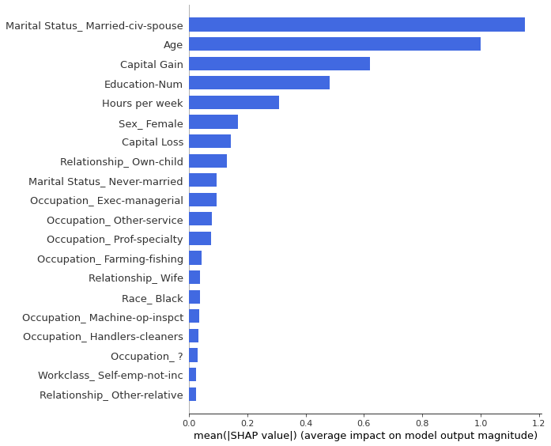


```python
shap_values_gen = shap_out(df_gen_out, best_params)
df_shap_gen, plot_gen = shap_frame(shap_values_gen, X)
shap.summary_plot(plot_gen, X, plot_type='bar', color='royalblue')
```


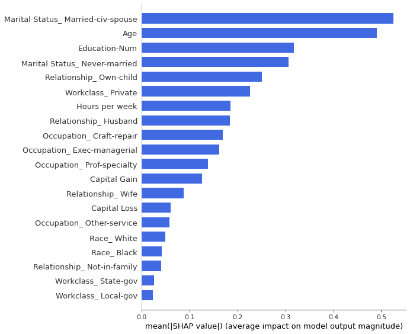


```python
shap_values_gen = shap_out(df_gen_out_2, best_params)
df_shap_gen, plot_gen = shap_frame(shap_values_gen, X)
shap.summary_plot(plot_gen, X, plot_type='bar', color='royalblue')
```


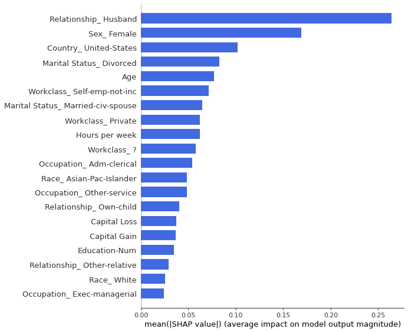


Original vs. Generated Robust


```python
# takes about 5 minutes to run. 
def shapley_rank(df_gen_out,df_org_out,best_params):
  arr_mean = []
  for r in range(10):
    shap_values_gen = shap_out(df_gen_out, best_params)
    df_shap_gen, plot_gen = shap_frame(shap_values_gen, X)
    shap_values_org = shap_out(df_org_out, best_params)
    df_shap_org, plot_org = shap_frame(shap_values_org, X)
    rank_df = pd.merge(df_shap_org, df_shap_gen, left_index=True, right_index=True, how="left")
    val = rank_df.head(10).corr(method="spearman").values[1,0]; print(val)
    arr_mean.append(val)
  return arr_mean
```


```python
#Original vs. Generated Robust
gen_out_arr = shapley_rank(df_gen_out,df_org_out,best_params)
np.array(gen_out_arr).mean()
#print: 57
```

    0.696969696969697
    0.4666666666666667
    0.4909090909090909
    0.6606060606060606
    0.503030303030303
    0.45454545454545453
    0.4666666666666667
    0.6363636363636364
    0.6484848484848484
    0.6727272727272727


    0.5696969696969697


```python
#Original vs. Generated 2 Robust
gen_out_arr_2 = shapley_rank(df_gen_out_2,df_org_out,best_params)
np.array(gen_out_arr_2).mean()
#print: 51
```

    0.45454545454545453
    0.22424242424242424
    0.47878787878787876
    0.6121212121212121
    0.7575757575757576
    0.696969696969697
    0.5515151515151515
    0.2606060606060606
    0.5757575757575758
    0.503030303030303


    0.5115151515151515


```python
#Original vs Original Robust
org_out_arr = shapley_rank(df_org_out,df_org_out,best_params)
np.array(org_out_arr).mean()
#print:91
```

    0.8666666666666667
    0.9393939393939394
    1.0
    0.9757575757575757
    0.7696969696969697
    0.9515151515151515
    0.9030303030303031
    0.9515151515151515
    0.8181818181818182
    0.9272727272727272


    0.9103030303030304


Bootstrapped Statistical Significance (t-stat and p-value)


```python
from scipy import stats

def bootstat(arr_mean, arr_mean_org):
  std = np.sqrt((np.array(arr_mean_org).var(ddof=1) + np.array(arr_mean).var(ddof=1))/2)
  N = len(arr_mean_org)
  un_var_t = (np.array(arr_mean_org).mean()-np.array(arr_mean).mean())/(std*np.sqrt(2/N))

  deg = 2*N - 2
  prob = stats.distributions.t.sf(np.abs(un_var_t), deg) * 2
  return un_var_t, prob
```


```python
bootstat(gen_out_arr,org_out_arr)
```


    (8.699973005786662, 7.274484094189893e-08)


```python
bootstat(gen_out_arr_2,org_out_arr)
```


    (6.8198837260442335, 2.197895398314553e-06)


```python
bootstat(gen_out_arr,gen_out_arr_2)
```


    (-0.9309523292869688, 0.3641970247994908)


##### **Mean Absolute Difference with Bootstrapped Trials**

This measure calculates the difference in local shapley value divergence between random draws from the synthetic and the generated dataset.


```python
# Identify interactions
import math
import shap

def shaped(df_final, full=False):

  for i in range(10):
    target = "Target"
    model = LGBMClassifier(colsample_bytree=0.2)
    test =  df_final.sample(int(len(df_final)*0.4),random_state=np.random.RandomState())
    train = df_final[~df_final.isin(test)].dropna()
    model = model.fit(train.drop([target],axis=1),train[target])
    #val = roc_auc_score(test[target],preds); 

    input_row = len(train) 
    sampled = min(1, (1/math.log(input_row, 3))*np.exp((2/math.log(input_row, 10000000)))/20)

    # sampled = sampled *2
    explainer = shap.TreeExplainer(model)
    # single = explainer.shap_values(train.drop([y],axis=1)[:int(input_row*sampled)].values)
    # inter = shap.TreeExplainer(model).shap_interaction_values(train.drop([y],axis=1)[:int(input_row*sampled*sampled)].values)
    # inter = shap.TreeExplainer(model).shap_interaction_values(train.drop([y],axis=1).sample(int(input_row*sampled),random_state=1))

    if full:
      single = explainer.shap_values(train.drop([y],axis=1))
    else:
      single = explainer.shap_values(train.drop([y],axis=1).sample(int(input_row*sampled),random_state=np.random.RandomState()))

    # Same as model
    is_true = False
    inter_portion = 0.5
    shap_fram = pd.DataFrame(single[0][:,:], columns=X)
    shap_fram = shap_fram.mean().sort_values().to_frame()
    shap_new = shap_fram[0].abs().sort_values(ascending=is_true)
    shap_new.columns = [i]
    main_ft = shap_new[shap_new.cumsum().sub((shap_new.sum()*inter_portion)).le(0)]
    if i==0:
      shap_full = shap_new
    else:
      shap_full = pd.merge(shap_full,shap_new,left_index=True, right_index=True, how="left")
  return shap_full
```

Takes about 15 minutes to run.


```python
shap_full = shaped(df_org_out,full=True)
org_score = [abs(shaped(df_org_out,full=False).T.mean().sort_values(ascending=False)-shap_full.T.mean().sort_values(ascending=False)).sum()/shap_full.T.mean().sum() for i in range(10)]
gen_score = [abs(shaped(df_gen_out,full=False).T.mean().sort_values(ascending=False)-shap_full.T.mean().sort_values(ascending=False)).sum()/shap_full.T.mean().sum() for i in range(10)]
gen_score_2 = [abs(shaped(df_gen_out_2,full=False).T.mean().sort_values(ascending=False)-shap_full.T.mean().sort_values(ascending=False)).sum()/shap_full.T.mean().sum() for i in range(10)]
```


```python
print("std: " +str(np.std(org_score)))
print(org_score)
print(gen_score)
print(gen_score_2)
```

    std: 0.047816475660523126
    [0.39547326489042284, 0.41733882513364634, 0.3845236786648996, 0.442755178495107, 0.30070698663172557, 0.39801455157692206, 0.31616994408642385, 0.3688722455050127, 0.4231893213767192, 0.31091077347369783]
    [0.48743359046477613, 0.5857555882787461, 0.5249769924024097, 0.5547607844710325, 0.6167648460524535, 0.563541107818233, 0.5762685989393008, 0.6081401430827861, 0.6180220180732053, 0.5640194736111122]
    [0.7679172782469333, 0.797596499350077, 0.7767721127307857, 0.772163222700925, 0.7767370526918683, 0.7640613959844879, 0.765488699177478, 0.7711019826787806, 0.7802099167063259, 0.7889217250667047]


```python
bootstat(gen_score,org_score)
```


    (-9.418345819275643, 2.2277350932602953e-08)


```python
bootstat(gen_score_2,org_score)
```


    (-24.578291899798195, 2.6715553666310997e-15)


```python
bootstat(gen_score_2, gen_score)
```


    (-15.27066753749065, 9.55299073960684e-12)


The generated score, is clearly far above the standard deviation of the original score. The score, like before can be turned into a p-value that would allow us to accept or reject the similarity in feature importance.

##### **Statistical Shapley Properties**

*Divergence Direction*

Any divergence away from 50% is skewed. The expectation is that for 50% of the local contributions, the generated model would give higher importance than the original model on the same underlying original data.


```python
target = "Target"
y = "Target"

def model_out(df_final):
  model = LGBMClassifier(colsample_bytree=0.2)
  test =  df_final.sample(int(len(df_final)*0.4),random_state=np.random.RandomState())
  train = df_final[~df_final.isin(test)].dropna()
  model_org = model.fit(train.drop([target],axis=1),train[target])
  return train, model

itters = 10
for ra in range(itters):
  train_org, model_org = model_out(df_org_out)
  train_gen, model_gen = model_out(df_gen_out)

  # Original Model, Original Data
  explainer_org = shap.TreeExplainer(model_org)
  single_org = explainer_org.shap_values(train_org.drop([y],axis=1))

  # Generated Model, New Data
  explainer_gen = shap.TreeExplainer(model_gen)
  single_gen = explainer_gen.shap_values(train_org.drop([y],axis=1))

  single_org_df = pd.DataFrame(single_org[0], columns=train_org[X].columns)
  single_gen_df = pd.DataFrame(single_gen[0], columns=train_org[X].columns)
  diverge_50_perc = pd.DataFrame(np.where(single_org_df>single_gen_df, 1, 0), columns=train_org[X].columns)

  diverge_50_perc.mean().head()

  if ra ==0:
    divergence_total = diverge_50_perc
    single_org_total = single_org_df
    single_gen_total = single_gen_df
  else:
    divergence_total += diverge_50_perc
    single_org_total += single_org_df
    single_gen_total += single_gen_df
  print("loop {}".format(ra))
```


    ---------------------------------------------------------------------------

    NameError                                 Traceback (most recent call last)

    <ipython-input-13-7731b41ce9c7> in <module>()
         15 
         16   # Original Model, Original Data
    ---> 17   explainer_org = shap.TreeExplainer(model_org)
         18   single_org = explainer_org.shap_values(train_org.drop([y],axis=1))
         19 


    NameError: name 'shap' is not defined


*Most Direction Divergent*


```python
(divergence_total.mean()/itters).sort_values(ascending=False).head(5)
```


    Capital Gain                0.350069
    Occupation_ Craft-repair    0.349803
    Race_ White                 0.346476
    Workclass_ ?                0.339356
    Occupation_ Tech-support    0.336357
    dtype: float64


```python
(divergence_total.mean()/itters).sort_values().head(5)
```


    Workclass_ Never-worked              0.000000
    Workclass_ Without-pay               0.000000
    Marital Status_ Married-AF-spouse    0.000077
    Occupation_ Farming-fishing          0.012238
    Occupation_ Handlers-cleaners        0.015637
    dtype: float64


*Effect Size Significance*


```python
std = np.sqrt((single_org_total.var(ddof=1) + single_gen_total.var(ddof=1))/2)
N = len(single_org_total)/itters ## p-value deflator
un_var_t = (single_org_total.mean()-single_gen_total.mean())/(std*np.sqrt(2/N)); un_var_t.head(5)
```


    Age                3.659415
    Education-Num     21.498684
    Capital Gain       0.400880
    Capital Loss      -6.718071
    Hours per week    -0.809055
    dtype: float64


Closest


```python
un_var_t[(un_var_t>-2)&(un_var_t<2)]
```


    Capital Gain                             0.400880
    Hours per week                          -0.809055
    Workclass_ Self-emp-inc                 -1.440123
    Marital Status_ Married-AF-spouse       -0.731073
    Marital Status_ Married-spouse-absent    1.670053
    Occupation_ Farming-fishing             -1.197582
    Occupation_ Protective-serv             -1.625542
    Occupation_ Sales                        0.991786
    Occupation_ Tech-support                 1.409111
    Occupation_Other                         1.245470
    Relationship_ Husband                    0.152252
    Relationship_ Unmarried                  0.046545
    Relationship_ Wife                      -1.157843
    Race_ Amer-Indian-Eskimo                 1.357922
    Race_ Other                              0.187878
    Country_ ?                              -0.935265
    Country_ United-States                  -1.919243
    dtype: float64


P-Value


```python
from scipy import stats
#Degrees of freedom
deg = 2*N - 2
# one-side p-value
# p = 1 - stats.t.cdf(un_var_t,df=deg)
# two-side p-value
prob = stats.distributions.t.sf(np.abs(un_var_t), deg) * 2  # use np.abs to get upper tail
df_prob =pd.DataFrame(prob, index=un_var_t.index.to_list()).round(5)
df_prob.head()
```


<div>
<style scoped>
    .dataframe tbody tr th:only-of-type {
        vertical-align: middle;
    }

    .dataframe tbody tr th {
        vertical-align: top;
    }

    .dataframe thead th {
        text-align: right;
    }
</style>
<table border="1" class="dataframe">
  <thead>
    <tr style="text-align: right;">
      <th></th>
      <th>0</th>
    </tr>
  </thead>
  <tbody>
    <tr>
      <th>Age</th>
      <td>0.00026</td>
    </tr>
    <tr>
      <th>Education-Num</th>
      <td>0.00000</td>
    </tr>
    <tr>
      <th>Capital Gain</th>
      <td>0.68853</td>
    </tr>
    <tr>
      <th>Capital Loss</th>
      <td>0.00000</td>
    </tr>
    <tr>
      <th>Hours per week</th>
      <td>0.41853</td>
    </tr>
  </tbody>
</table>
</div>


*Unitary Divergence Measure*

This can be used as a comparative measure accross multiple generated datasets.


```python
def logit2prob1(logit):
  odds = np.exp(logit)
  prob = odds / (2 + odds)
  return(prob)

val = logit2prob1(abs(single_org_total - single_gen_total).sum(axis=1)).sort_values().mean(); val
```


    0.9906210147698292


### AUC Analytics

##### **Draw Curves**


```python
target = y
df_org_out[target].value_counts()
```


```python
import collections
ConfusionMatrix = collections.namedtuple('conf', ['tp','fp','tn','fn']) 
def calc_ConfusionMatrix(actuals, scores, threshold=0.5, positive_label=1):
  tp=fp=tn=fn=0
  bool_actuals = [act==positive_label for act in actuals]
  for truth, score in zip(bool_actuals, scores):
      if score > threshold:                      # predicted positive 
          if truth:                              # actually positive 
              tp += 1
          else:                                  # actually negative              
              fp += 1          
      else:                                      # predicted negative 
          if not truth:                          # actually negative 
              tn += 1                          
          else:                                  # actually positive 
              fn += 1
  return ConfusionMatrix(tp, fp, tn, fn)


def FPR(conf_mtrx):
    return conf_mtrx.fp / (conf_mtrx.fp + conf_mtrx.tn) if (conf_mtrx.fp + conf_mtrx.tn)!=0 else 0
def TPR(conf_mtrx):
    return conf_mtrx.tp / (conf_mtrx.tp + conf_mtrx.fn) if (conf_mtrx.tp + conf_mtrx.fn)!=0 else 0

def apply(actuals, scores, **fxns):
    # generate thresholds over score domain 
    low = min(scores)
    high = max(scores)
    step = (abs(low) + abs(high)) / 100
    thresholds = np.arange(low-step, high+step, step)
    # calculate confusion matrices for all thresholds
    confusionMatrices = []
    for threshold in thresholds:
        confusionMatrices.append(calc_ConfusionMatrix(actuals, scores, threshold))
    # apply functions to confusion matrices 
    results = {fname:list(map(fxn, confusionMatrices)) for fname, fxn in fxns.items()}
    results["THR"] = thresholds
    return results

def ROC(actuals, scores):
    return apply(actuals, scores, FPR=FPR, TPR=TPR)
```


```python
from sklearn.metrics import roc_auc_score, roc_curve, auc

def model_out_auc(df_final, sklear=False):
  model = LGBMClassifier(colsample_bytree=0.2)
  test =  df_final.sample(int(len(df_final)*0.4),random_state=np.random.RandomState())
  train = df_final[~df_final.isin(test)].dropna()
  model = model.fit(train.drop([target],axis=1),train[target])
  probs = model.predict_proba(test.drop([target],axis=1))[:,1]
  if sklear:
    roccc = {}
    fpr, tpr, threshold = roc_curve(test[target], probs)
    roccc["FPR"] = fpr
    roccc["TPR"] = tpr
  else: 
    roccc = ROC(test[target], probs)
  roc_auc = auc(roccc["FPR"], roccc["TPR"])

  return train, model, roccc, roc_auc

train_org, model_org,roc_org, auc_org  = model_out_auc(df_org_out) 
train_gen, model_gen,roc_gen, auc_gen  = model_out_auc(df_gen_out)
train_gen_2, model_gen_2,roc_gen_2, auc_gen_2  = model_out_auc(df_gen_out)

#fpr_ x and tpr_ y 
```

*Specifically looking at the shape of the ROCAUC curve (metrics makes better sense at a later stage when used to compare distributions)*


```python
matrix_gen = np.array([np.array(roc_gen["FPR"]),np.array(roc_gen["TPR"])/auc_gen]).T
matrix_gen_2 = np.array([np.array(roc_gen_2["FPR"]),np.array(roc_gen_2["TPR"])/auc_gen_2]).T
matrix_org = np.array([np.array(roc_org["FPR"]),np.array(roc_org["TPR"])/auc_org]).T

# Test
print(area_between_two_curves(matrix_org, matrix_gen))
print(area_between_two_curves(matrix_org, matrix_gen_2))
```

    0.07465471342871643
    0.07009252822851131


```python
import matplotlib.pyplot as plt

def plot(matrix_org, matrix_gen, matrix_gen_2):
  plt.figure(0).clf()
  plt.plot(matrix_org[:,0],matrix_org[:,1],label="original, auc="+str(auc(matrix_org[:,0], matrix_org[:,1])))
  plt.plot(matrix_gen[:,0],matrix_gen[:,1],label="generated 1, auc="+str(auc(matrix_gen[:,0], matrix_gen[:,1])))
  plt.plot(matrix_gen_2[:,0],matrix_gen_2[:,1],label="generated 2, auc="+str(auc(matrix_gen_2[:,0], matrix_gen_2[:,1])))

  plt.legend(loc=0)

plot(matrix_org, matrix_gen, matrix_gen_2)
```


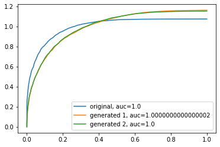


##### **Curve Metrics**


```python
from scipy.stats import ks_2samp
# Curves
def curve_metrics(matrix_org,matrix_gen):
  c_dict = {}
  c_dict["Curve Length Difference"] = round(curve_length_measure(matrix_org, matrix_gen),5)
  c_dict["Mean Absolute Difference"] = np.mean(abs(matrix_org[:, 1]-matrix_gen[:, 1])).round(5)
  c_dict["Partial Curve Mapping"] = round(pcm(matrix_gen, matrix_org),5)
  c_dict["Discrete Frechet Distance"] = round(frechet_dist(matrix_gen, matrix_org),5)
  c_dict["Dynamic Time Warping"] = round(dtw(matrix_gen, matrix_org)[0],5)
  c_dict["Area Between Curves"] = round(area_between_two_curves(matrix_org, matrix_gen),5)

  return c_dict

```

Generally speaking generated dataset two has a more similar shape than generated dataset one, but the difference is negligible. 


```python
c_m = curve_metrics(matrix_org,matrix_gen); c_m
```


    {'Area Between Curves': 0.07465,
     'Curve Length Difference': 2.76665,
     'Discrete Frechet Distance': 0.11529,
     'Dynamic Time Warping': 4.19539,
     'KS Statistic X x Y': 0.46078,
     'Mean Absolute Difference': 0.03605,
     'Partial Curve Mapping': 2.08875}


```python
c_m = curve_metrics(matrix_org,matrix_gen_2); c_m
```


    {'Area Between Curves': 0.07009,
     'Curve Length Difference': 2.61713,
     'Discrete Frechet Distance': 0.10678,
     'Dynamic Time Warping': 3.96493,
     'KS Statistic X x Y': 0.44118,
     'Mean Absolute Difference': 0.04449,
     'Partial Curve Mapping': 1.98528}


##### **Information Theory Divergence**


```python
# Information Theory (Divergences; Distribution Comparison)
def vector_distribution(a,b):
  dict_add = {}               
  dict_add["jensen_shannon_divergence"] = jensen_shannon_divergence(a,b)
  dict_add["ks_statistic"] = ks_statistic_vec(a,b) #here
  dict_add["kl_divergence"] = kl_divergence(a,b)
  #dict_add["earth_movers_distance"] = earth_movers_distance(a,b)

  return dict_add
```


```python
vector_distribution(matrix_org[:, 1],matrix_gen[:, 1])
```


    {'jensen_shannon_divergence': 0.9986128174436615,
     'kl_divergence': 0.006289725886977577,
     'ks_statistic': 0.1378819185991822}


```python
vector_distribution(matrix_org[:, 1],matrix_gen_2[:, 1])
```


    {'jensen_shannon_divergence': 0.9980859484818783,
     'kl_divergence': 0.008933607785973572,
     'ks_statistic': 0.1365996845478994}


##### **Vector Hypotheses**


```python
from scipy.stats import pearsonr, ranksums, mood, fligner, ansari, bartlett, levene, mannwhitneyu
def vector_hypotheses(a,b ):

  dict_stat = {}
  dict_pval = {}
  pea = pearsonr(a, b)
  dict_stat["pearsonr"], dict_pval["pearsonr"] = pea[0], pea[1]
  ran = ranksums(a, b)
  dict_stat["ranksums"], dict_pval["ranksums"] = ran[0], ran[1]
  moo = mood(a, b) 
  dict_stat["mood"], dict_pval["mood"] = moo[0], moo[1]
  fli = fligner(a, b)
  dict_stat["fligner"], dict_pval["fligner"] = fli[0], fli[1]
  ans = ansari(a, b)
  dict_stat["ansari"], dict_pval["ansari"] = ans[0], ans[1]
  bar = bartlett(a, b)
  dict_stat["bartlett"], dict_pval["bartlett"] = bar[0], bar[1]
  lev = levene(a, b)
  dict_stat["levene"], dict_pval["levene"] = lev[0], lev[1]
  man = mannwhitneyu(a, b)
  dict_stat["mannwhitneyu"], dict_pval["mannwhitneyu"] = man[0], man[1]
  return dict_stat, dict_pval

```


```python
dict_sta, dict_pval  = vector_hypotheses(matrix_org[:, 1],matrix_gen[:, 1])
print("Statistic")
print(dict_sta)
print("P-Value")
print(dict_pval)
```

    Statistic
    {'pearsonr': 0.998316428953093, 'ranksums': -0.1340176408171218, 'mood': -1.9900839628165832, 'fligner': 1.9194861523716578, 'ansari': 5572.5, 'bartlett': 1.2567818167900815, 'levene': 1.8896377410013447, 'mannwhitneyu': 5145.5}
    P-Value
    {'pearsonr': 1.7634255055600954e-125, 'ranksums': 0.8933886249187494, 'mood': 0.046581687113539064, 'fligner': 0.16591331765385497, 'ansari': 0.12957878459927974, 'bartlett': 0.26226112894254106, 'levene': 0.17076577766706008, 'mannwhitneyu': 0.44716320822189437}


```python
dict_sta, dict_pval  = vector_hypotheses(matrix_org[:, 1],matrix_gen_2[:, 1])
print("Statistic")
print(dict_sta)
print("P-Value")
print(dict_pval)
```

    Statistic
    {'pearsonr': 0.9975479373429316, 'ranksums': 0.11029770438931265, 'mood': -2.1130294245693486, 'fligner': 2.200235681128727, 'ansari': 5596.5, 'bartlett': 1.4319510195987892, 'levene': 2.30967208367581, 'mannwhitneyu': 5155.5}
    P-Value
    {'pearsonr': 2.5312690095121746e-117, 'ranksums': 0.912173277789444, 'mood': 0.03459824948284489, 'fligner': 0.13798963854371069, 'ansari': 0.10318071731741983, 'bartlett': 0.231446294818191, 'levene': 0.13013483553370128, 'mannwhitneyu': 0.45655689864543286}


### Model Coverage

Coverage is a simple idea; take the difference in performance of a model trained on generated data and tested on original data and a model trained on the generated data and tested on the original data. Coverage is a measure of the amount of scenarious incorporated in the data. If the difference is positive then the coverage of the data is high; i.e. overcovered, if it is negative it is undercovered. Overcoverage is not a bad sign if the data trained on generated data would eventually be used for the prediction of original data. Overcoverage is bad when we are interested in the underlying attributes and characteristics of the original data as proxied by the generated data. 


```python
def model_full(df_train, df_test):
  model = LGBMClassifier(colsample_bytree=0.2)
  model = model.fit(df_train.drop([target],axis=1),df_train[target])
  probs = model.predict_proba(df_test.drop([target],axis=1))[:,1]
  roccc = ROC(df_test[target], probs)
  roc_auc = auc(roccc["FPR"], roccc["TPR"])

  return model, roccc, probs, roc_auc
```


```python
def coverage_f(df_gen_out, df_org_out):
  _,_,_, gen_train_auc_cov = model_full(df_gen_out, df_org_out)
  _,_,_, org_train_auc_cov = model_full(df_org_out, df_gen_out)
  diff_auc_cov = gen_train_auc_cov - org_train_auc_cov; diff_auc_cov

  _,_,probs_gen, gen_train_auc_pred = model_full(df_gen_out, df_gen_out)
  _,_,probs_org, org_train_auc_pred = model_full(df_org_out, df_org_out)
  diff_auc_pred = gen_train_auc_pred - org_train_auc_pred; diff_auc_pred

  return diff_auc_cov, diff_auc_pred, diff_auc_cov + diff_auc_pred
```


```python
coverage, predictability, net_coverage = coverage_f(df_gen_out, df_org_out)
"coverage: {}, predictability: {}, net coverage: {}".format(coverage, predictability, net_coverage)
```


    'coverage: 0.06260587604174017, predictability: -0.05572069598622542, net coverage: 0.00688518005551475'


```python
coverage_2, predictability_2, net_coverage_2 = coverage_f(df_gen_out_2, df_org_out)
"coverage: {}, predictability: {}, net coverage: {}".format(coverage_2, predictability_2, net_coverage_2)
```


    'coverage: 0.21871178433554517, predictability: -0.2036546911153957, net coverage: 0.015057093220149476'


### Model Ordering Rank Correlation


```python
import numpy as np
import matplotlib.pyplot as plt
from matplotlib.colors import ListedColormap
from sklearn.model_selection import train_test_split
from sklearn.preprocessing import StandardScaler
from sklearn.datasets import make_moons, make_circles, make_classification
from sklearn.neural_network import MLPClassifier
from sklearn.neighbors import KNeighborsClassifier
from sklearn.svm import SVC
from sklearn.gaussian_process import GaussianProcessClassifier
from sklearn.gaussian_process.kernels import RBF
from sklearn.tree import DecisionTreeClassifier
from sklearn.ensemble import RandomForestClassifier, AdaBoostClassifier
from sklearn.naive_bayes import GaussianNB
from sklearn.discriminant_analysis import QuadraticDiscriminantAnalysis

h = .02  # step size in the mesh

names = ["Nearest Neighbors", "Linear SVM", "RBF SVM", "Gaussian Process",
         "Decision Tree", "Random Forest", "Neural Net", "AdaBoost",
         "Naive Bayes", "QDA"]

classifiers = [
    KNeighborsClassifier(3),
    SVC(kernel="linear", C=0.025, probability=True),
    SVC(gamma=2, C=1, probability=True),
    GaussianProcessClassifier(1.0 * RBF(1.0)),
    DecisionTreeClassifier(max_depth=5),
    RandomForestClassifier(max_depth=5, n_estimators=10, max_features=1),
    MLPClassifier(alpha=1, max_iter=1000),
    AdaBoostClassifier(),
    GaussianNB(),
    QuadraticDiscriminantAnalysis()]
```


```python
from sklearn.metrics import roc_auc_score

def models(names, classifiers, df, frac = 0.02):
  dict_model = {}
  for name, clf in zip(names, classifiers):
    test =  df.sample(int(len(df)*0.4),random_state=1)
    train = df[~df.isin(test)].dropna()
    clf.fit(train[X].sample(frac=frac,random_state=1), train[y].sample(frac=frac,random_state=1))
    dict_model[name] = {}
    #dict_model[name]["score"] = clf.score(df[X].sample(frac=frac,random_state=1), test[y].sample(frac=frac,random_state=1))
    preds = clf.predict_proba(test[X].sample(frac=frac,random_state=1))[:, 1]
    dict_model[name]["auc"] = roc_auc_score(test[y].sample(frac=frac,random_state=1), preds)
    print(name)
    
  return pd.DataFrame.from_dict(dict_model)

```

*Takes about 10 minutes.*


```python
df_class_org = models(names, classifiers, df_org_out )
df_class_gen = models(names, classifiers, df_gen_out )
df_class_gen_2 = models(names, classifiers, df_gen_out_2 )
```

    Nearest Neighbors
    Linear SVM
    RBF SVM
    Gaussian Process
    Decision Tree
    Random Forest
    Neural Net
    AdaBoost
    Naive Bayes
    QDA
    Nearest Neighbors
    Linear SVM
    RBF SVM
    Gaussian Process
    Decision Tree
    Random Forest
    Neural Net
    AdaBoost
    Naive Bayes
    QDA
    Nearest Neighbors
    Linear SVM
    RBF SVM
    Gaussian Process
    Decision Tree
    Random Forest
    Neural Net
    AdaBoost
    Naive Bayes
    QDA


```python
def rank_models(df_class_gen,df_class_org ):
  mergy_rank = pd.merge(df_class_gen.T.sort_values(by="auc",ascending=False),df_class_org.T, left_index=True, right_index=True, how="left")
  print(mergy_rank.head())
  print("====================================")
  print(mergy_rank.corr(method="spearman").iloc[0,1])
  return mergy_rank
```


```python
rank_gen = rank_models(df_class_gen,df_class_org )
```

                         auc_x     auc_y
    Linear SVM        0.830460  0.917889
    Naive Bayes       0.789094  0.907380
    Random Forest     0.782979  0.805841
    AdaBoost          0.777165  0.887260
    Gaussian Process  0.759757  0.789915
    ====================================
    0.7575757575757576


```python
rank_gen_2 = rank_models(df_class_gen_2,df_class_org )
```

                      auc_x     auc_y
    Decision Tree  0.631611  0.827835
    Neural Net     0.602163  0.836836
    Random Forest  0.548863  0.805841
    AdaBoost       0.537167  0.887260
    RBF SVM        0.517751  0.726132
    ====================================
    -0.05454545454545454


### Prediction (Vector) Analytics

##### **Cummulative Sum**


```python
_,_,probs_gen, _ = model_full(df_gen_out, df_org_out)
_,_,probs_gen_2, _ = model_full(df_gen_out_2, df_org_out)
_,_,probs_org, _ = model_full(df_org_out, df_org_out)
```


```python
def prob_matrix(probs_gen,probs_org):
  fr = pd.DataFrame(list(zip(probs_org,probs_gen)), columns=["Org","Gen"])
  fr["Org"] = fr["Org"].sort_values().values
  fr["Gen"] = fr["Gen"].sort_values().values

  matrix_org = np.array([fr.index,fr["Org"].values]).T
  matrix_gen = np.array([fr.index,fr["Gen"].values]).T

  matrix_gen[:,1] = np.interp(matrix_gen[:,1], (np.min(matrix_gen[:,1]), np.max(matrix_gen[:,1])), (np.min(matrix_org[:,1]), np.max(matrix_org[:,1])))

  choice = np.random.choice(len(matrix_gen), int(len(matrix_gen)*.05), replace=False)
  choice.sort()
  matrix_gen_sample = matrix_gen[choice,:]
  matrix_org_sample = matrix_org[choice,:]

  return matrix_org, matrix_org_sample, matrix_gen, matrix_gen_sample
```


```python
matrix_org, matrix_org_s, matrix_gen, matrix_gen_s = prob_matrix(probs_gen,probs_org)
_, _, matrix_gen_2, matrix_gen_s_2 = prob_matrix(probs_gen_2,probs_org)
```


```python
from scipy.stats import ks_2samp
# Curves
def curve_metrics(matrix_org,matrix_gen):
  c_dict = {}
  c_dict["Curve Length Difference"] = round(curve_length_measure(matrix_org, matrix_gen),5)
  c_dict["Mean Absolute Difference"] = np.mean(abs(matrix_org[:, 1]-matrix_gen[:, 1])).round(5)
  c_dict["Partial Curve Mapping"] = round(pcm(matrix_gen, matrix_org),5)
  c_dict["Discrete Frechet Distance"] = round(frechet_dist(matrix_gen, matrix_org),5)
  c_dict["Dynamic Time Warping"] = round(dtw(matrix_gen, matrix_org)[0],5)
  c_dict["Area Between Curves"] = round(area_between_two_curves(matrix_org, matrix_gen),5)
  #c_dict["KS Statistic X x Y"] = round(ks_2samp(matrix_org[:,1]*matrix_org[:,0], matrix_gen[:,1]*matrix_gen[:,1])[0],5)

  return c_dict

curve_metrics(matrix_org_s,matrix_gen_s)
```


    {'Area Between Curves': 0.0019,
     'Curve Length Difference': 5.09634,
     'Discrete Frechet Distance': 0.03834,
     'Dynamic Time Warping': 0.17651,
     'Mean Absolute Difference': 0.00272,
     'Partial Curve Mapping': 1.19651}


```python
curve_metrics(matrix_org_s,matrix_gen_s_2)
```


    {'Area Between Curves': 3835.60803,
     'Curve Length Difference': 11.80026,
     'Discrete Frechet Distance': 84.00007,
     'Dynamic Time Warping': 24873.81731,
     'KS Statistic X x Y': 0.98649,
     'Mean Absolute Difference': 0.11807,
     'Partial Curve Mapping': 66.16428}


```python
import matplotlib.pyplot as plt
plt.figure(0).clf()
plt.plot(matrix_org[:,0],matrix_org[:,1],label="data 1")
plt.plot(matrix_gen[:,0],matrix_gen[:,1],label="data 2")
plt.plot(matrix_gen_2[:,0],matrix_gen_2[:,1],label="data 3")

plt.legend(loc=0)
```


    <matplotlib.legend.Legend at 0x7feb752fc7f0>


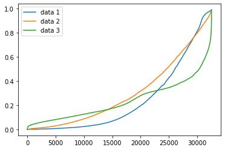


```python
vect_gen_dist_2.mean()/vect_gen_dist.mean()
```


    braycurtis        2.069921
    canberra          1.297541
    correlation       2.970100
    cosine            2.709373
    dice              1.498269
    euclidean         1.552736
    kulsinski         1.075813
    manhattan         1.586583
    rogerstanimoto    1.113568
    russellrao        1.096628
    sokalmichener     1.113568
    sokalsneath       1.158963
    sqeuclidean       2.409199
    yule              2.276070
    dtype: float64


```python
vect_gen_dist.mean()/vect_org_dist.mean()
```


    braycurtis         4.595591
    canberra           4.176313
    correlation       15.575828
    cosine            15.906179
    dice               1.135240
    euclidean          4.271593
    kulsinski          1.004658
    manhattan          5.142017
    rogerstanimoto     1.214569
    russellrao         0.998536
    sokalmichener      1.214569
    sokalsneath        1.055885
    sqeuclidean       17.913864
    yule               1.536492
    dtype: float64


*For all distance metrics considered, generated data 2 is worse.*


```python
vect_gen_dist = distance_vector(probs_org, probs_gen)
vect_gen_dist.mean()
```


    braycurtis          0.203801
    canberra          125.182026
    correlation         0.138967
    cosine              0.082829
    dice                0.476867
    euclidean           2.946031
    kulsinski           0.886949
    manhattan          35.903909
    rogerstanimoto      0.410823
    russellrao          0.857689
    sokalmichener       0.410823
    sokalsneath         0.784415
    sqeuclidean         8.711359
    yule                0.312046
    dtype: float64


```python
vect_gen_dist_2 = distance_vector(probs_org, probs_gen_2)
vect_gen_dist_2.mean()
```


    braycurtis          0.421852
    canberra          162.428845
    correlation         0.412746
    cosine              0.224414
    dice                0.714475
    euclidean           4.574408
    kulsinski           0.954191
    manhattan          56.964541
    rogerstanimoto      0.457479
    russellrao          0.940566
    sokalmichener       0.457479
    sokalsneath         0.909108
    sqeuclidean        20.987394
    yule                0.710238
    dtype: float64


Multiples Divergence

##### **Vector Extraction PCA**


```python
from deltapy import extract 
```


<p style="color: red;">
The default version of TensorFlow in Colab will switch to TensorFlow 2.x on the 27th of March, 2020.<br>
We recommend you <a href="https://www.tensorflow.org/guide/migrate" target="_blank">upgrade</a> now
or ensure your notebook will continue to use TensorFlow 1.x via the <code>%tensorflow_version 1.x</code> magic:
<a href="https://colab.research.google.com/notebooks/tensorflow_version.ipynb" target="_blank">more info</a>.</p>


```python
# _,_,probs_gen, _ = model_full(df_gen_out, df_org_out)
# _,_,probs_org, _ = model_full(df_org_out, df_org_out)
```


```python
choice = np.random.choice(len(probs_org), int(len(probs_org)*.01), replace=False)
choice.sort()
arr_prob_org = np.sort(probs_org)[choice]
arr_prob_gen = np.sort(probs_gen)[choice]
arr_prob_gen_2 = np.sort(probs_gen_2)[choice]
```


```python
def vect_extract(arr_in):
  dict_vect = {}
  dict_vect["abs_energy"] = extract.abs_energy(arr_in)
  dict_vect["mean_abs_change"] = extract.mean_abs_change(arr_in)
  dict_vect["mean_second_derivative_central"] = extract.mean_second_derivative_central(arr_in)
  dict_vect["partial_autocorrelation"] = extract.partial_autocorrelation(arr_in)[0][1]
  dict_vect["augmented_dickey_fuller"] = extract.augmented_dickey_fuller(arr_in)[0][1]
  dict_vect["gskew"] = extract.gskew(arr_in)
  dict_vect["stetson_mean"] = extract.stetson_mean(arr_in)
  dict_vect["count_above_mean"] = extract.count_above_mean(arr_in)
  dict_vect["longest_strike_below_mean"] = extract.longest_strike_below_mean(arr_in)
  dict_vect["wozniak"] = extract.wozniak(arr_in)[0][1]
  dict_vect["fft_coefficient"] = extract.fft_coefficient(arr_in)[0][1]
  dict_vect["ar_coefficient"] = extract.ar_coefficient(arr_in)[0][1]
  dict_vect["index_mass_quantile"] = extract.index_mass_quantile(arr_in)[0][1]
  dict_vect["number_cwt_peaks"] = extract.number_cwt_peaks(arr_in)[0][1]
  dict_vect["spkt_welch_density"] = extract.spkt_welch_density(arr_in)
  dict_vect["c3"] = extract.c3(arr_in)
  dict_vect["binned_entropy"] = extract.binned_entropy(arr_in)
  dict_vect["svd_entropy"] = extract.svd_entropy(arr_in)[0][1]
  dict_vect["hjorth_complexity"] = extract.hjorth_complexity(arr_in)
  dict_vect["max_langevin_fixed_point"] =extract.max_langevin_fixed_point(arr_in)
  dict_vect["percent_amplitude"] = extract.percent_amplitude(arr_in)[0][1]
  dict_vect["cad_prob"] = extract.cad_prob(arr_in)[1][1]
  dict_vect["zero_crossing_derivative"] = extract.zero_crossing_derivative(arr_in)[0][1]
  dict_vect["detrended_fluctuation_analysis"] = extract.detrended_fluctuation_analysis(arr_in)
  dict_vect["fisher_information"] = extract.fisher_information(arr_in)[0][1]
  dict_vect["higuchi_fractal_dimension"] = extract.higuchi_fractal_dimension(arr_in)[0][1]
  dict_vect["hurst_exponent"] = extract.hurst_exponent(arr_in)
  dict_vect["largest_lyauponov_exponent"] = extract.largest_lyauponov_exponent(arr_in)[0][1]
  dict_vect["whelch_method"] = extract.whelch_method(arr_in)[0][1]
  dict_vect["find_freq"] = extract.find_freq(arr_in)[0][1]
  dict_vect["flux_perc"] = extract.flux_perc(arr_in)['FluxPercentileRatioMid20']
  dict_vect["range_cum_s"] = extract.range_cum_s(arr_in)['Rcs']
  dict_vect["kurtosis"] = extract.kurtosis(arr_in)
  dict_vect["stetson_k"] = extract.stetson_k(arr_in)
  return dict_vect
```


```python
from sklearn.preprocessing import MinMaxScaler
from sklearn.decomposition import PCA
from scipy import stats

def mean_absolute_percentage_error(y_true: np.ndarray, y_pred: np.ndarray):
    """
    Returns the mean absolute percentage error between y_true and y_pred. Throws ValueError if y_true contains zero values.
    :param y_true: NumPy.ndarray with the ground truth values.
    :param y_pred: NumPy.ndarray with the ground predicted values.
    :return: Mean absolute percentage error (float).
    """
    y_true, y_pred = np.array(y_true), np.array(y_pred)
    return np.mean(np.abs((y_true - y_pred) / y_true))


def bootstrapped_frame(probs_org,probs_gen):
  
  scaler = MinMaxScaler()
  vect_gen = {}
  vect_org = {}
  for iteration in range(100):
    choice = np.random.choice(len(probs_org), int(len(probs_org)*.01), replace=False)
    choice.sort()
    arr_prob_org = np.sort(probs_org)[choice]
    arr_prob_gen = np.sort(probs_gen)[choice]
    vect_gen["Iteration_{}".format(iteration)] = vect_extract(arr_prob_gen)
    vect_org["Iteration_{}".format(iteration)] = vect_extract(arr_prob_org)

  vect_gen_df = pd.DataFrame.from_dict(vect_gen).T
  vect_org_df = pd.DataFrame.from_dict(vect_org).T

  vect_org_df_sc = pd.DataFrame(scaler.fit_transform(vect_org_df), columns=vect_org_df.columns)
  vect_gen_df_sc = pd.DataFrame(scaler.fit_transform(vect_gen_df), columns=vect_gen_df.columns)

  return vect_org_df, vect_org_df_sc, vect_gen_df, vect_gen_df_sc

def pca_variance(vect_org_df_sc, vect_gen_df_sc):
    pca_r = PCA(n_components=10)
    pca_f = PCA(n_components=10)

    real_t = pca_r.fit_transform(vect_org_df_sc)
    fake_t = pca_f.fit_transform(vect_gen_df_sc)

    pca_error = mean_absolute_percentage_error(pca_r.explained_variance_, pca_f.explained_variance_); pca_error
    pca_corr, p_value = stats.pearsonr(pca_r.explained_variance_, pca_f.explained_variance_); pca_corr

    return pca_error, pca_corr, p_value
```


```python
vect_org_df, vect_org_df_sc, vect_gen_df, vect_gen_df_sc = bootstrapped_frame(probs_org,probs_gen)
pca_error, pca_corr, p_value = pca_variance(vect_org_df_sc, vect_gen_df_sc)
"PCA Error: {}, PCA Correlation: {}, p-value: {}".format(pca_error, pca_corr, p_value)
```


    'PCA Error: 0.20546220195870615, PCA Correlation: 0.9987000879585963, p-value: 1.2472580318565797e-11'


```python
_, _, vect_gen_df_2, vect_gen_df_sc_2 = bootstrapped_frame(probs_org,probs_gen_2)
pca_error, pca_corr, p_value = pca_variance(vect_org_df_sc, vect_gen_df_sc_2)
"PCA Error: {}, PCA Correlation: {}, p-value: {}".format(pca_error, pca_corr, p_value)
```


    'PCA Error: 0.34273806320287803, PCA Correlation: 0.9584258858891025, p-value: 1.2429021809917593e-05'


Top 5 Most Divergent Charateristics


```python
series = abs(vect_org_df.median() - vect_gen_df.median())/(vect_org_df.std()+vect_gen_df.std())
series.sort_values(ascending=False).head()
```


    index_mass_quantile    3.867745
    stetson_mean           3.725235
    gskew                  3.690576
    percent_amplitude      3.428572
    binned_entropy         3.302312
    dtype: float64


```python
series_2 = abs(vect_org_df.median() - vect_gen_df_2.median())/(vect_org_df.std()+vect_gen_df_2.std())
series_2.sort_values(ascending=False).head()
```


    index_mass_quantile    12.345883
    mean_abs_change        11.081903
    gskew                  10.069360
    percent_amplitude       8.692994
    cad_prob                6.701544
    dtype: float64


```python
vect_org_df.median()["index_mass_quantile"]
```


    0.7630769230769231


```python
vect_gen_df.median()["index_mass_quantile"]
```


    0.6738461538461539


```python
vect_gen_df_2.median()["index_mass_quantile"]
```


    0.5353846153846153


##### **Distance Metrics**


```python
import numpy as np

# These are all distance measures, including correlation distance (e.g, the higher the larger
# ...the distance)

def braycurtis(a, b):
    return np.sum(np.fabs(a - b)) / np.sum(np.fabs(a + b))

def canberra(a, b):
    return np.sum(np.fabs(a - b) / (np.fabs(a) + np.fabs(b)))

def chebyshev(a, b):
    return np.amax(a - b)

def correlation(a, b):
    a = a - np.mean(a)
    b = b - np.mean(b)
    return 1.0 - np.mean(a * b) / np.sqrt(np.mean(np.square(a)) * np.mean(np.square(b)))

def cosine(a, b):
    return 1 - np.dot(a, b) / (np.sqrt(np.dot(a, a)) * np.sqrt(np.dot(b, b)))

def dice(a, b):
    nft = ((1 - a) * b).sum()
    ntf = (a * (1 - b)).sum()
    ntt = (a * b).sum()
    return float((ntf + nft) / np.array(2.0 * ntt + ntf + nft))

def euclidean(a, b):
    return np.sqrt(np.sum(np.dot((a - b), (a - b))))

def hamming(a, b, w = None):
    if w is None:
        w = np.ones(a.shape[0])
    return np.average(a != b, weights = w)

def jaccard(a, b):
    return np.double(np.bitwise_and((a != b), np.bitwise_or(a != 0, b != 0)).sum()) / np.double(np.bitwise_or(a != 0, b != 0).sum())

def kulsinski(a, b):
    nft = ((1 - a) * b).sum()
    ntf = (a * (1 - b)).sum()
    ntt = (a * b).sum()
    return (ntf + nft - ntt + len(a)) / (ntf + nft + len(a))

def manhattan(a, b):
    return np.sum(np.fabs(a - b))


def rogerstanimoto(a, b):
    nff = ((1 - a) * (1 - b)).sum()
    nft = ((1 - a) * b).sum()
    ntf = (a * (1 - b)).sum()
    ntt = (a * b).sum()
    return float(2.0 * (ntf + nft)) / float(ntt + nff + (2.0 * (ntf + nft)))

def russellrao(a, b):
    return float(len(a) - (a * b).sum()) / len(a)

def sokalmichener(a, b):
    nff = ((1 - a) * (1 - b)).sum()
    nft = ((1 - a) * b).sum()
    ntf = (a * (1 - b)).sum()
    ntt = (a * b).sum()
    return float(2.0 * (ntf + nft)) / float(ntt + nff + 2.0 * (ntf + nft))

def sokalsneath(a, b):
    nft = ((1 - a) * b).sum()
    ntf = (a * (1 - b)).sum()
    ntt = (a * b).sum()
    return float(2.0 * (ntf + nft)) / np.array(ntt + 2.0 * (ntf + nft))

def sqeuclidean(a, b):
    return np.sum(np.dot((a - b), (a - b)))

def yule(a, b):
    nff = ((1 - a) * (1 - b)).sum()
    nft = ((1 - a) * b).sum()
    ntf = (a * (1 - b)).sum()
    ntt = (a * b).sum()
    return float(2.0 * ntf * nft / np.array(ntt * nff + ntf * nft))

# Distance and Similarity measures.
# (All similarity measures, turned into distance measures)
def vector_distance(a,b):
  dict_dist = {}
  dict_dist["braycurtis"] = braycurtis(a, b)
  dict_dist["canberra"] = canberra(a, b)
  dict_dist["correlation"] = correlation(a, b)
  dict_dist["cosine"] = cosine(a, b)
  dict_dist["dice"] = dice(a, b)
  dict_dist["euclidean"] = euclidean(a, b)
  # dict_dist["hamming"] = hamming(a, b) #discrete
  # dict_dist["jaccard"] = jaccard(a, b) #discrete
  dict_dist["kulsinski"] = kulsinski(a, b)
  dict_dist["manhattan"] = manhattan(a, b)
  dict_dist["rogerstanimoto"] = rogerstanimoto(a, b)
  dict_dist["russellrao"] = russellrao(a, b)
  dict_dist["sokalmichener"] = sokalmichener(a, b)
  dict_dist["sokalsneath"] = sokalsneath(a, b)
  dict_dist["sqeuclidean"] = sqeuclidean(a, b)
  dict_dist["yule"] = yule(a, b)
  return dict_dist
```


```python
_,_,probs_org_1, _ = model_full(df_org_out.sample(frac=0.5), df_org_out)
_,_,probs_org_2, _ = model_full(df_org_out.sample(frac=0.5), df_org_out)
```


```python
def distance_vector(probs_org_1, probs_org_2):
  vect_org_dist = {}
  for iteration in range(100):
    choice = np.random.choice(len(probs_org_1), int(len(probs_org_1)*.01), replace=False)
    choice.sort()
    arr_prob_org_1 = probs_org_1[choice]
    arr_prob_org_2 = probs_org_2[choice]
    vect_org_dist["Iteration_{}".format(iteration)] = vector_distance(arr_prob_org_1,arr_prob_org_2 )

  return pd.DataFrame.from_dict(vect_org_dist).T
```


```python
vect_org_dist = distance_vector(probs_org_1, probs_org_2)
vect_org_dist.mean()
```


    braycurtis         0.044347
    canberra          29.974291
    correlation        0.008922
    cosine             0.005207
    dice               0.420058
    euclidean          0.689680
    kulsinski          0.882837
    manhattan          6.982457
    rogerstanimoto     0.338246
    russellrao         0.858947
    sokalmichener      0.338246
    sokalsneath        0.742898
    sqeuclidean        0.486291
    yule               0.203090
    dtype: float64


## Similarity Measures (Data Derived)

### Input (Vector) Similarity

#### **Distribution (KDE)**

##### ***Example KDE***


```python
from statsmodels.sandbox.nonparametric import kernels
from statsmodels.nonparametric import bandwidths

kernel_switch = dict(gau=kernels.Gaussian, epa=kernels.Epanechnikov,
                    uni=kernels.Uniform, tri=kernels.Triangular,
                    biw=kernels.Biweight, triw=kernels.Triweight,
                    cos=kernels.Cosine, cos2=kernels.Cosine2)
bw = bandwidths.select_bandwidth(df_org_out["Age"], "normal_reference", kernel_switch["gau"]())
```

See if you can actually retrieve the functio that would be interesitng.

What is KDE multivariate? KDEMultivariate, due to its FFT-based implementation. It should be preferred for univariate, continuous data. KDEMultivariate also supports mixed data.

That is interesting, maybe everything has a function, if it doesnt you can fit one. https://github.com/Kestrel67/Python-Libraries/blob/master/MathsFuncs/ArcLength.py


```python
import matplotlib.pyplot as plt
import statsmodels.api as sm

def kde_func(series, bw, additional=[]):
  kde = sm.nonparametric.KDEUnivariate(series)
  kde.fit(bw=bw) # Estimate the densities

  kde.support
  kde.density
  fig = plt.figure(figsize=(12, 5))
  ax = fig.add_subplot(111)

  # Plot the histrogram
  ax.hist(series, bins=20, density=True, label='Histogram from samples',
          zorder=5, edgecolor='k', alpha=0.5)

  # Plot the KDE as fitted using the default arguments
  ax.plot(kde.support, kde.density, lw=3, label='KDE from samples', zorder=10)

  if len(additional)>0:
    for r in additional:
      ax.plot(kde.support, r, lw=3, label='KDE other: {}'.format(r), zorder=10)

  return ax, kde.support, kde.density, kde 

def rescale_interpolate(df_org, df_gen, feat):
  max_target = df_org[feat].astype(int).max()
  min_target = df_org[feat].astype(int).min()
  change = df_gen[feat]
  #change = df_org["Age"].sample(int(len(df_org)*0.5))
  scaled_array = np.interp(change, (change.min(), change.max()), (min_target, max_target))
  return scaled_array

feature = "Age"

pl, support_org, density_org, kde_org = kde_func(df_org_out["Age"], bw)
```


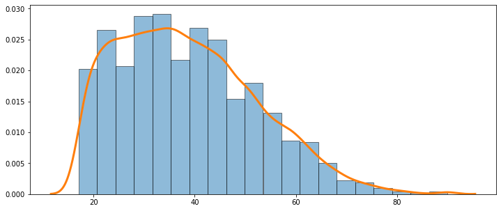


Rescale Generated Feature To Match Orignal


```python
scaled_array = rescale_interpolate(df_org, df_gen, feature)
pl, support_gen, density_gen, kde_gen = kde_func(scaled_array, bw, [density_org] )
```


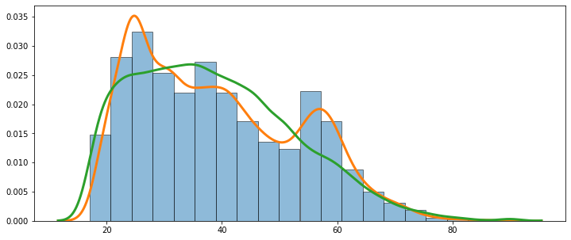


```python
scaled_array_2 = rescale_interpolate(df_org, df_gen_2, feature)
pl, support_gen_2, density_gen_2, kde_gen_2 = kde_func(scaled_array_2, bw, [density_org, density_gen] )
```


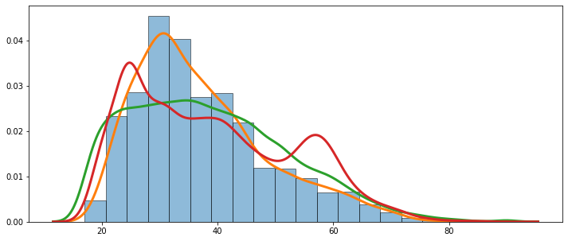


Multiple. Here you can probably include curve metrics and distance metrics. 


```python
from statsmodels.sandbox.nonparametric import kernels
from statsmodels.nonparametric import bandwidths

def density_arr(dist_org_1,dist_org_2, col):

  kernel_switch = dict(gau=kernels.Gaussian, epa=kernels.Epanechnikov,
                      uni=kernels.Uniform, tri=kernels.Triangular,
                      biw=kernels.Biweight, triw=kernels.Triweight,
                      cos=kernels.Cosine, cos2=kernels.Cosine2)
  bw = bandwidths.select_bandwidth(df_org_out[col], "normal_reference", kernel_switch["gau"]())


  import matplotlib.pyplot as plt
  import statsmodels.api as sm

  def kde_func_sans(series, bw ):
    kde = sm.nonparametric.KDEUnivariate(series)
    kde.fit(bw=bw) # Estimate the densities

    return kde.support, kde.density, kde 

  support_org_1, density_org_1, kde_org = kde_func_sans(dist_org_1[col], bw)

  max_target = dist_org_1[col].astype(int).max()
  min_target = dist_org_1[col].astype(int).min()
  change = dist_org_2[col]
  scaled_array = np.interp(change, (change.min(), change.max()), (min_target, max_target))
  support_org_2, density_org_2, kde_gen = kde_func_sans(scaled_array, bw)
  return density_org_1, density_org_2, support_org_1, support_org_2
```


```python
def distance_funct_kde(df_1, df_2, X):

  for en, col in enumerate(X):
    density_org_1, density_org_2, _, _ = density_arr(df_1, df_2, col)
    vect_org_dens_dist = {}
    for iteration in range(100):
      choice = np.random.choice(len(density_org_1), int(len(density_org_1)*.01), replace=False)
      choice.sort()
      arr_dens_org_1 = density_org_1[choice]
      arr_dens_org_2 = density_org_2[choice]
      vect_org_dens_dist["Iteration_{}".format(iteration)] = vector_distance(arr_dens_org_1,arr_dens_org_2 )
    
    mean_series = pd.DataFrame.from_dict(vect_org_dens_dist).T.mean()
    if en==0:
      frame_all = mean_series.to_frame()
    else:
      frame_all = pd.merge(frame_all,mean_series.to_frame(), left_index=True, right_index=True,how="left" )

  frame_all.columns = X
  return  frame_all
```


```python
def distance_comp(df_org_out,df_gen_out):
  frac = 0.5
  vect_org_dens_dist = distance_funct_kde(df_org_out.sample(frac=frac).astype('double'),df_org_out.sample(frac=frac).astype('double'), X)
  vect_gen_dens_dist = distance_funct_kde(df_gen_out.astype('double'),df_org_out.astype('double'), X)
  vect_gen_dens_dist.loc["canberra",:] = vect_gen_dens_dist.loc["canberra",:]*frac
  vect_gen_dens_dist.loc["sqeuclidean",:] = vect_gen_dens_dist.loc["sqeuclidean",:]*frac
  vect_gen_dens_dist.loc["manhattan",:] = vect_gen_dens_dist.loc["manhattan",:]*frac
  return vect_gen_dens_dist, vect_org_dens_dist
```


```python
df_gen_out_2.shape
```


    (32561, 53)


```python
vect_gen_dens_dist, vect_org_dens_dist = distance_comp(df_org_out,df_gen_out)
vect_gen_dens_dist_2, _ = distance_comp(df_org_out,df_gen_out_2)
```

##### ***Distribution Distance Map***


```python
vect_gen_dens_dist
```


<div>
<style scoped>
    .dataframe tbody tr th:only-of-type {
        vertical-align: middle;
    }

    .dataframe tbody tr th {
        vertical-align: top;
    }

    .dataframe thead th {
        text-align: right;
    }
</style>
<table border="1" class="dataframe">
  <thead>
    <tr style="text-align: right;">
      <th></th>
      <th>Age</th>
      <th>Education-Num</th>
      <th>Capital Gain</th>
      <th>Capital Loss</th>
      <th>Hours per week</th>
      <th>Workclass_ ?</th>
      <th>Workclass_ Federal-gov</th>
      <th>Workclass_ Local-gov</th>
      <th>Workclass_ Never-worked</th>
      <th>Workclass_ Private</th>
      <th>Workclass_ Self-emp-inc</th>
      <th>Workclass_ Self-emp-not-inc</th>
      <th>Workclass_ State-gov</th>
      <th>Workclass_ Without-pay</th>
      <th>Marital Status_ Divorced</th>
      <th>Marital Status_ Married-AF-spouse</th>
      <th>Marital Status_ Married-civ-spouse</th>
      <th>Marital Status_ Married-spouse-absent</th>
      <th>Marital Status_ Never-married</th>
      <th>Marital Status_ Separated</th>
      <th>Marital Status_ Widowed</th>
      <th>Occupation_ ?</th>
      <th>Occupation_ Adm-clerical</th>
      <th>Occupation_ Craft-repair</th>
      <th>Occupation_ Exec-managerial</th>
      <th>Occupation_ Farming-fishing</th>
      <th>Occupation_ Handlers-cleaners</th>
      <th>Occupation_ Machine-op-inspct</th>
      <th>Occupation_ Other-service</th>
      <th>Occupation_ Prof-specialty</th>
      <th>Occupation_ Protective-serv</th>
      <th>Occupation_ Sales</th>
      <th>Occupation_ Tech-support</th>
      <th>Occupation_ Transport-moving</th>
      <th>Occupation_Other</th>
      <th>Relationship_ Husband</th>
      <th>Relationship_ Not-in-family</th>
      <th>Relationship_ Other-relative</th>
      <th>Relationship_ Own-child</th>
      <th>Relationship_ Unmarried</th>
      <th>Relationship_ Wife</th>
      <th>Race_ Amer-Indian-Eskimo</th>
      <th>Race_ Asian-Pac-Islander</th>
      <th>Race_ Black</th>
      <th>Race_ Other</th>
      <th>Race_ White</th>
      <th>Sex_ Female</th>
      <th>Sex_ Male</th>
      <th>Country_ ?</th>
      <th>Country_ Mexico</th>
      <th>Country_ United-States</th>
      <th>Country_Other</th>
    </tr>
  </thead>
  <tbody>
    <tr>
      <th>braycurtis</th>
      <td>0.107187</td>
      <td>0.257094</td>
      <td>1.045770</td>
      <td>0.999057</td>
      <td>0.505376</td>
      <td>1.660232e-01</td>
      <td>2.800900e-01</td>
      <td>6.227599e-02</td>
      <td>5.625000e-01</td>
      <td>0.175105</td>
      <td>8.440693e-03</td>
      <td>3.765182e-01</td>
      <td>2.468813e-01</td>
      <td>2.820513e-01</td>
      <td>1.659887e-01</td>
      <td>2.580645e-01</td>
      <td>0.002631</td>
      <td>2.150235e-01</td>
      <td>0.023188</td>
      <td>2.404594e-01</td>
      <td>3.441215e-01</td>
      <td>7.363659e-02</td>
      <td>1.582003e-01</td>
      <td>1.253601e-01</td>
      <td>1.994231e-02</td>
      <td>5.468379e-02</td>
      <td>2.609296e-01</td>
      <td>1.352424e-01</td>
      <td>8.799736e-02</td>
      <td>9.843460e-02</td>
      <td>3.179650e-02</td>
      <td>3.399433e-02</td>
      <td>5.514497e-02</td>
      <td>8.898738e-02</td>
      <td>2.685185e-01</td>
      <td>0.053091</td>
      <td>0.057902</td>
      <td>1.590227e-01</td>
      <td>7.454527e-03</td>
      <td>1.075044e-01</td>
      <td>6.248132e-02</td>
      <td>1.639785e-01</td>
      <td>6.290610e-01</td>
      <td>2.304471e-01</td>
      <td>2.615804e-01</td>
      <td>1.143561e-01</td>
      <td>0.026116</td>
      <td>0.025952</td>
      <td>8.188976e-02</td>
      <td>1.942356e-01</td>
      <td>3.985456e-02</td>
      <td>1.974050e-01</td>
    </tr>
    <tr>
      <th>canberra</th>
      <td>36.807327</td>
      <td>39.501419</td>
      <td>156.225103</td>
      <td>149.037505</td>
      <td>80.847849</td>
      <td>2.714479e+01</td>
      <td>4.579471e+01</td>
      <td>1.018212e+01</td>
      <td>9.196875e+01</td>
      <td>29.324915</td>
      <td>1.380053e+00</td>
      <td>6.156073e+01</td>
      <td>4.036510e+01</td>
      <td>4.611538e+01</td>
      <td>2.713915e+01</td>
      <td>4.219355e+01</td>
      <td>0.420831</td>
      <td>3.515634e+01</td>
      <td>4.242312</td>
      <td>3.931512e+01</td>
      <td>5.626387e+01</td>
      <td>1.203958e+01</td>
      <td>2.586575e+01</td>
      <td>2.049637e+01</td>
      <td>3.260567e+00</td>
      <td>8.940799e+00</td>
      <td>4.266199e+01</td>
      <td>2.211213e+01</td>
      <td>1.438757e+01</td>
      <td>1.609406e+01</td>
      <td>5.198728e+00</td>
      <td>5.558074e+00</td>
      <td>9.016202e+00</td>
      <td>1.454944e+01</td>
      <td>4.390278e+01</td>
      <td>8.946376</td>
      <td>12.319880</td>
      <td>2.600021e+01</td>
      <td>1.218815e+00</td>
      <td>1.757697e+01</td>
      <td>1.021570e+01</td>
      <td>2.681048e+01</td>
      <td>1.028515e+02</td>
      <td>3.767810e+01</td>
      <td>4.276839e+01</td>
      <td>1.869722e+01</td>
      <td>4.578723</td>
      <td>4.574612</td>
      <td>1.338898e+01</td>
      <td>3.175752e+01</td>
      <td>6.516220e+00</td>
      <td>3.227572e+01</td>
    </tr>
    <tr>
      <th>correlation</th>
      <td>0.062978</td>
      <td>0.254596</td>
      <td>1.152678</td>
      <td>0.990703</td>
      <td>0.435163</td>
      <td>-1.110223e-17</td>
      <td>-4.107825e-17</td>
      <td>-5.551115e-18</td>
      <td>0.000000e+00</td>
      <td>0.075822</td>
      <td>1.443290e-17</td>
      <td>1.998401e-17</td>
      <td>-3.108624e-17</td>
      <td>-2.775558e-17</td>
      <td>-6.661338e-18</td>
      <td>-1.110223e-17</td>
      <td>0.000020</td>
      <td>-7.660539e-17</td>
      <td>0.001111</td>
      <td>-2.109424e-17</td>
      <td>-3.552714e-17</td>
      <td>-4.440892e-18</td>
      <td>-1.665335e-17</td>
      <td>-1.221245e-17</td>
      <td>-8.881784e-18</td>
      <td>-2.442491e-17</td>
      <td>-1.221245e-17</td>
      <td>5.551115e-18</td>
      <td>-1.110223e-17</td>
      <td>-1.110223e-18</td>
      <td>-4.440892e-18</td>
      <td>-2.775558e-17</td>
      <td>-3.552714e-17</td>
      <td>-4.218847e-17</td>
      <td>-1.998401e-17</td>
      <td>0.007203</td>
      <td>0.006023</td>
      <td>-1.221245e-17</td>
      <td>9.992007e-18</td>
      <td>4.440892e-18</td>
      <td>2.220446e-18</td>
      <td>-2.220446e-17</td>
      <td>-1.221245e-17</td>
      <td>-2.331468e-17</td>
      <td>-3.663736e-17</td>
      <td>-4.440892e-18</td>
      <td>0.001561</td>
      <td>0.001518</td>
      <td>-1.998401e-17</td>
      <td>-1.665335e-17</td>
      <td>4.440892e-18</td>
      <td>-2.997602e-17</td>
    </tr>
    <tr>
      <th>cosine</th>
      <td>0.027303</td>
      <td>0.169280</td>
      <td>1.151224</td>
      <td>0.989608</td>
      <td>0.401555</td>
      <td>-2.220446e-17</td>
      <td>-9.992007e-18</td>
      <td>-2.775558e-17</td>
      <td>-4.773959e-17</td>
      <td>0.054231</td>
      <td>1.776357e-17</td>
      <td>-1.665335e-17</td>
      <td>-5.440093e-17</td>
      <td>-3.774758e-17</td>
      <td>-1.332268e-17</td>
      <td>1.998401e-17</td>
      <td>0.000014</td>
      <td>-4.662937e-17</td>
      <td>0.000838</td>
      <td>-3.885781e-17</td>
      <td>-1.665335e-17</td>
      <td>-2.442491e-17</td>
      <td>0.000000e+00</td>
      <td>-1.110223e-18</td>
      <td>-6.661338e-18</td>
      <td>-3.219647e-17</td>
      <td>-2.775558e-17</td>
      <td>-4.773959e-17</td>
      <td>-5.773160e-17</td>
      <td>3.330669e-18</td>
      <td>4.440892e-18</td>
      <td>-3.330669e-17</td>
      <td>-8.881784e-18</td>
      <td>-1.221245e-17</td>
      <td>-2.220446e-18</td>
      <td>0.005054</td>
      <td>0.004772</td>
      <td>1.887379e-17</td>
      <td>1.554312e-17</td>
      <td>7.771561e-18</td>
      <td>4.440892e-18</td>
      <td>-5.440093e-17</td>
      <td>-2.775558e-17</td>
      <td>-2.886580e-17</td>
      <td>-5.551115e-18</td>
      <td>-2.442491e-17</td>
      <td>0.001143</td>
      <td>0.001114</td>
      <td>-2.220446e-18</td>
      <td>-3.552714e-17</td>
      <td>0.000000e+00</td>
      <td>1.887379e-17</td>
    </tr>
    <tr>
      <th>dice</th>
      <td>0.982029</td>
      <td>0.845034</td>
      <td>1.000460</td>
      <td>0.999972</td>
      <td>0.922192</td>
      <td>-6.631816e+01</td>
      <td>2.363924e+01</td>
      <td>9.933530e+00</td>
      <td>1.172375e+00</td>
      <td>-1.362170</td>
      <td>-5.213239e+01</td>
      <td>-1.077875e+02</td>
      <td>3.335971e+01</td>
      <td>6.654116e-01</td>
      <td>-8.777804e+01</td>
      <td>7.990613e-01</td>
      <td>-1.164531</td>
      <td>8.573976e+00</td>
      <td>-1.550515</td>
      <td>-1.504182e+01</td>
      <td>1.501581e+01</td>
      <td>-5.211676e+01</td>
      <td>-1.403817e+02</td>
      <td>-5.948616e+01</td>
      <td>-3.569208e+01</td>
      <td>2.223424e+00</td>
      <td>-6.637036e+01</td>
      <td>2.744367e+01</td>
      <td>-3.723063e+01</td>
      <td>3.014204e+00</td>
      <td>9.279175e+00</td>
      <td>-8.653323e+01</td>
      <td>-2.952802e+01</td>
      <td>-2.700802e+01</td>
      <td>-3.322523e+01</td>
      <td>-1.273231</td>
      <td>-1.882688</td>
      <td>-3.175311e+01</td>
      <td>-2.668797e+02</td>
      <td>6.710548e+00</td>
      <td>7.190707e+00</td>
      <td>-2.273606e+00</td>
      <td>-4.308067e+01</td>
      <td>8.193377e+01</td>
      <td>-5.459571e+00</td>
      <td>-2.718699e+02</td>
      <td>-1.472591</td>
      <td>-1.480231</td>
      <td>3.740574e+01</td>
      <td>4.582668e+01</td>
      <td>2.482688e+02</td>
      <td>-1.604431e+02</td>
    </tr>
    <tr>
      <th>euclidean</th>
      <td>0.059156</td>
      <td>1.154072</td>
      <td>0.018479</td>
      <td>0.062073</td>
      <td>0.587745</td>
      <td>6.029946e+01</td>
      <td>3.395534e+01</td>
      <td>8.349877e+00</td>
      <td>8.027507e-01</td>
      <td>8.326871</td>
      <td>1.339271e+00</td>
      <td>2.158266e+02</td>
      <td>3.060238e+01</td>
      <td>4.914275e-01</td>
      <td>7.463193e+01</td>
      <td>1.094913e+00</td>
      <td>0.118525</td>
      <td>8.642424e+00</td>
      <td>1.072016</td>
      <td>2.644936e+01</td>
      <td>4.841800e+01</td>
      <td>1.711456e+01</td>
      <td>1.153469e+02</td>
      <td>5.838062e+01</td>
      <td>8.496312e+00</td>
      <td>3.409012e+00</td>
      <td>4.922673e+01</td>
      <td>1.855332e+01</td>
      <td>2.768967e+01</td>
      <td>1.380876e+01</td>
      <td>1.358272e+00</td>
      <td>1.450500e+01</td>
      <td>8.267974e+00</td>
      <td>1.342747e+01</td>
      <td>6.468308e+00</td>
      <td>2.400044</td>
      <td>2.827384</td>
      <td>2.679853e+01</td>
      <td>6.941855e+00</td>
      <td>4.137753e+01</td>
      <td>1.036407e+01</td>
      <td>5.971365e+00</td>
      <td>1.962807e+02</td>
      <td>8.611113e+01</td>
      <td>9.992349e+00</td>
      <td>3.510646e+02</td>
      <td>1.215313</td>
      <td>1.209613</td>
      <td>4.055326e+00</td>
      <td>1.868061e+01</td>
      <td>7.661302e+01</td>
      <td>7.864015e+01</td>
    </tr>
    <tr>
      <th>kulsinski</th>
      <td>0.999815</td>
      <td>0.991146</td>
      <td>1.000000</td>
      <td>1.000000</td>
      <td>0.999226</td>
      <td>8.111304e-01</td>
      <td>1.331958e+00</td>
      <td>1.210714e+00</td>
      <td>9.910029e-01</td>
      <td>2.812190</td>
      <td>1.601562e+00</td>
      <td>1.330205e+00</td>
      <td>1.126731e+00</td>
      <td>1.000023e+00</td>
      <td>1.617402e+00</td>
      <td>1.005565e+00</td>
      <td>3.459193</td>
      <td>1.219863e+00</td>
      <td>2.554826</td>
      <td>1.221902e+00</td>
      <td>1.208694e+00</td>
      <td>8.626725e-01</td>
      <td>1.352520e+00</td>
      <td>-2.393614e+00</td>
      <td>3.354882e+00</td>
      <td>1.226449e+00</td>
      <td>1.048404e+00</td>
      <td>1.211608e+00</td>
      <td>1.057298e+00</td>
      <td>1.366791e+00</td>
      <td>1.300116e+00</td>
      <td>-9.791100e-01</td>
      <td>1.075857e+00</td>
      <td>1.420211e+00</td>
      <td>6.781170e-01</td>
      <td>3.162711</td>
      <td>2.211596</td>
      <td>1.198107e+00</td>
      <td>1.136793e+00</td>
      <td>1.316610e+00</td>
      <td>1.624344e+00</td>
      <td>1.182429e+00</td>
      <td>-3.199814e-01</td>
      <td>-1.082789e+00</td>
      <td>1.077291e+00</td>
      <td>1.290443e+00</td>
      <td>2.626484</td>
      <td>2.627537</td>
      <td>1.455330e+00</td>
      <td>1.163769e+00</td>
      <td>1.455960e+00</td>
      <td>9.641476e-01</td>
    </tr>
    <tr>
      <th>manhattan</th>
      <td>0.368136</td>
      <td>5.305297</td>
      <td>0.013982</td>
      <td>0.047632</td>
      <td>1.609435</td>
      <td>3.278294e+01</td>
      <td>1.883294e+01</td>
      <td>4.659609e+00</td>
      <td>4.389134e-01</td>
      <td>42.460222</td>
      <td>7.172823e-01</td>
      <td>1.167161e+02</td>
      <td>1.793041e+01</td>
      <td>2.660898e-01</td>
      <td>3.978628e+01</td>
      <td>5.925279e-01</td>
      <td>0.618135</td>
      <td>4.787558e+00</td>
      <td>5.485222</td>
      <td>1.441991e+01</td>
      <td>2.687370e+01</td>
      <td>9.211630e+00</td>
      <td>6.069943e+01</td>
      <td>3.192476e+01</td>
      <td>4.614366e+00</td>
      <td>1.960482e+00</td>
      <td>2.546759e+01</td>
      <td>1.068587e+01</td>
      <td>1.522251e+01</td>
      <td>8.383656e+00</td>
      <td>7.698553e-01</td>
      <td>7.728716e+00</td>
      <td>4.368403e+00</td>
      <td>7.442999e+00</td>
      <td>3.510071e+00</td>
      <td>12.532411</td>
      <td>14.110847</td>
      <td>1.461358e+01</td>
      <td>3.828330e+00</td>
      <td>2.212247e+01</td>
      <td>5.776897e+00</td>
      <td>3.375567e+00</td>
      <td>1.047490e+02</td>
      <td>4.709633e+01</td>
      <td>5.468358e+00</td>
      <td>1.924568e+02</td>
      <td>6.241882</td>
      <td>6.207006</td>
      <td>2.276934e+00</td>
      <td>1.050852e+01</td>
      <td>4.187761e+01</td>
      <td>4.122725e+01</td>
    </tr>
    <tr>
      <th>rogerstanimoto</th>
      <td>0.040442</td>
      <td>0.192515</td>
      <td>0.000063</td>
      <td>0.000180</td>
      <td>0.035307</td>
      <td>-8.384387e-01</td>
      <td>1.280293e+00</td>
      <td>8.936283e-01</td>
      <td>-4.053556e-02</td>
      <td>4.146566</td>
      <td>2.646222e+00</td>
      <td>1.305202e+00</td>
      <td>5.360435e-01</td>
      <td>1.773131e-03</td>
      <td>2.472713e+00</td>
      <td>4.308376e-02</td>
      <td>5.260298</td>
      <td>8.963557e-01</td>
      <td>3.750138</td>
      <td>8.803306e-01</td>
      <td>8.513424e-01</td>
      <td>-4.293008e-01</td>
      <td>1.530134e+00</td>
      <td>-1.249927e+01</td>
      <td>1.030980e+01</td>
      <td>8.709634e-01</td>
      <td>2.185071e-01</td>
      <td>1.007398e+00</td>
      <td>1.796780e-01</td>
      <td>1.446115e+00</td>
      <td>1.236039e+00</td>
      <td>-8.578095e+00</td>
      <td>2.709600e-01</td>
      <td>1.853774e+00</td>
      <td>-1.281831e+00</td>
      <td>4.781026</td>
      <td>3.152278</td>
      <td>8.270043e-01</td>
      <td>5.223204e-01</td>
      <td>1.273493e+00</td>
      <td>2.436469e+00</td>
      <td>7.683816e-01</td>
      <td>-5.286451e+00</td>
      <td>-8.983310e+00</td>
      <td>2.510769e-01</td>
      <td>1.104807e+00</td>
      <td>3.850171</td>
      <td>3.856677</td>
      <td>1.891325e+00</td>
      <td>5.823794e-01</td>
      <td>1.834525e+00</td>
      <td>-8.346734e-02</td>
    </tr>
    <tr>
      <th>russellrao</th>
      <td>0.999811</td>
      <td>0.990197</td>
      <td>1.000000</td>
      <td>1.000000</td>
      <td>0.999211</td>
      <td>-1.382495e+03</td>
      <td>-6.520732e+01</td>
      <td>-9.667686e+01</td>
      <td>9.932677e-01</td>
      <td>-0.756240</td>
      <td>-3.332272e+02</td>
      <td>-2.770080e+03</td>
      <td>-7.309538e+01</td>
      <td>9.645141e-01</td>
      <td>-2.669349e+03</td>
      <td>8.796992e-01</td>
      <td>-0.556598</td>
      <td>-8.249170e+00</td>
      <td>-0.852889</td>
      <td>-1.609432e+02</td>
      <td>-8.854070e+01</td>
      <td>-4.583099e+02</td>
      <td>-4.049024e+03</td>
      <td>-2.439043e+03</td>
      <td>-1.878872e+03</td>
      <td>-1.293321e+01</td>
      <td>-3.914091e+02</td>
      <td>-1.088373e+02</td>
      <td>-1.000658e+03</td>
      <td>-1.082561e+02</td>
      <td>-1.093237e+01</td>
      <td>-2.342124e+03</td>
      <td>-2.208728e+02</td>
      <td>-2.397038e+02</td>
      <td>-3.727730e+00</td>
      <td>-0.646664</td>
      <td>-1.155683</td>
      <td>-2.777184e+02</td>
      <td>-7.563441e+03</td>
      <td>-1.183830e+03</td>
      <td>-1.058404e+02</td>
      <td>-1.393273e+01</td>
      <td>-5.657795e+02</td>
      <td>-6.239211e+02</td>
      <td>-1.269747e+01</td>
      <td>-7.415646e+04</td>
      <td>-0.811785</td>
      <td>-0.819810</td>
      <td>-1.236464e+01</td>
      <td>-7.874056e+01</td>
      <td>-2.066548e+04</td>
      <td>-1.886418e+03</td>
    </tr>
    <tr>
      <th>sokalmichener</th>
      <td>0.040442</td>
      <td>0.192515</td>
      <td>0.000063</td>
      <td>0.000180</td>
      <td>0.035307</td>
      <td>-8.384387e-01</td>
      <td>1.280293e+00</td>
      <td>8.936283e-01</td>
      <td>-4.053556e-02</td>
      <td>4.146566</td>
      <td>2.646222e+00</td>
      <td>1.305202e+00</td>
      <td>5.360435e-01</td>
      <td>1.773131e-03</td>
      <td>2.472713e+00</td>
      <td>4.308376e-02</td>
      <td>5.260298</td>
      <td>8.963557e-01</td>
      <td>3.750138</td>
      <td>8.803306e-01</td>
      <td>8.513424e-01</td>
      <td>-4.293008e-01</td>
      <td>1.530134e+00</td>
      <td>-1.249927e+01</td>
      <td>1.030980e+01</td>
      <td>8.709634e-01</td>
      <td>2.185071e-01</td>
      <td>1.007398e+00</td>
      <td>1.796780e-01</td>
      <td>1.446115e+00</td>
      <td>1.236039e+00</td>
      <td>-8.578095e+00</td>
      <td>2.709600e-01</td>
      <td>1.853774e+00</td>
      <td>-1.281831e+00</td>
      <td>4.781026</td>
      <td>3.152278</td>
      <td>8.270043e-01</td>
      <td>5.223204e-01</td>
      <td>1.273493e+00</td>
      <td>2.436469e+00</td>
      <td>7.683816e-01</td>
      <td>-5.286451e+00</td>
      <td>-8.983310e+00</td>
      <td>2.510769e-01</td>
      <td>1.104807e+00</td>
      <td>3.850171</td>
      <td>3.856677</td>
      <td>1.891325e+00</td>
      <td>5.823794e-01</td>
      <td>1.834525e+00</td>
      <td>-8.346734e-02</td>
    </tr>
    <tr>
      <th>sokalsneath</th>
      <td>0.995446</td>
      <td>0.956146</td>
      <td>1.000107</td>
      <td>0.999993</td>
      <td>0.979218</td>
      <td>1.362803e+00</td>
      <td>1.713160e+00</td>
      <td>1.388591e+00</td>
      <td>1.007167e+00</td>
      <td>1.770248</td>
      <td>1.442053e+00</td>
      <td>1.394800e+00</td>
      <td>4.501828e-01</td>
      <td>1.124381e+00</td>
      <td>1.348501e+00</td>
      <td>9.990887e-01</td>
      <td>1.871082</td>
      <td>1.375473e+00</td>
      <td>1.703191</td>
      <td>1.290723e+00</td>
      <td>1.314053e+00</td>
      <td>1.413147e+00</td>
      <td>1.517297e+00</td>
      <td>1.312517e+00</td>
      <td>1.381934e+00</td>
      <td>1.214216e+00</td>
      <td>1.415065e+00</td>
      <td>1.201840e+00</td>
      <td>1.296744e+00</td>
      <td>1.390398e+00</td>
      <td>1.362347e+00</td>
      <td>1.273292e+00</td>
      <td>1.264156e+00</td>
      <td>1.369182e+00</td>
      <td>1.239568e+00</td>
      <td>1.812382</td>
      <td>1.622782</td>
      <td>1.165594e+00</td>
      <td>1.378471e+00</td>
      <td>1.904083e+00</td>
      <td>1.251183e+00</td>
      <td>1.202534e+00</td>
      <td>1.318785e+00</td>
      <td>1.313873e+00</td>
      <td>1.099104e+00</td>
      <td>1.333184e+00</td>
      <td>1.727585</td>
      <td>1.725115</td>
      <td>-5.198052e-01</td>
      <td>1.141969e+00</td>
      <td>1.343650e+00</td>
      <td>1.437628e+00</td>
    </tr>
    <tr>
      <th>sqeuclidean</th>
      <td>0.001754</td>
      <td>0.669254</td>
      <td>0.000411</td>
      <td>0.008656</td>
      <td>0.179136</td>
      <td>2.564670e+04</td>
      <td>3.686042e+03</td>
      <td>2.487129e+02</td>
      <td>2.037923e+00</td>
      <td>34.770219</td>
      <td>1.557423e+01</td>
      <td>2.993596e+05</td>
      <td>3.145263e+03</td>
      <td>2.005813e+00</td>
      <td>4.948079e+04</td>
      <td>5.613500e+00</td>
      <td>0.007039</td>
      <td>2.932317e+02</td>
      <td>0.576116</td>
      <td>6.499659e+03</td>
      <td>7.866110e+03</td>
      <td>1.637692e+03</td>
      <td>6.799194e+04</td>
      <td>2.547844e+04</td>
      <td>4.891359e+02</td>
      <td>2.733044e+01</td>
      <td>1.874938e+04</td>
      <td>1.338352e+03</td>
      <td>5.112254e+03</td>
      <td>6.991135e+02</td>
      <td>7.897731e+00</td>
      <td>1.772917e+03</td>
      <td>4.426050e+02</td>
      <td>1.256523e+03</td>
      <td>2.402585e+02</td>
      <td>2.888183</td>
      <td>4.005583</td>
      <td>4.729176e+03</td>
      <td>2.749280e+02</td>
      <td>9.060140e+03</td>
      <td>2.738498e+02</td>
      <td>2.698536e+02</td>
      <td>2.427380e+05</td>
      <td>2.292155e+04</td>
      <td>6.579765e+02</td>
      <td>6.426407e+05</td>
      <td>0.740103</td>
      <td>0.733385</td>
      <td>5.900873e+01</td>
      <td>2.044639e+03</td>
      <td>2.150258e+04</td>
      <td>5.005236e+04</td>
    </tr>
    <tr>
      <th>yule</th>
      <td>0.730637</td>
      <td>0.494377</td>
      <td>0.113987</td>
      <td>1.067617</td>
      <td>0.210037</td>
      <td>4.280900e-01</td>
      <td>4.343865e-01</td>
      <td>4.518529e-01</td>
      <td>1.893373e-02</td>
      <td>0.626275</td>
      <td>3.933266e-01</td>
      <td>6.326804e-01</td>
      <td>4.379046e-01</td>
      <td>2.212716e-02</td>
      <td>5.270316e-01</td>
      <td>6.068669e-02</td>
      <td>0.572350</td>
      <td>2.418229e-01</td>
      <td>0.652407</td>
      <td>3.887139e-01</td>
      <td>4.196414e-01</td>
      <td>4.970566e-01</td>
      <td>6.174896e-01</td>
      <td>6.083598e-01</td>
      <td>5.480530e-01</td>
      <td>3.299635e-01</td>
      <td>2.958583e-01</td>
      <td>4.234696e-01</td>
      <td>5.318104e-01</td>
      <td>5.268070e-01</td>
      <td>2.592002e-01</td>
      <td>5.510176e-01</td>
      <td>3.603672e-01</td>
      <td>4.133024e-01</td>
      <td>2.096385e-01</td>
      <td>0.598359</td>
      <td>0.709530</td>
      <td>3.553221e-01</td>
      <td>6.328162e-01</td>
      <td>5.571006e-01</td>
      <td>4.955148e-01</td>
      <td>1.936034e-01</td>
      <td>4.320271e-01</td>
      <td>6.004462e-01</td>
      <td>2.223519e-01</td>
      <td>8.969624e-01</td>
      <td>0.642845</td>
      <td>0.644201</td>
      <td>2.792708e-01</td>
      <td>3.462921e-01</td>
      <td>8.684214e-01</td>
      <td>4.786322e-01</td>
    </tr>
  </tbody>
</table>
</div>


Distribution Divergence Distance Map (multiples)


```python
ddd_map = vect_gen_dens_dist/vect_org_dens_dist; ddd_map
```


<div>
<style scoped>
    .dataframe tbody tr th:only-of-type {
        vertical-align: middle;
    }

    .dataframe tbody tr th {
        vertical-align: top;
    }

    .dataframe thead th {
        text-align: right;
    }
</style>
<table border="1" class="dataframe">
  <thead>
    <tr style="text-align: right;">
      <th></th>
      <th>Age</th>
      <th>Education-Num</th>
      <th>Capital Gain</th>
      <th>Capital Loss</th>
      <th>Hours per week</th>
      <th>Workclass_ ?</th>
      <th>Workclass_ Federal-gov</th>
      <th>Workclass_ Local-gov</th>
      <th>Workclass_ Never-worked</th>
      <th>Workclass_ Private</th>
      <th>Workclass_ Self-emp-inc</th>
      <th>Workclass_ Self-emp-not-inc</th>
      <th>Workclass_ State-gov</th>
      <th>Workclass_ Without-pay</th>
      <th>Marital Status_ Divorced</th>
      <th>Marital Status_ Married-AF-spouse</th>
      <th>Marital Status_ Married-civ-spouse</th>
      <th>Marital Status_ Married-spouse-absent</th>
      <th>Marital Status_ Never-married</th>
      <th>Marital Status_ Separated</th>
      <th>Marital Status_ Widowed</th>
      <th>Occupation_ ?</th>
      <th>Occupation_ Adm-clerical</th>
      <th>Occupation_ Craft-repair</th>
      <th>Occupation_ Exec-managerial</th>
      <th>Occupation_ Farming-fishing</th>
      <th>Occupation_ Handlers-cleaners</th>
      <th>Occupation_ Machine-op-inspct</th>
      <th>Occupation_ Other-service</th>
      <th>Occupation_ Prof-specialty</th>
      <th>Occupation_ Protective-serv</th>
      <th>Occupation_ Sales</th>
      <th>Occupation_ Tech-support</th>
      <th>Occupation_ Transport-moving</th>
      <th>Occupation_Other</th>
      <th>Relationship_ Husband</th>
      <th>Relationship_ Not-in-family</th>
      <th>Relationship_ Other-relative</th>
      <th>Relationship_ Own-child</th>
      <th>Relationship_ Unmarried</th>
      <th>Relationship_ Wife</th>
      <th>Race_ Amer-Indian-Eskimo</th>
      <th>Race_ Asian-Pac-Islander</th>
      <th>Race_ Black</th>
      <th>Race_ Other</th>
      <th>Race_ White</th>
      <th>Sex_ Female</th>
      <th>Sex_ Male</th>
      <th>Country_ ?</th>
      <th>Country_ Mexico</th>
      <th>Country_ United-States</th>
      <th>Country_Other</th>
    </tr>
  </thead>
  <tbody>
    <tr>
      <th>braycurtis</th>
      <td>10.888793</td>
      <td>23.920137</td>
      <td>8.371496</td>
      <td>0.996967</td>
      <td>33.757306</td>
      <td>8.117659</td>
      <td>15.734467</td>
      <td>131.464606</td>
      <td>inf</td>
      <td>148.399113</td>
      <td>0.271790</td>
      <td>41.793522</td>
      <td>21.347007</td>
      <td>inf</td>
      <td>8.340933</td>
      <td>0.946237</td>
      <td>2.528324</td>
      <td>4.855004</td>
      <td>6.166117</td>
      <td>8.384019</td>
      <td>47.636252</td>
      <td>3.612069</td>
      <td>12.369916</td>
      <td>250.845514</td>
      <td>8.958527</td>
      <td>1.473658</td>
      <td>17.010124</td>
      <td>56.396087</td>
      <td>2.509073</td>
      <td>5.337201</td>
      <td>1.132960</td>
      <td>3.343389</td>
      <td>1.482612</td>
      <td>4.328023</td>
      <td>2.774691</td>
      <td>30.964164</td>
      <td>29.676471</td>
      <td>9.270089</td>
      <td>4.720579</td>
      <td>52.876816</td>
      <td>16.078525</td>
      <td>2.969833</td>
      <td>108.408188</td>
      <td>inf</td>
      <td>2.489858</td>
      <td>62.350986</td>
      <td>13.556695</td>
      <td>13.541481</td>
      <td>1.922772</td>
      <td>6.448622</td>
      <td>16.831907</td>
      <td>17.832252</td>
    </tr>
    <tr>
      <th>canberra</th>
      <td>5.589760</td>
      <td>11.834610</td>
      <td>4.188997</td>
      <td>1.128602</td>
      <td>5.477848</td>
      <td>8.142560</td>
      <td>15.782732</td>
      <td>131.867871</td>
      <td>inf</td>
      <td>127.070672</td>
      <td>0.272624</td>
      <td>41.921723</td>
      <td>21.412489</td>
      <td>inf</td>
      <td>8.366519</td>
      <td>0.949139</td>
      <td>2.534515</td>
      <td>4.869896</td>
      <td>6.319722</td>
      <td>8.409737</td>
      <td>47.782376</td>
      <td>3.623149</td>
      <td>12.407861</td>
      <td>251.614978</td>
      <td>8.986007</td>
      <td>1.478178</td>
      <td>17.062303</td>
      <td>56.569081</td>
      <td>2.516769</td>
      <td>5.353572</td>
      <td>1.136435</td>
      <td>3.353645</td>
      <td>1.487160</td>
      <td>4.341299</td>
      <td>2.783203</td>
      <td>31.721780</td>
      <td>10.907291</td>
      <td>9.298525</td>
      <td>4.735060</td>
      <td>53.039015</td>
      <td>16.127846</td>
      <td>2.978943</td>
      <td>108.740728</td>
      <td>inf</td>
      <td>2.497495</td>
      <td>62.542247</td>
      <td>13.367981</td>
      <td>13.287019</td>
      <td>1.928670</td>
      <td>6.468403</td>
      <td>16.883539</td>
      <td>17.886952</td>
    </tr>
    <tr>
      <th>correlation</th>
      <td>97.849888</td>
      <td>1456.423180</td>
      <td>39.068738</td>
      <td>0.990476</td>
      <td>2477.032836</td>
      <td>0.384615</td>
      <td>0.925000</td>
      <td>0.500000</td>
      <td>NaN</td>
      <td>26975.584040</td>
      <td>-6.500000</td>
      <td>-0.900000</td>
      <td>7.000000</td>
      <td>-inf</td>
      <td>-1.500000</td>
      <td>0.416667</td>
      <td>6.453422</td>
      <td>1.352941</td>
      <td>35.989160</td>
      <td>2.714286</td>
      <td>3.555556</td>
      <td>2.000000</td>
      <td>1.000000</td>
      <td>1.222222</td>
      <td>0.666667</td>
      <td>-7.333333</td>
      <td>0.392857</td>
      <td>-0.076923</td>
      <td>0.714286</td>
      <td>0.018519</td>
      <td>0.250000</td>
      <td>0.625000</td>
      <td>1.523810</td>
      <td>-6.333333</td>
      <td>1.384615</td>
      <td>925.641799</td>
      <td>994.037591</td>
      <td>0.215686</td>
      <td>-0.346154</td>
      <td>-0.444444</td>
      <td>-0.285714</td>
      <td>4.000000</td>
      <td>-0.611111</td>
      <td>-inf</td>
      <td>-4.125000</td>
      <td>0.250000</td>
      <td>186.259428</td>
      <td>187.657982</td>
      <td>-4.500000</td>
      <td>-0.576923</td>
      <td>0.129032</td>
      <td>-2.076923</td>
    </tr>
    <tr>
      <th>cosine</th>
      <td>98.484131</td>
      <td>1352.973471</td>
      <td>39.125588</td>
      <td>0.990393</td>
      <td>2664.919321</td>
      <td>-inf</td>
      <td>0.300000</td>
      <td>-3.571429</td>
      <td>1.162162</td>
      <td>25145.586391</td>
      <td>-0.666667</td>
      <td>0.681818</td>
      <td>-16.333333</td>
      <td>0.809524</td>
      <td>-4.000000</td>
      <td>-0.428571</td>
      <td>6.477013</td>
      <td>-3.500000</td>
      <td>36.423932</td>
      <td>2.187500</td>
      <td>7.500000</td>
      <td>-3.666667</td>
      <td>-0.000000</td>
      <td>0.018868</td>
      <td>2.000000</td>
      <td>-7.250000</td>
      <td>2.777778</td>
      <td>-8.600000</td>
      <td>1.155556</td>
      <td>-0.187500</td>
      <td>-0.129032</td>
      <td>-1.764706</td>
      <td>-0.615385</td>
      <td>0.523810</td>
      <td>-inf</td>
      <td>938.002032</td>
      <td>964.859321</td>
      <td>-1.545455</td>
      <td>-1.272727</td>
      <td>-0.466667</td>
      <td>-0.266667</td>
      <td>-4.900000</td>
      <td>25.000000</td>
      <td>1.130435</td>
      <td>2.500000</td>
      <td>-5.500000</td>
      <td>185.162247</td>
      <td>185.044826</td>
      <td>0.062500</td>
      <td>16.000000</td>
      <td>0.000000</td>
      <td>-1.000000</td>
    </tr>
    <tr>
      <th>dice</th>
      <td>1.002994</td>
      <td>1.048039</td>
      <td>1.000565</td>
      <td>1.000063</td>
      <td>1.053722</td>
      <td>-11.784947</td>
      <td>309.190425</td>
      <td>-4.583342</td>
      <td>1.190310</td>
      <td>0.828496</td>
      <td>17.259671</td>
      <td>3.677394</td>
      <td>-12.710367</td>
      <td>0.716805</td>
      <td>-1.966949</td>
      <td>0.723559</td>
      <td>1.024235</td>
      <td>-2.461099</td>
      <td>1.046199</td>
      <td>1.881668</td>
      <td>-1.127593</td>
      <td>-79.374929</td>
      <td>2.438008</td>
      <td>-2.404057</td>
      <td>1.169139</td>
      <td>-0.117736</td>
      <td>-42.918276</td>
      <td>-0.802749</td>
      <td>0.688584</td>
      <td>-0.070449</td>
      <td>-0.508666</td>
      <td>0.988831</td>
      <td>1.800161</td>
      <td>7.134185</td>
      <td>-26.873323</td>
      <td>1.031749</td>
      <td>0.925312</td>
      <td>0.955694</td>
      <td>-13.074331</td>
      <td>-0.688141</td>
      <td>-0.106764</td>
      <td>-3.507761</td>
      <td>8.033705</td>
      <td>-44.727656</td>
      <td>-4.311143</td>
      <td>0.363170</td>
      <td>1.003573</td>
      <td>1.000563</td>
      <td>-5.213548</td>
      <td>17.001819</td>
      <td>-0.920859</td>
      <td>-159.869286</td>
    </tr>
    <tr>
      <th>euclidean</th>
      <td>12.309141</td>
      <td>50.540201</td>
      <td>566.335008</td>
      <td>13.102184</td>
      <td>92.297553</td>
      <td>36.927582</td>
      <td>116.326344</td>
      <td>101.154626</td>
      <td>inf</td>
      <td>213.803970</td>
      <td>1.003535</td>
      <td>124.630892</td>
      <td>43.487172</td>
      <td>inf</td>
      <td>9.987284</td>
      <td>2.449642</td>
      <td>3.615540</td>
      <td>10.826609</td>
      <td>8.890525</td>
      <td>13.077874</td>
      <td>75.566578</td>
      <td>7.587455</td>
      <td>38.047635</td>
      <td>691.115216</td>
      <td>21.102032</td>
      <td>2.120206</td>
      <td>38.329207</td>
      <td>69.032340</td>
      <td>3.754093</td>
      <td>3.240479</td>
      <td>1.597962</td>
      <td>5.977417</td>
      <td>2.591763</td>
      <td>9.585008</td>
      <td>15.523176</td>
      <td>44.237097</td>
      <td>42.051814</td>
      <td>63.835975</td>
      <td>19.940165</td>
      <td>117.404579</td>
      <td>25.159913</td>
      <td>5.908174</td>
      <td>689.085043</td>
      <td>inf</td>
      <td>9.783839</td>
      <td>116.492914</td>
      <td>19.408667</td>
      <td>19.603888</td>
      <td>4.994334</td>
      <td>42.111052</td>
      <td>18.090256</td>
      <td>92.517685</td>
    </tr>
    <tr>
      <th>kulsinski</th>
      <td>1.000060</td>
      <td>1.001959</td>
      <td>1.000000</td>
      <td>1.000000</td>
      <td>1.000514</td>
      <td>0.249244</td>
      <td>0.596291</td>
      <td>1.327148</td>
      <td>0.993331</td>
      <td>1.106655</td>
      <td>1.309460</td>
      <td>0.985402</td>
      <td>-0.133937</td>
      <td>0.988734</td>
      <td>1.471173</td>
      <td>1.017320</td>
      <td>0.892649</td>
      <td>1.267986</td>
      <td>0.881762</td>
      <td>0.422842</td>
      <td>1.077267</td>
      <td>0.849450</td>
      <td>1.269995</td>
      <td>-1.440851</td>
      <td>2.978715</td>
      <td>1.339071</td>
      <td>0.900195</td>
      <td>1.468829</td>
      <td>1.279061</td>
      <td>-0.044490</td>
      <td>1.171610</td>
      <td>-1.074634</td>
      <td>0.979384</td>
      <td>1.299192</td>
      <td>0.661878</td>
      <td>0.922470</td>
      <td>1.013910</td>
      <td>1.370861</td>
      <td>1.273854</td>
      <td>1.340622</td>
      <td>1.291920</td>
      <td>1.176468</td>
      <td>-0.366994</td>
      <td>-1.194691</td>
      <td>0.476980</td>
      <td>0.747702</td>
      <td>0.963222</td>
      <td>0.933811</td>
      <td>1.321408</td>
      <td>0.479821</td>
      <td>0.341290</td>
      <td>1.140623</td>
    </tr>
    <tr>
      <th>manhattan</th>
      <td>9.577122</td>
      <td>25.174956</td>
      <td>222.920586</td>
      <td>4.534592</td>
      <td>35.206797</td>
      <td>17.659833</td>
      <td>53.788613</td>
      <td>53.494962</td>
      <td>inf</td>
      <td>151.964026</td>
      <td>0.464169</td>
      <td>62.771370</td>
      <td>24.148688</td>
      <td>inf</td>
      <td>4.930645</td>
      <td>1.204824</td>
      <td>2.553579</td>
      <td>5.394803</td>
      <td>6.348434</td>
      <td>6.554265</td>
      <td>39.939416</td>
      <td>3.824536</td>
      <td>18.622650</td>
      <td>335.352887</td>
      <td>10.641136</td>
      <td>1.094028</td>
      <td>17.957953</td>
      <td>34.981790</td>
      <td>1.940972</td>
      <td>1.783207</td>
      <td>0.809934</td>
      <td>2.653800</td>
      <td>1.293038</td>
      <td>4.879634</td>
      <td>7.287244</td>
      <td>31.554629</td>
      <td>29.829850</td>
      <td>30.339472</td>
      <td>9.870650</td>
      <td>56.081136</td>
      <td>13.043602</td>
      <td>3.115750</td>
      <td>323.025196</td>
      <td>inf</td>
      <td>4.802082</td>
      <td>58.553988</td>
      <td>13.671991</td>
      <td>13.964050</td>
      <td>2.385722</td>
      <td>20.790897</td>
      <td>9.283729</td>
      <td>44.298042</td>
    </tr>
    <tr>
      <th>rogerstanimoto</th>
      <td>0.881787</td>
      <td>1.085073</td>
      <td>22.843709</td>
      <td>6.511675</td>
      <td>1.053731</td>
      <td>-0.085020</td>
      <td>0.239126</td>
      <td>-1.833693</td>
      <td>5.062223</td>
      <td>1.101830</td>
      <td>3.095465</td>
      <td>0.907665</td>
      <td>-0.012613</td>
      <td>0.046074</td>
      <td>9.209360</td>
      <td>-0.771369</td>
      <td>0.871007</td>
      <td>-6.890961</td>
      <td>0.853407</td>
      <td>0.102867</td>
      <td>1.741093</td>
      <td>-3.624254</td>
      <td>3.881906</td>
      <td>-4.533850</td>
      <td>17.375249</td>
      <td>-2.249876</td>
      <td>0.353099</td>
      <td>-1.410571</td>
      <td>-0.209239</td>
      <td>-0.012731</td>
      <td>2.752021</td>
      <td>24.878723</td>
      <td>0.672751</td>
      <td>4.455052</td>
      <td>-15.014476</td>
      <td>0.906347</td>
      <td>1.007037</td>
      <td>-1.949646</td>
      <td>-1.190242</td>
      <td>11.633963</td>
      <td>2.140448</td>
      <td>24.360216</td>
      <td>7.651482</td>
      <td>14.162458</td>
      <td>0.044893</td>
      <td>0.384608</td>
      <td>0.951010</td>
      <td>0.909927</td>
      <td>4.644608</td>
      <td>0.093654</td>
      <td>0.150346</td>
      <td>0.203625</td>
    </tr>
    <tr>
      <th>russellrao</th>
      <td>1.000062</td>
      <td>1.002085</td>
      <td>1.000000</td>
      <td>1.000000</td>
      <td>1.000524</td>
      <td>7.870207</td>
      <td>24.966596</td>
      <td>0.194706</td>
      <td>0.995085</td>
      <td>0.804323</td>
      <td>19.690927</td>
      <td>4.134271</td>
      <td>0.783697</td>
      <td>0.976109</td>
      <td>1.694395</td>
      <td>0.907977</td>
      <td>1.051558</td>
      <td>1.034023</td>
      <td>1.119822</td>
      <td>1.537249</td>
      <td>0.648733</td>
      <td>2.158295</td>
      <td>3.030907</td>
      <td>7.314704</td>
      <td>2.147677</td>
      <td>0.245688</td>
      <td>3.378331</td>
      <td>0.275003</td>
      <td>0.946766</td>
      <td>0.103467</td>
      <td>0.472449</td>
      <td>2.614849</td>
      <td>1.679415</td>
      <td>1.734337</td>
      <td>-4.740269</td>
      <td>1.091156</td>
      <td>0.904099</td>
      <td>68.733725</td>
      <td>15.709843</td>
      <td>1.723997</td>
      <td>0.444044</td>
      <td>2.604586</td>
      <td>10.066104</td>
      <td>8.567587</td>
      <td>-69.429643</td>
      <td>1.026967</td>
      <td>1.009210</td>
      <td>1.055869</td>
      <td>5.382685</td>
      <td>49.417707</td>
      <td>0.386269</td>
      <td>28.952592</td>
    </tr>
    <tr>
      <th>sokalmichener</th>
      <td>0.881787</td>
      <td>1.085073</td>
      <td>22.843709</td>
      <td>6.511675</td>
      <td>1.053731</td>
      <td>-0.085020</td>
      <td>0.239126</td>
      <td>-1.833693</td>
      <td>5.062223</td>
      <td>1.101830</td>
      <td>3.095465</td>
      <td>0.907665</td>
      <td>-0.012613</td>
      <td>0.046074</td>
      <td>9.209360</td>
      <td>-0.771369</td>
      <td>0.871007</td>
      <td>-6.890961</td>
      <td>0.853407</td>
      <td>0.102867</td>
      <td>1.741093</td>
      <td>-3.624254</td>
      <td>3.881906</td>
      <td>-4.533850</td>
      <td>17.375249</td>
      <td>-2.249876</td>
      <td>0.353099</td>
      <td>-1.410571</td>
      <td>-0.209239</td>
      <td>-0.012731</td>
      <td>2.752021</td>
      <td>24.878723</td>
      <td>0.672751</td>
      <td>4.455052</td>
      <td>-15.014476</td>
      <td>0.906347</td>
      <td>1.007037</td>
      <td>-1.949646</td>
      <td>-1.190242</td>
      <td>11.633963</td>
      <td>2.140448</td>
      <td>24.360216</td>
      <td>7.651482</td>
      <td>14.162458</td>
      <td>0.044893</td>
      <td>0.384608</td>
      <td>0.951010</td>
      <td>0.909927</td>
      <td>4.644608</td>
      <td>0.093654</td>
      <td>0.150346</td>
      <td>0.203625</td>
    </tr>
    <tr>
      <th>sokalsneath</th>
      <td>1.000759</td>
      <td>1.013736</td>
      <td>1.000133</td>
      <td>1.000016</td>
      <td>1.014737</td>
      <td>0.923467</td>
      <td>1.376186</td>
      <td>1.069855</td>
      <td>1.004760</td>
      <td>1.053157</td>
      <td>1.124873</td>
      <td>1.221335</td>
      <td>0.588278</td>
      <td>1.109246</td>
      <td>0.923046</td>
      <td>0.870481</td>
      <td>0.986795</td>
      <td>3.557028</td>
      <td>0.982954</td>
      <td>1.021948</td>
      <td>1.557382</td>
      <td>1.126407</td>
      <td>1.109815</td>
      <td>1.010419</td>
      <td>1.061984</td>
      <td>0.948294</td>
      <td>0.947005</td>
      <td>1.068229</td>
      <td>0.996709</td>
      <td>1.330583</td>
      <td>1.157232</td>
      <td>0.967453</td>
      <td>1.709044</td>
      <td>0.981749</td>
      <td>1.317703</td>
      <td>0.987923</td>
      <td>1.013871</td>
      <td>1.030841</td>
      <td>1.000418</td>
      <td>1.443370</td>
      <td>0.522307</td>
      <td>2.920942</td>
      <td>1.117769</td>
      <td>1.451230</td>
      <td>1.016371</td>
      <td>1.032631</td>
      <td>0.996550</td>
      <td>0.996712</td>
      <td>-0.354923</td>
      <td>1.100561</td>
      <td>1.003974</td>
      <td>1.633945</td>
    </tr>
    <tr>
      <th>sqeuclidean</th>
      <td>75.305004</td>
      <td>1276.872847</td>
      <td>225011.951936</td>
      <td>178.792412</td>
      <td>4331.660189</td>
      <td>532.088343</td>
      <td>4938.127369</td>
      <td>3416.733097</td>
      <td>inf</td>
      <td>22801.741701</td>
      <td>1.380524</td>
      <td>8429.757383</td>
      <td>382.538899</td>
      <td>inf</td>
      <td>121.513046</td>
      <td>3.440237</td>
      <td>6.518907</td>
      <td>25.488886</td>
      <td>39.486529</td>
      <td>114.564341</td>
      <td>1681.488466</td>
      <td>28.316525</td>
      <td>476.820612</td>
      <td>467838.759407</td>
      <td>172.853328</td>
      <td>0.566738</td>
      <td>1045.548604</td>
      <td>899.614396</td>
      <td>6.018164</td>
      <td>3.008965</td>
      <td>0.636574</td>
      <td>29.329759</td>
      <td>3.697744</td>
      <td>32.733231</td>
      <td>182.480753</td>
      <td>976.981067</td>
      <td>880.441987</td>
      <td>4888.619198</td>
      <td>350.487050</td>
      <td>4888.533924</td>
      <td>116.200169</td>
      <td>21.316629</td>
      <td>193272.191969</td>
      <td>inf</td>
      <td>110.661609</td>
      <td>4057.779079</td>
      <td>187.957530</td>
      <td>191.845227</td>
      <td>15.105759</td>
      <td>1331.640196</td>
      <td>109.948057</td>
      <td>9467.918830</td>
    </tr>
    <tr>
      <th>yule</th>
      <td>1.015119</td>
      <td>1.326593</td>
      <td>8.521596</td>
      <td>0.132005</td>
      <td>1.532251</td>
      <td>1.098216</td>
      <td>2.382910</td>
      <td>0.995443</td>
      <td>1.338533</td>
      <td>0.941393</td>
      <td>1.236036</td>
      <td>1.366098</td>
      <td>1.643507</td>
      <td>0.887628</td>
      <td>0.824039</td>
      <td>1.536841</td>
      <td>1.020888</td>
      <td>1.466194</td>
      <td>1.036179</td>
      <td>1.151000</td>
      <td>1.364075</td>
      <td>1.240980</td>
      <td>1.211226</td>
      <td>1.191436</td>
      <td>1.145141</td>
      <td>1.158013</td>
      <td>0.823712</td>
      <td>1.160509</td>
      <td>1.164357</td>
      <td>0.859858</td>
      <td>1.207841</td>
      <td>1.085395</td>
      <td>1.195969</td>
      <td>1.371339</td>
      <td>2.473417</td>
      <td>1.026047</td>
      <td>0.982709</td>
      <td>1.238339</td>
      <td>1.087643</td>
      <td>1.166383</td>
      <td>1.418397</td>
      <td>1.039298</td>
      <td>1.397544</td>
      <td>1.253584</td>
      <td>1.305886</td>
      <td>1.089131</td>
      <td>1.008183</td>
      <td>1.018385</td>
      <td>1.266394</td>
      <td>1.547699</td>
      <td>1.022398</td>
      <td>1.206591</td>
    </tr>
  </tbody>
</table>
</div>


Most measures show that datasets 1 distribution is better than 2. There are some exception like Capital gain.


```python
ddd_map_gen = vect_gen_dens_dist_2/vect_gen_dens_dist; ddd_map_gen
```


<div>
<style scoped>
    .dataframe tbody tr th:only-of-type {
        vertical-align: middle;
    }

    .dataframe tbody tr th {
        vertical-align: top;
    }

    .dataframe thead th {
        text-align: right;
    }
</style>
<table border="1" class="dataframe">
  <thead>
    <tr style="text-align: right;">
      <th></th>
      <th>Age</th>
      <th>Education-Num</th>
      <th>Capital Gain</th>
      <th>Capital Loss</th>
      <th>Hours per week</th>
      <th>Workclass_ ?</th>
      <th>Workclass_ Federal-gov</th>
      <th>Workclass_ Local-gov</th>
      <th>Workclass_ Never-worked</th>
      <th>Workclass_ Private</th>
      <th>Workclass_ Self-emp-inc</th>
      <th>Workclass_ Self-emp-not-inc</th>
      <th>Workclass_ State-gov</th>
      <th>Workclass_ Without-pay</th>
      <th>Marital Status_ Divorced</th>
      <th>Marital Status_ Married-AF-spouse</th>
      <th>Marital Status_ Married-civ-spouse</th>
      <th>Marital Status_ Married-spouse-absent</th>
      <th>Marital Status_ Never-married</th>
      <th>Marital Status_ Separated</th>
      <th>Marital Status_ Widowed</th>
      <th>Occupation_ ?</th>
      <th>Occupation_ Adm-clerical</th>
      <th>Occupation_ Craft-repair</th>
      <th>Occupation_ Exec-managerial</th>
      <th>Occupation_ Farming-fishing</th>
      <th>Occupation_ Handlers-cleaners</th>
      <th>Occupation_ Machine-op-inspct</th>
      <th>Occupation_ Other-service</th>
      <th>Occupation_ Prof-specialty</th>
      <th>Occupation_ Protective-serv</th>
      <th>Occupation_ Sales</th>
      <th>Occupation_ Tech-support</th>
      <th>Occupation_ Transport-moving</th>
      <th>Occupation_Other</th>
      <th>Relationship_ Husband</th>
      <th>Relationship_ Not-in-family</th>
      <th>Relationship_ Other-relative</th>
      <th>Relationship_ Own-child</th>
      <th>Relationship_ Unmarried</th>
      <th>Relationship_ Wife</th>
      <th>Race_ Amer-Indian-Eskimo</th>
      <th>Race_ Asian-Pac-Islander</th>
      <th>Race_ Black</th>
      <th>Race_ Other</th>
      <th>Race_ White</th>
      <th>Sex_ Female</th>
      <th>Sex_ Male</th>
      <th>Country_ ?</th>
      <th>Country_ Mexico</th>
      <th>Country_ United-States</th>
      <th>Country_Other</th>
    </tr>
  </thead>
  <tbody>
    <tr>
      <th>braycurtis</th>
      <td>1.436830</td>
      <td>1.555701</td>
      <td>0.967414</td>
      <td>1.004221</td>
      <td>1.419954</td>
      <td>2.815512</td>
      <td>0.900912</td>
      <td>2.579126</td>
      <td>1.510155</td>
      <td>0.889829</td>
      <td>3.402638</td>
      <td>0.287893</td>
      <td>0.883308</td>
      <td>2.334812</td>
      <td>0.199921</td>
      <td>2.110149</td>
      <td>6.393337</td>
      <td>1.200835</td>
      <td>1.859089</td>
      <td>1.531480</td>
      <td>0.155132</td>
      <td>1.881996</td>
      <td>1.216560</td>
      <td>0.676627</td>
      <td>1.025672</td>
      <td>2.439651</td>
      <td>0.353022</td>
      <td>1.222336</td>
      <td>1.755961</td>
      <td>0.224474</td>
      <td>0.146053</td>
      <td>4.572201</td>
      <td>1.559802</td>
      <td>1.427494</td>
      <td>1.103141</td>
      <td>0.189176</td>
      <td>1.605279</td>
      <td>2.380313</td>
      <td>17.603372</td>
      <td>0.744913</td>
      <td>2.109158</td>
      <td>0.307246</td>
      <td>0.659939</td>
      <td>0.644077</td>
      <td>1.535918</td>
      <td>0.491595</td>
      <td>0.667870</td>
      <td>0.668765</td>
      <td>3.216811</td>
      <td>1.714349</td>
      <td>1.659421</td>
      <td>1.590114</td>
    </tr>
    <tr>
      <th>canberra</th>
      <td>1.325691</td>
      <td>1.892229</td>
      <td>0.926192</td>
      <td>0.976514</td>
      <td>1.023251</td>
      <td>2.815512</td>
      <td>0.900912</td>
      <td>2.579126</td>
      <td>1.510155</td>
      <td>0.898097</td>
      <td>3.402638</td>
      <td>0.287893</td>
      <td>0.883308</td>
      <td>2.334812</td>
      <td>0.199921</td>
      <td>2.110149</td>
      <td>6.406804</td>
      <td>1.200835</td>
      <td>1.893512</td>
      <td>1.531480</td>
      <td>0.155132</td>
      <td>1.881996</td>
      <td>1.216560</td>
      <td>0.676627</td>
      <td>1.025672</td>
      <td>2.439651</td>
      <td>0.353022</td>
      <td>1.222336</td>
      <td>1.755961</td>
      <td>0.224474</td>
      <td>0.146053</td>
      <td>4.572201</td>
      <td>1.559802</td>
      <td>1.427494</td>
      <td>1.103141</td>
      <td>0.184526</td>
      <td>1.859749</td>
      <td>2.380313</td>
      <td>17.603372</td>
      <td>0.744913</td>
      <td>2.109158</td>
      <td>0.307246</td>
      <td>0.659939</td>
      <td>0.644077</td>
      <td>1.535918</td>
      <td>0.491595</td>
      <td>0.671803</td>
      <td>0.670716</td>
      <td>3.216811</td>
      <td>1.714349</td>
      <td>1.659421</td>
      <td>1.590114</td>
    </tr>
    <tr>
      <th>correlation</th>
      <td>1.292750</td>
      <td>1.611733</td>
      <td>0.893104</td>
      <td>1.008939</td>
      <td>2.247361</td>
      <td>-0.600000</td>
      <td>-0.135135</td>
      <td>2.200000</td>
      <td>inf</td>
      <td>0.777696</td>
      <td>2.461538</td>
      <td>-0.611111</td>
      <td>-0.214286</td>
      <td>0.040000</td>
      <td>2.500000</td>
      <td>-0.100000</td>
      <td>40.785009</td>
      <td>0.072464</td>
      <td>3.337274</td>
      <td>1.157895</td>
      <td>0.343750</td>
      <td>6.000000</td>
      <td>-0.400000</td>
      <td>-0.636364</td>
      <td>0.625000</td>
      <td>0.545455</td>
      <td>4.090909</td>
      <td>-3.000000</td>
      <td>1.400000</td>
      <td>18.000000</td>
      <td>-2.750000</td>
      <td>-0.200000</td>
      <td>0.406250</td>
      <td>0.736842</td>
      <td>1.166667</td>
      <td>0.037639</td>
      <td>1.895552</td>
      <td>0.454545</td>
      <td>-1.888889</td>
      <td>-3.750000</td>
      <td>-19.000000</td>
      <td>0.500000</td>
      <td>3.181818</td>
      <td>1.761905</td>
      <td>1.484848</td>
      <td>3.250000</td>
      <td>0.440245</td>
      <td>0.439326</td>
      <td>-0.333333</td>
      <td>0.866667</td>
      <td>-3.250000</td>
      <td>-0.296296</td>
    </tr>
    <tr>
      <th>cosine</th>
      <td>1.738064</td>
      <td>1.708616</td>
      <td>0.892797</td>
      <td>1.008408</td>
      <td>2.275575</td>
      <td>2.800000</td>
      <td>-1.111111</td>
      <td>0.280000</td>
      <td>-0.837209</td>
      <td>0.781771</td>
      <td>-2.187500</td>
      <td>1.933333</td>
      <td>0.367347</td>
      <td>1.000000</td>
      <td>-0.166667</td>
      <td>-1.111111</td>
      <td>40.693902</td>
      <td>0.785714</td>
      <td>3.367875</td>
      <td>0.828571</td>
      <td>-3.200000</td>
      <td>-0.181818</td>
      <td>-inf</td>
      <td>29.000000</td>
      <td>0.833333</td>
      <td>1.482759</td>
      <td>1.640000</td>
      <td>0.139535</td>
      <td>0.653846</td>
      <td>10.000000</td>
      <td>-10.250000</td>
      <td>0.266667</td>
      <td>3.000000</td>
      <td>0.909091</td>
      <td>3.000000</td>
      <td>0.036999</td>
      <td>2.051155</td>
      <td>-0.882353</td>
      <td>1.071429</td>
      <td>-2.142857</td>
      <td>1.750000</td>
      <td>0.244898</td>
      <td>0.200000</td>
      <td>0.923077</td>
      <td>-1.600000</td>
      <td>1.954545</td>
      <td>0.443493</td>
      <td>0.443657</td>
      <td>-12.000000</td>
      <td>-0.937500</td>
      <td>-inf</td>
      <td>0.352941</td>
    </tr>
    <tr>
      <th>dice</th>
      <td>1.000132</td>
      <td>1.032087</td>
      <td>1.000438</td>
      <td>1.000021</td>
      <td>1.073697</td>
      <td>0.071008</td>
      <td>-1.045430</td>
      <td>2.757262</td>
      <td>0.475174</td>
      <td>1.023701</td>
      <td>4.185696</td>
      <td>-0.157681</td>
      <td>-1.091547</td>
      <td>1.533769</td>
      <td>0.393790</td>
      <td>1.690658</td>
      <td>0.984233</td>
      <td>-1.653462</td>
      <td>1.030089</td>
      <td>7.432138</td>
      <td>-1.625895</td>
      <td>-0.595583</td>
      <td>0.590536</td>
      <td>-5.815651</td>
      <td>0.931050</td>
      <td>-3.032886</td>
      <td>0.548999</td>
      <td>-1.513496</td>
      <td>-1.014402</td>
      <td>10.695429</td>
      <td>-1.523436</td>
      <td>2.074636</td>
      <td>0.326934</td>
      <td>0.619215</td>
      <td>-0.111937</td>
      <td>0.973881</td>
      <td>1.183919</td>
      <td>0.773299</td>
      <td>-0.190762</td>
      <td>-4.453413</td>
      <td>-3.214829</td>
      <td>-13.527442</td>
      <td>0.464932</td>
      <td>0.949301</td>
      <td>2.197719</td>
      <td>3.778732</td>
      <td>0.999780</td>
      <td>1.007722</td>
      <td>0.262710</td>
      <td>0.282920</td>
      <td>-1.637553</td>
      <td>0.257379</td>
    </tr>
    <tr>
      <th>euclidean</th>
      <td>1.367157</td>
      <td>1.160781</td>
      <td>0.298798</td>
      <td>0.604661</td>
      <td>1.322228</td>
      <td>3.534470</td>
      <td>1.235737</td>
      <td>6.212764</td>
      <td>7.356445</td>
      <td>0.888738</td>
      <td>4.825179</td>
      <td>0.063836</td>
      <td>1.528433</td>
      <td>3.099551</td>
      <td>0.127533</td>
      <td>2.020589</td>
      <td>6.355968</td>
      <td>2.255500</td>
      <td>1.873498</td>
      <td>4.853025</td>
      <td>0.089919</td>
      <td>1.290048</td>
      <td>0.667201</td>
      <td>0.703326</td>
      <td>0.892806</td>
      <td>3.473430</td>
      <td>0.404608</td>
      <td>2.362503</td>
      <td>1.878587</td>
      <td>0.382617</td>
      <td>0.256782</td>
      <td>7.251210</td>
      <td>0.766637</td>
      <td>1.458676</td>
      <td>0.600231</td>
      <td>0.189177</td>
      <td>1.593064</td>
      <td>2.637211</td>
      <td>6.873677</td>
      <td>0.277136</td>
      <td>2.700811</td>
      <td>0.247836</td>
      <td>0.504651</td>
      <td>0.650403</td>
      <td>1.183998</td>
      <td>0.658270</td>
      <td>0.661912</td>
      <td>0.662709</td>
      <td>4.337622</td>
      <td>1.489656</td>
      <td>3.253147</td>
      <td>1.721018</td>
    </tr>
    <tr>
      <th>kulsinski</th>
      <td>1.000017</td>
      <td>1.002652</td>
      <td>1.000000</td>
      <td>1.000000</td>
      <td>1.000698</td>
      <td>1.409806</td>
      <td>0.863064</td>
      <td>1.076626</td>
      <td>1.094306</td>
      <td>0.975424</td>
      <td>0.914055</td>
      <td>0.602933</td>
      <td>1.192239</td>
      <td>0.996625</td>
      <td>0.806611</td>
      <td>0.935951</td>
      <td>1.054950</td>
      <td>0.887806</td>
      <td>0.974968</td>
      <td>0.727210</td>
      <td>0.812100</td>
      <td>1.274747</td>
      <td>1.205865</td>
      <td>-0.712506</td>
      <td>0.183326</td>
      <td>0.686463</td>
      <td>0.841798</td>
      <td>0.940877</td>
      <td>0.898944</td>
      <td>0.917319</td>
      <td>0.908538</td>
      <td>-1.418200</td>
      <td>1.397785</td>
      <td>0.754100</td>
      <td>1.072979</td>
      <td>1.044276</td>
      <td>0.936302</td>
      <td>0.688962</td>
      <td>1.126115</td>
      <td>1.133671</td>
      <td>0.798643</td>
      <td>0.924283</td>
      <td>-1.790728</td>
      <td>-1.358099</td>
      <td>1.127890</td>
      <td>0.882860</td>
      <td>1.013935</td>
      <td>1.001961</td>
      <td>3.443755</td>
      <td>0.901167</td>
      <td>1.085205</td>
      <td>1.117947</td>
    </tr>
    <tr>
      <th>manhattan</th>
      <td>1.316123</td>
      <td>1.302794</td>
      <td>0.514768</td>
      <td>0.569231</td>
      <td>1.154509</td>
      <td>3.445008</td>
      <td>1.183970</td>
      <td>5.958193</td>
      <td>7.327967</td>
      <td>0.889060</td>
      <td>4.798244</td>
      <td>0.068144</td>
      <td>1.396364</td>
      <td>3.218220</td>
      <td>0.132637</td>
      <td>2.032910</td>
      <td>6.388641</td>
      <td>2.219182</td>
      <td>1.873749</td>
      <td>4.633400</td>
      <td>0.089228</td>
      <td>1.334312</td>
      <td>0.681903</td>
      <td>0.698603</td>
      <td>0.889970</td>
      <td>3.244918</td>
      <td>0.429103</td>
      <td>2.240138</td>
      <td>1.831677</td>
      <td>0.350239</td>
      <td>0.243260</td>
      <td>7.072365</td>
      <td>0.789624</td>
      <td>1.397968</td>
      <td>0.640101</td>
      <td>0.188139</td>
      <td>1.590817</td>
      <td>2.584753</td>
      <td>7.101311</td>
      <td>0.311315</td>
      <td>2.605627</td>
      <td>0.265324</td>
      <td>0.503025</td>
      <td>0.712375</td>
      <td>1.246898</td>
      <td>0.644428</td>
      <td>0.658524</td>
      <td>0.657673</td>
      <td>4.203362</td>
      <td>1.499407</td>
      <td>3.245809</td>
      <td>1.875702</td>
    </tr>
    <tr>
      <th>rogerstanimoto</th>
      <td>0.917293</td>
      <td>0.877499</td>
      <td>0.608215</td>
      <td>0.807314</td>
      <td>0.866666</td>
      <td>-0.562042</td>
      <td>0.482633</td>
      <td>1.376673</td>
      <td>-9.625081</td>
      <td>0.972349</td>
      <td>0.672207</td>
      <td>-0.712828</td>
      <td>2.525187</td>
      <td>-3.301930</td>
      <td>0.505911</td>
      <td>-4.757723</td>
      <td>1.064096</td>
      <td>0.429221</td>
      <td>0.968955</td>
      <td>-0.562929</td>
      <td>-0.089784</td>
      <td>-0.729834</td>
      <td>1.718452</td>
      <td>-0.214887</td>
      <td>-0.141375</td>
      <td>-0.703040</td>
      <td>-2.437877</td>
      <td>0.501218</td>
      <td>-0.692576</td>
      <td>0.720158</td>
      <td>0.573859</td>
      <td>-0.182552</td>
      <td>8.012072</td>
      <td>0.156348</td>
      <td>0.741804</td>
      <td>1.051572</td>
      <td>0.931832</td>
      <td>-0.732181</td>
      <td>2.009721</td>
      <td>1.476839</td>
      <td>0.497174</td>
      <td>0.503753</td>
      <td>0.251607</td>
      <td>-0.203942</td>
      <td>3.492076</td>
      <td>0.434315</td>
      <td>1.020919</td>
      <td>1.007175</td>
      <td>9.233543</td>
      <td>0.288792</td>
      <td>1.268529</td>
      <td>-4.552352</td>
    </tr>
    <tr>
      <th>russellrao</th>
      <td>1.000017</td>
      <td>1.003030</td>
      <td>1.000000</td>
      <td>1.000000</td>
      <td>1.000712</td>
      <td>1.317454</td>
      <td>4.738215</td>
      <td>8.189290</td>
      <td>0.885697</td>
      <td>1.029334</td>
      <td>1.190030</td>
      <td>0.039410</td>
      <td>6.673573</td>
      <td>1.018638</td>
      <td>0.161873</td>
      <td>1.067015</td>
      <td>0.975465</td>
      <td>6.935342</td>
      <td>1.054998</td>
      <td>6.278921</td>
      <td>1.150545</td>
      <td>0.295662</td>
      <td>0.529136</td>
      <td>1.113434</td>
      <td>0.957989</td>
      <td>6.589791</td>
      <td>1.155271</td>
      <td>5.956186</td>
      <td>0.461447</td>
      <td>2.645252</td>
      <td>6.947352</td>
      <td>1.588524</td>
      <td>0.331346</td>
      <td>0.947865</td>
      <td>0.002982</td>
      <td>0.944543</td>
      <td>1.216777</td>
      <td>1.393410</td>
      <td>0.109035</td>
      <td>0.068510</td>
      <td>3.691468</td>
      <td>0.222501</td>
      <td>0.925299</td>
      <td>1.057221</td>
      <td>0.177498</td>
      <td>1.988226</td>
      <td>0.970820</td>
      <td>0.972742</td>
      <td>1.670519</td>
      <td>0.439410</td>
      <td>7.193469</td>
      <td>0.961934</td>
    </tr>
    <tr>
      <th>sokalmichener</th>
      <td>0.917293</td>
      <td>0.877499</td>
      <td>0.608215</td>
      <td>0.807314</td>
      <td>0.866666</td>
      <td>-0.562042</td>
      <td>0.482633</td>
      <td>1.376673</td>
      <td>-9.625081</td>
      <td>0.972349</td>
      <td>0.672207</td>
      <td>-0.712828</td>
      <td>2.525187</td>
      <td>-3.301930</td>
      <td>0.505911</td>
      <td>-4.757723</td>
      <td>1.064096</td>
      <td>0.429221</td>
      <td>0.968955</td>
      <td>-0.562929</td>
      <td>-0.089784</td>
      <td>-0.729834</td>
      <td>1.718452</td>
      <td>-0.214887</td>
      <td>-0.141375</td>
      <td>-0.703040</td>
      <td>-2.437877</td>
      <td>0.501218</td>
      <td>-0.692576</td>
      <td>0.720158</td>
      <td>0.573859</td>
      <td>-0.182552</td>
      <td>8.012072</td>
      <td>0.156348</td>
      <td>0.741804</td>
      <td>1.051572</td>
      <td>0.931832</td>
      <td>-0.732181</td>
      <td>2.009721</td>
      <td>1.476839</td>
      <td>0.497174</td>
      <td>0.503753</td>
      <td>0.251607</td>
      <td>-0.203942</td>
      <td>3.492076</td>
      <td>0.434315</td>
      <td>1.020919</td>
      <td>1.007175</td>
      <td>9.233543</td>
      <td>0.288792</td>
      <td>1.268529</td>
      <td>-4.552352</td>
    </tr>
    <tr>
      <th>sokalsneath</th>
      <td>1.000033</td>
      <td>1.008839</td>
      <td>1.000107</td>
      <td>1.000005</td>
      <td>1.018691</td>
      <td>0.938311</td>
      <td>0.782982</td>
      <td>0.870096</td>
      <td>1.110429</td>
      <td>0.992038</td>
      <td>0.755081</td>
      <td>0.926966</td>
      <td>2.998754</td>
      <td>0.744838</td>
      <td>1.003827</td>
      <td>1.110896</td>
      <td>1.007076</td>
      <td>-0.241445</td>
      <td>0.992245</td>
      <td>0.798599</td>
      <td>0.924431</td>
      <td>0.947530</td>
      <td>1.519687</td>
      <td>1.052318</td>
      <td>0.944257</td>
      <td>1.089891</td>
      <td>0.904580</td>
      <td>0.891181</td>
      <td>1.028006</td>
      <td>0.958428</td>
      <td>0.869064</td>
      <td>1.067556</td>
      <td>0.778472</td>
      <td>0.979185</td>
      <td>0.733697</td>
      <td>1.008676</td>
      <td>0.968103</td>
      <td>0.983700</td>
      <td>1.332956</td>
      <td>0.693437</td>
      <td>1.059853</td>
      <td>1.140819</td>
      <td>1.128076</td>
      <td>1.010434</td>
      <td>1.108363</td>
      <td>1.001096</td>
      <td>1.000369</td>
      <td>0.997506</td>
      <td>-2.495055</td>
      <td>1.122217</td>
      <td>0.995100</td>
      <td>0.916981</td>
    </tr>
    <tr>
      <th>sqeuclidean</th>
      <td>1.870886</td>
      <td>1.347195</td>
      <td>0.074510</td>
      <td>0.512133</td>
      <td>1.744358</td>
      <td>12.992926</td>
      <td>3.739941</td>
      <td>55.199325</td>
      <td>100.029652</td>
      <td>0.789911</td>
      <td>13.781915</td>
      <td>0.002862</td>
      <td>5.074811</td>
      <td>4.371563</td>
      <td>0.006311</td>
      <td>3.012889</td>
      <td>40.399853</td>
      <td>9.274147</td>
      <td>3.509743</td>
      <td>15.968839</td>
      <td>0.024444</td>
      <td>1.067431</td>
      <td>0.793074</td>
      <td>0.505361</td>
      <td>1.007852</td>
      <td>37.389255</td>
      <td>0.135275</td>
      <td>8.913808</td>
      <td>1.448028</td>
      <td>0.131312</td>
      <td>0.137428</td>
      <td>33.985548</td>
      <td>0.817063</td>
      <td>1.948079</td>
      <td>0.264724</td>
      <td>0.035767</td>
      <td>2.539231</td>
      <td>8.973145</td>
      <td>34.415015</td>
      <td>0.038253</td>
      <td>16.533052</td>
      <td>0.025286</td>
      <td>0.294267</td>
      <td>0.424601</td>
      <td>0.622522</td>
      <td>0.475703</td>
      <td>0.438358</td>
      <td>0.439264</td>
      <td>17.896597</td>
      <td>1.420038</td>
      <td>19.863090</td>
      <td>2.592968</td>
    </tr>
    <tr>
      <th>yule</th>
      <td>0.948020</td>
      <td>1.051638</td>
      <td>1.845719</td>
      <td>-0.055412</td>
      <td>4.142634</td>
      <td>1.345874</td>
      <td>0.827028</td>
      <td>1.170560</td>
      <td>2.207962</td>
      <td>1.010058</td>
      <td>1.080167</td>
      <td>0.737630</td>
      <td>1.088578</td>
      <td>1.167099</td>
      <td>0.997603</td>
      <td>0.818315</td>
      <td>0.991093</td>
      <td>1.183468</td>
      <td>1.015659</td>
      <td>1.032236</td>
      <td>0.798090</td>
      <td>0.967970</td>
      <td>0.902031</td>
      <td>0.959685</td>
      <td>1.002929</td>
      <td>0.844767</td>
      <td>1.411017</td>
      <td>1.123169</td>
      <td>1.104331</td>
      <td>1.161990</td>
      <td>1.179934</td>
      <td>0.958835</td>
      <td>0.779057</td>
      <td>0.978100</td>
      <td>0.601814</td>
      <td>0.985764</td>
      <td>1.046838</td>
      <td>1.218734</td>
      <td>0.974384</td>
      <td>0.894432</td>
      <td>0.968085</td>
      <td>1.333053</td>
      <td>0.997575</td>
      <td>0.979151</td>
      <td>1.168840</td>
      <td>0.959268</td>
      <td>0.992047</td>
      <td>0.994924</td>
      <td>1.139212</td>
      <td>0.902306</td>
      <td>0.990140</td>
      <td>1.111490</td>
    </tr>
  </tbody>
</table>
</div>


```python
(vect_gen_dens_dist_2.mean()/vect_gen_dens_dist.mean()).head()
```


    Age               1.288197
    Education-Num     1.725507
    Capital Gain      0.928326
    Capital Loss      0.970389
    Hours per week    1.050219
    dtype: float64


```python
(vect_gen_dens_dist_2.T.mean()/vect_gen_dens_dist.T.mean())
```


    braycurtis        1.181376
    canberra          1.169346
    correlation       1.195997
    cosine            1.187734
    dice              1.605266
    euclidean         1.093739
    kulsinski         1.137532
    manhattan         1.084304
    rogerstanimoto    2.086101
    russellrao        2.492467
    sokalmichener     2.086101
    sokalsneath       0.995341
    sqeuclidean       1.083195
    yule              0.991279
    dtype: float64


*On average a 40% (3%) divergence in mean (median) distribution accuracy from the first to the second generated dataset.*


```python
(vect_gen_dens_dist_2.T.mean()/vect_gen_dens_dist.T.mean()).mean()
```


    1.3849840798113717


```python
(vect_gen_dens_dist_2.T.median()/vect_gen_dens_dist.T.median()).median()
```


    1.0316316093773075


And what about with the original dataset.


```python
(vect_gen_dens_dist.T.mean()/vect_org_dens_dist.T.median()).median()
```


    7.169357012237074


Most Divergent Distribution (by Canberra)


```python
ddd_map.loc["canberra",:].T.sort_values(ascending=False).head()
```


    Workclass_ Without-pay             inf
    Race_ Black                        inf
    Workclass_ Never-worked            inf
    Occupation_ Craft-repair    251.614978
    Workclass_ Local-gov        131.867871
    Name: canberra, dtype: float64


Least Divergent Distribution (by Canberra)

*The first one is even less divergent than a real data draw.*


```python
ddd_map.loc["canberra",:].T.sort_values(ascending=True).head()
```


    Workclass_ Self-emp-inc              0.272624
    Marital Status_ Married-AF-spouse    0.949139
    Capital Loss                         1.128602
    Occupation_ Protective-serv          1.136435
    Occupation_ Farming-fishing          1.478178
    Name: canberra, dtype: float64


The average divergence is 10 times that of two real data draws


```python
ddd_map.loc["canberra",:].replace(np.inf,np.nan).median()
```


    8.366518632247397


##### ***Curve Metrics Map***


```python
#curve_dictionary(matrix_org, matrix_gen):
# I removed two methods, because they are too costly
def dict_curve(matrix_org_s,matrix_gen_s):
  c_dict = {}
  c_dict["Curve Length Difference"] = round(curve_length_measure(matrix_org_s, matrix_gen_s),5)
  c_dict["Partial Curve Mapping"] = round(pcm(matrix_gen_s, matrix_org_s),5)
  c_dict["Discrete Frechet Distance"] = round(frechet_dist(matrix_gen_s, matrix_org_s),5)
  c_dict["Dynamic Time Warping"] = round(dtw(matrix_gen_s, matrix_org_s)[0],5)
  c_dict["Area Between Curves"] = round(area_between_two_curves(matrix_org_s, matrix_gen_s),5)
  #c_dict["KS Statistic X x Y"] = round(ks_2samp(matrix_org_s[:,1]*matrix_org_s[:,0], matrix_gen_s[:,1]*matrix_gen_s[:,1])[0],5)
  return c_dict
```


```python
def curve_funct_kde(df_1, df_2, X, frac=0.01):

  for en, col in enumerate(X):
    print(col)
    density_org_1, density_org_2, support_org_1, support_org_2 = density_arr(df_1, df_2, col)
    vect_org_dens_curve = {}
    for iteration in range(20):
      choice = np.random.choice(len(density_org_1), int(len(density_org_1)*frac), replace=False)
      choice.sort()

      matrix_dens_org_1 = np.array([support_org_1,density_org_1]).T[choice]
      matrix_dens_org_2 = np.array([support_org_2,density_org_2]).T[choice]

      vect_org_dens_curve["Iteration_{}".format(iteration)] = dict_curve(matrix_dens_org_1,matrix_dens_org_2 )
    
    mean_series = pd.DataFrame.from_dict(vect_org_dens_curve).T.mean()
    if en==0:
      frame_all = mean_series.to_frame()
    else:
      frame_all = pd.merge(frame_all,mean_series.to_frame(), left_index=True, right_index=True,how="left" )

  frame_all.columns = X
  return  frame_all
```

*This takes about 10 minutes to run.*


```python
#frac = 0.5
#vect_org_dens_curve = curve_funct_kde(df_org_out.sample(frac=frac).astype('double'),df_org_out.sample(frac=frac).astype('double'), X, 0.01)
#vect_org_dens_curve.to_csv("vect_org_dens_curve.csv",index=False)
#Uncomment above to run and save new csv file. 
vect_org_dens_curve = pd.read_csv("vect_org_dens_curve.csv",index=False)
```

    Age
    Education-Num
    Capital Gain
    Capital Loss
    Hours per week
    Workclass_ ?
    Workclass_ Federal-gov
    Workclass_ Local-gov
    Workclass_ Never-worked
    Workclass_ Private
    Workclass_ Self-emp-inc
    Workclass_ Self-emp-not-inc
    Workclass_ State-gov
    Workclass_ Without-pay
    Marital Status_ Divorced
    Marital Status_ Married-AF-spouse
    Marital Status_ Married-civ-spouse
    Marital Status_ Married-spouse-absent
    Marital Status_ Never-married
    Marital Status_ Separated
    Marital Status_ Widowed
    Occupation_ ?
    Occupation_ Adm-clerical
    Occupation_ Craft-repair
    Occupation_ Exec-managerial
    Occupation_ Farming-fishing
    Occupation_ Handlers-cleaners
    Occupation_ Machine-op-inspct
    Occupation_ Other-service
    Occupation_ Prof-specialty
    Occupation_ Protective-serv
    Occupation_ Sales
    Occupation_ Tech-support
    Occupation_ Transport-moving
    Occupation_Other
    Relationship_ Husband
    Relationship_ Not-in-family
    Relationship_ Other-relative
    Relationship_ Own-child
    Relationship_ Unmarried
    Relationship_ Wife
    Race_ Amer-Indian-Eskimo
    Race_ Asian-Pac-Islander
    Race_ Black
    Race_ Other
    Race_ White
    Sex_ Female
    Sex_ Male
    Country_ ?
    Country_ Mexico
    Country_ United-States
    Country_Other


```python
# vect_gen_dens_curve = curve_funct_kde(df_gen_out.astype('double'),df_org_out.astype('double'), X, frac=0.005)
# vect_gen_dens_curve.to_csv("vect_gen_dens_curve.csv",index=False)

#Uncomment above to run and save new csv file. 
vect_gen_dens_curve = pd.read_csv("vect_gen_dens_curve.csv",index=False)
```

    Age
    Education-Num
    Capital Gain
    Capital Loss
    Hours per week
    Workclass_ ?
    Workclass_ Federal-gov
    Workclass_ Local-gov
    Workclass_ Never-worked
    Workclass_ Private
    Workclass_ Self-emp-inc
    Workclass_ Self-emp-not-inc
    Workclass_ State-gov
    Workclass_ Without-pay
    Marital Status_ Divorced
    Marital Status_ Married-AF-spouse
    Marital Status_ Married-civ-spouse
    Marital Status_ Married-spouse-absent
    Marital Status_ Never-married
    Marital Status_ Separated
    Marital Status_ Widowed
    Occupation_ ?
    Occupation_ Adm-clerical
    Occupation_ Craft-repair
    Occupation_ Exec-managerial
    Occupation_ Farming-fishing
    Occupation_ Handlers-cleaners
    Occupation_ Machine-op-inspct
    Occupation_ Other-service
    Occupation_ Prof-specialty
    Occupation_ Protective-serv
    Occupation_ Sales
    Occupation_ Tech-support
    Occupation_ Transport-moving
    Occupation_Other
    Relationship_ Husband
    Relationship_ Not-in-family
    Relationship_ Other-relative
    Relationship_ Own-child
    Relationship_ Unmarried
    Relationship_ Wife
    Race_ Amer-Indian-Eskimo
    Race_ Asian-Pac-Islander
    Race_ Black
    Race_ Other
    Race_ White
    Sex_ Female
    Sex_ Male
    Country_ ?
    Country_ Mexico
    Country_ United-States
    Country_Other


```python
# vect_gen_dens_curve_2 = curve_funct_kde(df_gen_out_2.astype('double'),df_org_out.astype('double'), X, frac=0.005)
# vect_gen_dens_curve_2.to_csv("vect_gen_dens_curve_2.csv",index=False)

#Uncomment above to run and save new csv file. 
vect_gen_dens_curve_2 = pd.read_csv("vect_gen_dens_curve_2.csv",index=False)
```

    Age
    Education-Num
    Capital Gain
    Capital Loss
    Hours per week
    Workclass_ ?
    Workclass_ Federal-gov
    Workclass_ Local-gov
    Workclass_ Never-worked
    Workclass_ Private
    Workclass_ Self-emp-inc
    Workclass_ Self-emp-not-inc
    Workclass_ State-gov
    Workclass_ Without-pay
    Marital Status_ Divorced
    Marital Status_ Married-AF-spouse
    Marital Status_ Married-civ-spouse
    Marital Status_ Married-spouse-absent
    Marital Status_ Never-married
    Marital Status_ Separated
    Marital Status_ Widowed
    Occupation_ ?
    Occupation_ Adm-clerical
    Occupation_ Craft-repair
    Occupation_ Exec-managerial
    Occupation_ Farming-fishing
    Occupation_ Handlers-cleaners
    Occupation_ Machine-op-inspct
    Occupation_ Other-service
    Occupation_ Prof-specialty
    Occupation_ Protective-serv
    Occupation_ Sales
    Occupation_ Tech-support
    Occupation_ Transport-moving
    Occupation_Other
    Relationship_ Husband
    Relationship_ Not-in-family
    Relationship_ Other-relative
    Relationship_ Own-child
    Relationship_ Unmarried
    Relationship_ Wife
    Race_ Amer-Indian-Eskimo
    Race_ Asian-Pac-Islander
    Race_ Black
    Race_ Other
    Race_ White
    Sex_ Female
    Sex_ Male
    Country_ ?
    Country_ Mexico
    Country_ United-States
    Country_Other


Distribution Divergence Curve Metrics Map (multiples)


```python
ddcm_map = vect_gen_dens_curve/vect_org_dens_curve; ddcm_map
```


<div>
<style scoped>
    .dataframe tbody tr th:only-of-type {
        vertical-align: middle;
    }

    .dataframe tbody tr th {
        vertical-align: top;
    }

    .dataframe thead th {
        text-align: right;
    }
</style>
<table border="1" class="dataframe">
  <thead>
    <tr style="text-align: right;">
      <th></th>
      <th>Age</th>
      <th>Education-Num</th>
      <th>Capital Gain</th>
      <th>Capital Loss</th>
      <th>Hours per week</th>
      <th>Workclass_ ?</th>
      <th>Workclass_ Federal-gov</th>
      <th>Workclass_ Local-gov</th>
      <th>Workclass_ Never-worked</th>
      <th>Workclass_ Private</th>
      <th>Workclass_ Self-emp-inc</th>
      <th>Workclass_ Self-emp-not-inc</th>
      <th>Workclass_ State-gov</th>
      <th>Workclass_ Without-pay</th>
      <th>Marital Status_ Divorced</th>
      <th>Marital Status_ Married-AF-spouse</th>
      <th>Marital Status_ Married-civ-spouse</th>
      <th>Marital Status_ Married-spouse-absent</th>
      <th>Marital Status_ Never-married</th>
      <th>Marital Status_ Separated</th>
      <th>Marital Status_ Widowed</th>
      <th>Occupation_ ?</th>
      <th>Occupation_ Adm-clerical</th>
      <th>Occupation_ Craft-repair</th>
      <th>Occupation_ Exec-managerial</th>
      <th>Occupation_ Farming-fishing</th>
      <th>Occupation_ Handlers-cleaners</th>
      <th>Occupation_ Machine-op-inspct</th>
      <th>Occupation_ Other-service</th>
      <th>Occupation_ Prof-specialty</th>
      <th>Occupation_ Protective-serv</th>
      <th>Occupation_ Sales</th>
      <th>Occupation_ Tech-support</th>
      <th>Occupation_ Transport-moving</th>
      <th>Occupation_Other</th>
      <th>Relationship_ Husband</th>
      <th>Relationship_ Not-in-family</th>
      <th>Relationship_ Other-relative</th>
      <th>Relationship_ Own-child</th>
      <th>Relationship_ Unmarried</th>
      <th>Relationship_ Wife</th>
      <th>Race_ Amer-Indian-Eskimo</th>
      <th>Race_ Asian-Pac-Islander</th>
      <th>Race_ Black</th>
      <th>Race_ Other</th>
      <th>Race_ White</th>
      <th>Sex_ Female</th>
      <th>Sex_ Male</th>
      <th>Country_ ?</th>
      <th>Country_ Mexico</th>
      <th>Country_ United-States</th>
      <th>Country_Other</th>
    </tr>
  </thead>
  <tbody>
    <tr>
      <th>Curve Length Difference</th>
      <td>15.819478</td>
      <td>5.569971</td>
      <td>2.008894</td>
      <td>1.933176</td>
      <td>3.885171</td>
      <td>1.827465</td>
      <td>2.074795</td>
      <td>1.807764</td>
      <td>1.227930</td>
      <td>25.018655</td>
      <td>0.488590</td>
      <td>2.823082</td>
      <td>1.787405</td>
      <td>1.040260</td>
      <td>3.881979</td>
      <td>1.647749</td>
      <td>0.593596</td>
      <td>1.541344</td>
      <td>2.425865</td>
      <td>2.507023</td>
      <td>3.765513</td>
      <td>1.598832</td>
      <td>2.188082</td>
      <td>2.968224</td>
      <td>2.177702</td>
      <td>1.289731</td>
      <td>6.354835</td>
      <td>3.124349</td>
      <td>2.481213</td>
      <td>1.550738</td>
      <td>1.338157</td>
      <td>2.232103</td>
      <td>2.431906</td>
      <td>1.865209</td>
      <td>1.455940</td>
      <td>11.370954</td>
      <td>250.435388</td>
      <td>15.770794</td>
      <td>1.023499</td>
      <td>5.900435</td>
      <td>2.542379</td>
      <td>3.713658</td>
      <td>1.639818</td>
      <td>8.706253</td>
      <td>2.453891</td>
      <td>3.633280</td>
      <td>12.788383</td>
      <td>12.262262</td>
      <td>2.706347</td>
      <td>1.862645</td>
      <td>2.767903</td>
      <td>1.378910</td>
    </tr>
    <tr>
      <th>Partial Curve Mapping</th>
      <td>16.629750</td>
      <td>10.272298</td>
      <td>6.925495</td>
      <td>3.758151</td>
      <td>11.084327</td>
      <td>4.151061</td>
      <td>4.557312</td>
      <td>8.633600</td>
      <td>3.159093</td>
      <td>49.043225</td>
      <td>0.474153</td>
      <td>15.716620</td>
      <td>6.330074</td>
      <td>1.041684</td>
      <td>31.217163</td>
      <td>1.748851</td>
      <td>0.574251</td>
      <td>3.255957</td>
      <td>2.315864</td>
      <td>9.684873</td>
      <td>57.791702</td>
      <td>3.813647</td>
      <td>13.399626</td>
      <td>8.571050</td>
      <td>4.932874</td>
      <td>4.506462</td>
      <td>30.323966</td>
      <td>24.380679</td>
      <td>5.531525</td>
      <td>4.790921</td>
      <td>1.218015</td>
      <td>9.288643</td>
      <td>8.592355</td>
      <td>7.944406</td>
      <td>9.518562</td>
      <td>11.622640</td>
      <td>274.229206</td>
      <td>257.769473</td>
      <td>0.693432</td>
      <td>59.844194</td>
      <td>8.023196</td>
      <td>31.972902</td>
      <td>13.375663</td>
      <td>131.610594</td>
      <td>4.482357</td>
      <td>31.614015</td>
      <td>11.664670</td>
      <td>14.813488</td>
      <td>6.779162</td>
      <td>9.713032</td>
      <td>15.768356</td>
      <td>7.816002</td>
    </tr>
    <tr>
      <th>Discrete Frechet Distance</th>
      <td>9.806753</td>
      <td>21.634436</td>
      <td>474.824561</td>
      <td>10.139132</td>
      <td>76.639324</td>
      <td>2.571482</td>
      <td>11.643970</td>
      <td>3.635722</td>
      <td>16.868762</td>
      <td>39.167565</td>
      <td>0.145140</td>
      <td>21.874488</td>
      <td>1.740658</td>
      <td>1.076709</td>
      <td>17.387553</td>
      <td>4.139621</td>
      <td>0.589052</td>
      <td>38.144637</td>
      <td>2.540462</td>
      <td>16.749267</td>
      <td>11.468437</td>
      <td>0.410827</td>
      <td>29.704972</td>
      <td>1.536729</td>
      <td>0.296567</td>
      <td>9.818086</td>
      <td>102.262086</td>
      <td>5.673163</td>
      <td>23.961015</td>
      <td>12.512675</td>
      <td>0.737415</td>
      <td>21.364544</td>
      <td>1.225731</td>
      <td>1.978429</td>
      <td>19.682834</td>
      <td>14.392522</td>
      <td>315.293701</td>
      <td>19.028936</td>
      <td>1.437450</td>
      <td>30.920093</td>
      <td>1.513782</td>
      <td>75.421794</td>
      <td>5.938722</td>
      <td>1500.511267</td>
      <td>4.918483</td>
      <td>20.430950</td>
      <td>14.147049</td>
      <td>14.148691</td>
      <td>4.213411</td>
      <td>10.435630</td>
      <td>5.251394</td>
      <td>44.410739</td>
    </tr>
    <tr>
      <th>Dynamic Time Warping</th>
      <td>7.683880</td>
      <td>22.745592</td>
      <td>315.811966</td>
      <td>4.822043</td>
      <td>39.775995</td>
      <td>2.594220</td>
      <td>11.350071</td>
      <td>3.750517</td>
      <td>13.107086</td>
      <td>26.041185</td>
      <td>0.150592</td>
      <td>21.268320</td>
      <td>2.031036</td>
      <td>0.994469</td>
      <td>16.900983</td>
      <td>3.943365</td>
      <td>0.607464</td>
      <td>36.043614</td>
      <td>2.181786</td>
      <td>16.062893</td>
      <td>12.487597</td>
      <td>0.429023</td>
      <td>26.690299</td>
      <td>1.574094</td>
      <td>0.365893</td>
      <td>9.633587</td>
      <td>90.369884</td>
      <td>6.802578</td>
      <td>18.759821</td>
      <td>11.927606</td>
      <td>0.727286</td>
      <td>17.035364</td>
      <td>1.467973</td>
      <td>1.895780</td>
      <td>18.682661</td>
      <td>10.750089</td>
      <td>222.136913</td>
      <td>20.361688</td>
      <td>1.658840</td>
      <td>31.118334</td>
      <td>2.053346</td>
      <td>70.766730</td>
      <td>6.322753</td>
      <td>1360.496016</td>
      <td>5.002961</td>
      <td>19.820435</td>
      <td>11.229404</td>
      <td>11.680165</td>
      <td>4.364099</td>
      <td>10.570316</td>
      <td>5.815666</td>
      <td>38.830405</td>
    </tr>
    <tr>
      <th>Area Between Curves</th>
      <td>8.701001</td>
      <td>21.417968</td>
      <td>43.294286</td>
      <td>1.322002</td>
      <td>37.366576</td>
      <td>3.486214</td>
      <td>4.533886</td>
      <td>1.320714</td>
      <td>14.196078</td>
      <td>39.208231</td>
      <td>0.148699</td>
      <td>7.627641</td>
      <td>3.428323</td>
      <td>1.105311</td>
      <td>28.427223</td>
      <td>1.567985</td>
      <td>0.588870</td>
      <td>29.503931</td>
      <td>2.541305</td>
      <td>20.220774</td>
      <td>23.208716</td>
      <td>0.338042</td>
      <td>37.657221</td>
      <td>5.108932</td>
      <td>0.258308</td>
      <td>11.687179</td>
      <td>120.921027</td>
      <td>5.185769</td>
      <td>18.621062</td>
      <td>22.243116</td>
      <td>0.760758</td>
      <td>10.403999</td>
      <td>1.330496</td>
      <td>1.960718</td>
      <td>31.211039</td>
      <td>14.404984</td>
      <td>313.734777</td>
      <td>133.886667</td>
      <td>1.194121</td>
      <td>32.239380</td>
      <td>1.509552</td>
      <td>82.388889</td>
      <td>9.244754</td>
      <td>1595.623260</td>
      <td>2.095790</td>
      <td>34.731170</td>
      <td>14.146066</td>
      <td>14.143013</td>
      <td>3.511671</td>
      <td>4.809355</td>
      <td>5.741073</td>
      <td>69.893990</td>
    </tr>
    <tr>
      <th>KS Statistic X x Y</th>
      <td>0.944667</td>
      <td>0.995068</td>
      <td>0.988566</td>
      <td>1.012778</td>
      <td>0.991703</td>
      <td>0.958926</td>
      <td>1.018855</td>
      <td>1.019112</td>
      <td>1.007029</td>
      <td>1.118865</td>
      <td>1.007865</td>
      <td>1.011553</td>
      <td>1.013580</td>
      <td>0.976906</td>
      <td>1.006025</td>
      <td>1.012462</td>
      <td>1.009968</td>
      <td>0.986300</td>
      <td>0.983825</td>
      <td>0.991581</td>
      <td>1.017836</td>
      <td>1.009112</td>
      <td>1.001823</td>
      <td>0.992624</td>
      <td>1.017137</td>
      <td>1.010278</td>
      <td>0.977448</td>
      <td>1.021594</td>
      <td>1.011701</td>
      <td>0.997533</td>
      <td>1.006034</td>
      <td>1.015216</td>
      <td>1.006732</td>
      <td>0.983244</td>
      <td>1.030814</td>
      <td>1.069698</td>
      <td>0.822551</td>
      <td>0.986900</td>
      <td>1.001861</td>
      <td>1.003023</td>
      <td>0.981212</td>
      <td>1.008972</td>
      <td>0.997630</td>
      <td>0.988960</td>
      <td>1.024877</td>
      <td>0.998752</td>
      <td>0.920327</td>
      <td>0.938413</td>
      <td>1.013230</td>
      <td>1.021313</td>
      <td>0.971480</td>
      <td>1.006745</td>
    </tr>
  </tbody>
</table>
</div>


```python
ddcm_map.T.mean()
```


    Curve Length Difference       8.801722
    Partial Curve Mapping        24.557127
    Discrete Frechet Distance    59.545527
    Dynamic Time Warping         49.994129
    Area Between Curves          55.657729
    KS Statistic X x Y            0.998283
    dtype: float64


```python
ddcm_map_gen = vect_gen_dens_curve_2/vect_gen_dens_curve; ddcm_map_gen
```


<div>
<style scoped>
    .dataframe tbody tr th:only-of-type {
        vertical-align: middle;
    }

    .dataframe tbody tr th {
        vertical-align: top;
    }

    .dataframe thead th {
        text-align: right;
    }
</style>
<table border="1" class="dataframe">
  <thead>
    <tr style="text-align: right;">
      <th></th>
      <th>Age</th>
      <th>Education-Num</th>
      <th>Capital Gain</th>
      <th>Capital Loss</th>
      <th>Hours per week</th>
      <th>Workclass_ ?</th>
      <th>Workclass_ Federal-gov</th>
      <th>Workclass_ Local-gov</th>
      <th>Workclass_ Never-worked</th>
      <th>Workclass_ Private</th>
      <th>Workclass_ Self-emp-inc</th>
      <th>Workclass_ Self-emp-not-inc</th>
      <th>Workclass_ State-gov</th>
      <th>Workclass_ Without-pay</th>
      <th>Marital Status_ Divorced</th>
      <th>Marital Status_ Married-AF-spouse</th>
      <th>Marital Status_ Married-civ-spouse</th>
      <th>Marital Status_ Married-spouse-absent</th>
      <th>Marital Status_ Never-married</th>
      <th>Marital Status_ Separated</th>
      <th>Marital Status_ Widowed</th>
      <th>Occupation_ ?</th>
      <th>Occupation_ Adm-clerical</th>
      <th>Occupation_ Craft-repair</th>
      <th>Occupation_ Exec-managerial</th>
      <th>Occupation_ Farming-fishing</th>
      <th>Occupation_ Handlers-cleaners</th>
      <th>Occupation_ Machine-op-inspct</th>
      <th>Occupation_ Other-service</th>
      <th>Occupation_ Prof-specialty</th>
      <th>Occupation_ Protective-serv</th>
      <th>Occupation_ Sales</th>
      <th>Occupation_ Tech-support</th>
      <th>Occupation_ Transport-moving</th>
      <th>Occupation_Other</th>
      <th>Relationship_ Husband</th>
      <th>Relationship_ Not-in-family</th>
      <th>Relationship_ Other-relative</th>
      <th>Relationship_ Own-child</th>
      <th>Relationship_ Unmarried</th>
      <th>Relationship_ Wife</th>
      <th>Race_ Amer-Indian-Eskimo</th>
      <th>Race_ Asian-Pac-Islander</th>
      <th>Race_ Black</th>
      <th>Race_ Other</th>
      <th>Race_ White</th>
      <th>Sex_ Female</th>
      <th>Sex_ Male</th>
      <th>Country_ ?</th>
      <th>Country_ Mexico</th>
      <th>Country_ United-States</th>
      <th>Country_Other</th>
    </tr>
  </thead>
  <tbody>
    <tr>
      <th>Curve Length Difference</th>
      <td>1.442795</td>
      <td>1.231636</td>
      <td>0.931364</td>
      <td>0.851266</td>
      <td>1.320403</td>
      <td>1.145752</td>
      <td>0.799557</td>
      <td>1.654395</td>
      <td>1.051551</td>
      <td>0.923818</td>
      <td>2.229512</td>
      <td>0.792229</td>
      <td>0.692628</td>
      <td>0.849304</td>
      <td>0.537808</td>
      <td>1.091294</td>
      <td>6.013493</td>
      <td>1.163381</td>
      <td>1.670446</td>
      <td>1.356242</td>
      <td>0.560673</td>
      <td>0.948401</td>
      <td>1.053704</td>
      <td>0.675756</td>
      <td>1.264754</td>
      <td>1.552644</td>
      <td>0.593822</td>
      <td>0.959024</td>
      <td>1.078724</td>
      <td>0.607364</td>
      <td>0.273346</td>
      <td>1.746039</td>
      <td>1.505244</td>
      <td>1.052942</td>
      <td>1.164369</td>
      <td>0.239334</td>
      <td>1.365622</td>
      <td>1.029261</td>
      <td>2.571011</td>
      <td>1.157640</td>
      <td>1.105048</td>
      <td>0.937309</td>
      <td>0.949986</td>
      <td>1.179358</td>
      <td>0.710720</td>
      <td>0.649788</td>
      <td>0.693184</td>
      <td>0.673768</td>
      <td>1.099096</td>
      <td>1.499650</td>
      <td>1.243686</td>
      <td>1.166306</td>
    </tr>
    <tr>
      <th>Partial Curve Mapping</th>
      <td>1.293916</td>
      <td>1.140031</td>
      <td>0.586601</td>
      <td>0.396530</td>
      <td>1.444240</td>
      <td>3.182092</td>
      <td>1.270954</td>
      <td>1.846661</td>
      <td>2.228988</td>
      <td>0.872807</td>
      <td>3.458734</td>
      <td>0.337080</td>
      <td>1.692474</td>
      <td>1.429594</td>
      <td>0.127050</td>
      <td>1.322845</td>
      <td>5.790841</td>
      <td>1.512989</td>
      <td>1.888011</td>
      <td>1.300335</td>
      <td>0.123454</td>
      <td>1.197798</td>
      <td>1.504448</td>
      <td>0.779651</td>
      <td>0.939022</td>
      <td>4.434366</td>
      <td>0.640113</td>
      <td>1.009753</td>
      <td>1.370533</td>
      <td>0.450642</td>
      <td>0.106177</td>
      <td>4.238526</td>
      <td>0.983325</td>
      <td>0.851975</td>
      <td>0.807976</td>
      <td>0.222294</td>
      <td>1.308940</td>
      <td>1.385489</td>
      <td>18.194520</td>
      <td>0.790511</td>
      <td>2.351642</td>
      <td>0.561067</td>
      <td>0.839355</td>
      <td>0.712503</td>
      <td>1.172185</td>
      <td>0.618594</td>
      <td>0.714905</td>
      <td>0.664610</td>
      <td>3.411867</td>
      <td>2.748024</td>
      <td>1.576916</td>
      <td>1.235959</td>
    </tr>
    <tr>
      <th>Discrete Frechet Distance</th>
      <td>1.341138</td>
      <td>1.104584</td>
      <td>0.214705</td>
      <td>0.486727</td>
      <td>1.270447</td>
      <td>573.626945</td>
      <td>0.072088</td>
      <td>3.747777</td>
      <td>4.261342</td>
      <td>0.891728</td>
      <td>19.622063</td>
      <td>0.310062</td>
      <td>2.099735</td>
      <td>2.666316</td>
      <td>0.381540</td>
      <td>0.696904</td>
      <td>6.383956</td>
      <td>0.449381</td>
      <td>1.861930</td>
      <td>1.338736</td>
      <td>0.361318</td>
      <td>11.347716</td>
      <td>0.286586</td>
      <td>2.474309</td>
      <td>8.434725</td>
      <td>0.078859</td>
      <td>1.857649</td>
      <td>2.697988</td>
      <td>22.516439</td>
      <td>0.217305</td>
      <td>1.691075</td>
      <td>1.424861</td>
      <td>1.534451</td>
      <td>2.368398</td>
      <td>0.950103</td>
      <td>0.190307</td>
      <td>1.598607</td>
      <td>4.444029</td>
      <td>2.975357</td>
      <td>0.263983</td>
      <td>13.033790</td>
      <td>0.214471</td>
      <td>0.925025</td>
      <td>0.039126</td>
      <td>2.035226</td>
      <td>0.200645</td>
      <td>0.668006</td>
      <td>0.668275</td>
      <td>6.327395</td>
      <td>0.442997</td>
      <td>0.976965</td>
      <td>0.146465</td>
    </tr>
    <tr>
      <th>Dynamic Time Warping</th>
      <td>1.308987</td>
      <td>1.190844</td>
      <td>0.391367</td>
      <td>0.596033</td>
      <td>1.084958</td>
      <td>356.245769</td>
      <td>0.089491</td>
      <td>3.270427</td>
      <td>4.239570</td>
      <td>0.863399</td>
      <td>16.511555</td>
      <td>0.292152</td>
      <td>1.787269</td>
      <td>2.701036</td>
      <td>0.344412</td>
      <td>0.775111</td>
      <td>5.499927</td>
      <td>0.473369</td>
      <td>1.726758</td>
      <td>1.419266</td>
      <td>0.344657</td>
      <td>9.768718</td>
      <td>0.285265</td>
      <td>2.422608</td>
      <td>7.103204</td>
      <td>0.113739</td>
      <td>1.816928</td>
      <td>3.001592</td>
      <td>21.777299</td>
      <td>0.233574</td>
      <td>1.566584</td>
      <td>1.438972</td>
      <td>1.457886</td>
      <td>2.396096</td>
      <td>0.949570</td>
      <td>0.227561</td>
      <td>1.449874</td>
      <td>4.668133</td>
      <td>2.877860</td>
      <td>0.279733</td>
      <td>9.482804</td>
      <td>0.235601</td>
      <td>0.863520</td>
      <td>0.041736</td>
      <td>2.126833</td>
      <td>0.254800</td>
      <td>0.745561</td>
      <td>0.717348</td>
      <td>6.501435</td>
      <td>0.565426</td>
      <td>0.932801</td>
      <td>0.184218</td>
    </tr>
    <tr>
      <th>Area Between Curves</th>
      <td>1.453570</td>
      <td>1.541854</td>
      <td>0.434663</td>
      <td>1.136115</td>
      <td>1.377822</td>
      <td>97.710069</td>
      <td>0.097155</td>
      <td>12.045091</td>
      <td>2.848757</td>
      <td>0.890469</td>
      <td>10.996429</td>
      <td>0.734465</td>
      <td>0.784641</td>
      <td>14.132146</td>
      <td>0.231131</td>
      <td>1.266913</td>
      <td>6.381233</td>
      <td>0.637293</td>
      <td>1.859536</td>
      <td>1.861716</td>
      <td>0.348272</td>
      <td>16.272766</td>
      <td>0.265221</td>
      <td>0.755031</td>
      <td>7.147215</td>
      <td>0.028740</td>
      <td>1.931474</td>
      <td>3.909887</td>
      <td>18.419059</td>
      <td>0.095058</td>
      <td>1.647531</td>
      <td>1.832731</td>
      <td>0.665614</td>
      <td>1.683307</td>
      <td>0.431665</td>
      <td>0.190272</td>
      <td>1.592767</td>
      <td>3.870687</td>
      <td>2.569812</td>
      <td>0.288510</td>
      <td>8.916839</td>
      <td>0.264329</td>
      <td>0.796087</td>
      <td>0.017765</td>
      <td>0.813747</td>
      <td>0.223457</td>
      <td>0.667677</td>
      <td>0.667933</td>
      <td>7.426216</td>
      <td>2.274652</td>
      <td>2.058045</td>
      <td>0.231863</td>
    </tr>
    <tr>
      <th>KS Statistic X x Y</th>
      <td>1.001952</td>
      <td>0.910741</td>
      <td>1.016194</td>
      <td>0.977061</td>
      <td>1.030120</td>
      <td>1.036004</td>
      <td>0.985078</td>
      <td>0.989113</td>
      <td>1.005818</td>
      <td>0.946039</td>
      <td>0.995199</td>
      <td>0.996996</td>
      <td>1.029841</td>
      <td>1.024824</td>
      <td>0.980839</td>
      <td>1.006448</td>
      <td>0.957689</td>
      <td>1.001208</td>
      <td>1.058904</td>
      <td>1.016980</td>
      <td>0.990652</td>
      <td>1.001207</td>
      <td>1.013966</td>
      <td>1.014862</td>
      <td>1.006018</td>
      <td>0.979655</td>
      <td>1.004250</td>
      <td>0.951263</td>
      <td>1.001217</td>
      <td>1.042028</td>
      <td>0.973007</td>
      <td>0.964630</td>
      <td>1.005468</td>
      <td>0.992691</td>
      <td>0.999415</td>
      <td>0.876325</td>
      <td>1.244157</td>
      <td>1.012069</td>
      <td>0.990724</td>
      <td>0.983732</td>
      <td>1.008648</td>
      <td>0.994069</td>
      <td>0.976248</td>
      <td>1.014887</td>
      <td>0.998819</td>
      <td>1.020601</td>
      <td>1.079107</td>
      <td>1.061780</td>
      <td>0.981008</td>
      <td>1.010140</td>
      <td>1.031232</td>
      <td>0.992083</td>
    </tr>
  </tbody>
</table>
</div>


```python
ddcm_map_gen.T.mean()
```


    Curve Length Difference       1.174162
    Partial Curve Mapping         1.751344
    Discrete Frechet Distance    13.773472
    Dynamic Time Warping          9.377762
    Area Between Curves           4.744717
    KS Statistic X x Y            1.003519
    dtype: float64


Most Divergent Curves


```python
ddcm_map.loc["Area Between Curves",:].T.sort_values(ascending=False).head()
```


    Race_ Black                      1595.623260
    Relationship_ Not-in-family       313.734777
    Relationship_ Other-relative      133.886667
    Occupation_ Handlers-cleaners     120.921027
    Race_ Amer-Indian-Eskimo           82.388889
    Name: Area Between Curves, dtype: float64


Least Divergent Curve


```python
ddcm_map.loc["Area Between Curves",:].T.sort_values(ascending=True).head()
```


    Workclass_ Self-emp-inc               0.148699
    Occupation_ Exec-managerial           0.258308
    Occupation_ ?                         0.338042
    Marital Status_ Married-civ-spouse    0.588870
    Occupation_ Protective-serv           0.760758
    Name: Area Between Curves, dtype: float64


Average Curve Divergence Accross All Features


```python
ddcm_map.loc["Area Between Curves",:].replace(np.inf,np.nan).median()
```


    9.82437681223898


##### ***Concatenated Distribution (Standardised)***


```python
from sklearn.preprocessing import MinMaxScaler, StandardScaler

choice = np.random.choice(len(df_org_out), int(len(df_org_out)*.002), replace=False)
choice.sort()

scaler = StandardScaler() #because of outlying large values
df_org_out_scaled = pd.DataFrame(scaler.fit_transform(df_org_out), columns=df_org_out.columns)
df_gen_out_scaled = pd.DataFrame(scaler.transform(df_gen_out), columns=df_org_out.columns)
df_gen_out_scaled_2 = pd.DataFrame(scaler.transform(df_gen_out_2), columns=df_org_out.columns)
```


```python
single_vect_org = df_org_out_scaled.values.flatten()
single_vect_gen = df_gen_out_scaled.values.flatten()
single_vect_gen_2 = df_gen_out_scaled_2.values.flatten()

bw_big = bandwidths.select_bandwidth(single_vect_gen, "normal_reference", kernel_switch["gau"]())
pl, support_org, density_org, kde_org = kde_func(single_vect_org, bw_big)
pl, support_gen, density_gen, kde_gen = kde_func(single_vect_gen, bw_big, [density_org] )
pl, support_gen_2, density_gen_2, kde_gen_2 = kde_func(single_vect_gen_2, bw_big, [density_org, density_gen] )
```


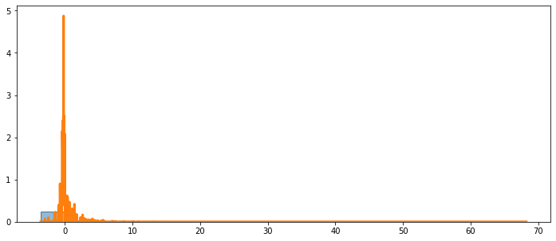


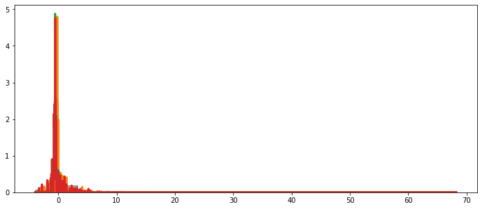


```python
matrix_org = np.array([support_org,density_org]).T
matrix_gen = np.array([support_gen,density_gen]).T
matrix_gen_2 = np.array([support_gen_2,density_gen_2]).T

matrix_org_s = matrix_org[choice,:]
matrix_gen_s = matrix_gen[choice,:]
matrix_gen_s_2 = matrix_gen_2[choice,:]

len(matrix_org_s)
```


    65


*Can also add relative as opposed to absolute metrics here in the future*


```python
dict_curve(matrix_org_s, matrix_gen_s)
```


    {'Area Between Curves': 0.0019,
     'Curve Length Difference': 5.09634,
     'Discrete Frechet Distance': 0.03834,
     'Dynamic Time Warping': 0.17651,
     'KS Statistic X x Y': 0.96923,
     'Partial Curve Mapping': 1.19651}


```python
dict_curve(matrix_org_s, matrix_gen_s_2)
```


    {'Area Between Curves': 0.08469,
     'Curve Length Difference': 11.57991,
     'Discrete Frechet Distance': 0.38858,
     'Dynamic Time Warping': 11.13309,
     'KS Statistic X x Y': 0.96923,
     'Partial Curve Mapping': 8.80795}


### Input (Matrix) Similarity

Dissimilarity Matrics, Normalised Matrix, Two Dimesional Histogram, Covariance Matrics, Upper-Triangular Matrix,  Unitary Arrays, Eigen Vectors

##### **Square Matrix Similarity Tests**


```python
import ecopy
from sklearn.preprocessing import MinMaxScaler, StandardScaler
# scaler = MinMaxScaler()
scaler = StandardScaler()
fraction = 0.01
df_org_out_scaled = pd.DataFrame(scaler.fit_transform(df_org_out), columns=df_org_out.columns).sample(frac=fraction)
df_gen_out_scaled = pd.DataFrame(scaler.transform(df_gen_out), columns=df_org_out.columns).sample(frac=fraction)
df_gen_out_scaled_2 = pd.DataFrame(scaler.transform(df_gen_out_2), columns=df_org_out.columns).sample(frac=fraction)
```


```python
import pandasvault as pv
qconstant_col = pv.constant_feature_detect(data=df_org_out_scaled,threshold=0.85)
```

    39  variables are found to be almost constant


```python
df_org_out_scaled = df_org_out_scaled.drop(qconstant_col, axis=1)
df_gen_out_scaled = df_gen_out_scaled.drop(qconstant_col, axis=1)
df_gen_out_scaled_2 = df_gen_out_scaled_2.drop(qconstant_col, axis=1)
```

Creates a dissimilarity matrix (distance between rows), it is a matrix that expresses the similarity pair to pair between two sets. It's square and symmetric. Because you are taking distance measures, you have to scale the data. Better for 2D historgram or shapley values. https://fukamilab.github.io/BIO202/06-C-matrix-comparison.html


```python
import ecopy as ep
## ep.transform(varespec, method='total', axis=1) # can also scale other methods
dist_org = ep.distance(df_org_out_scaled, 'euclidean') #'bray'
dist_gen = ep.distance(df_gen_out_scaled, 'euclidean')
dist_gen_2 = ep.distance(df_gen_out_scaled_2, 'euclidean')


def dist_stats(dist_org,dist_gen):
  pvalue = {}
  stat ={}
  ### The mantel test would actually work very well for shapley values (output that is the same)
  ### Low p-value signifies similarity (r_obs is the statistic)
  mant = ep.Mantel(dist_org,dist_gen )
  pvalue["mantel"] = mant.pval
  stat["mantel"] = mant.r_obs


  ### Conducts permutation procrustes test of relationship between two non-diagonal (raw) matrices
  ### Low p-value signifies similarity (ml2 is the statistic)
  ep_test = ep.procrustes_test(dist_org,dist_gen)
  pvalue["procrustes"] = ep_test.pval
  stat["procrustes"] = ep_test.m12_obs

  # RDA Analysis
  # All values should be 1
  rd = ep.rda(dist_org,dist_gen )

  pvalue["rda"] = round(1- rd.R2,5)
  stat["rda"] = rd.R2a

  return pvalue, stat


pvalue, stat = dist_stats(dist_org,dist_gen)
print(pvalue)
print(stat)

pvalue_2, stat_2 = dist_stats(dist_org,dist_gen_2)
print(pvalue_2)
print(stat_2)

## mantel, proscrutes, rda -- all pvalue 0.0 for similarity
## mantel, proscrutes, rda -- highest/lowest stats, 1, 0, 1. 
## values to focus on -- mantel, proscrutes
```

    Warning: X is a numpy array but not a design matrix. Make sure that matrix X represents the model you wish to analyze. Use patsy.dmatrix if unsure
    {'mantel': 1.0, 'procrustes': 0.6766766766766766, 'rda': 0.00749}
    {'mantel': -0.010194218687066232, 'procrustes': 0.9836169241954136, 'rda': 3.4350820047610826}
    Warning: X is a numpy array but not a design matrix. Make sure that matrix X represents the model you wish to analyze. Use patsy.dmatrix if unsure
    {'mantel': 0.22622622622622623, 'procrustes': 0.34734734734734735, 'rda': 0.00063}
    {'mantel': 0.0133473108802217, 'procrustes': 0.977812706884194, 'rda': 1.20617476435566}


##### **Matrics Divergence Metrics**


```python
## values should be zero for no divergence
## all prefer to be of same lenght
def distribution_matrix(a,b):
  dict_add = {}               
  dict_add["jensen_shannon_divergence"] = 1 - np.nanmean(jensen_shannon_divergence(a,b))
  dict_add["ks_statistic"] = ks_statistic(a,b)
  dict_add["ks_statistic_kde"] = ks_statistic_kde(a,b)
  dict_add["js_metric"] = js_metric(a,b)
  x = kl_divergence(a,b)
  x[x == -np.inf] = np.nan
  dict_add["kl_divergence"] = 1-np.nanmean(jensen_shannon_divergence(a,b))
  return dict_add
```

Honestly many are just averages.


```python
#small sample, distance matrix, not that interesting
dist_gen.shape
```


    (326, 326)


```python
distribution_matrix(dist_org, dist_gen)
```


    {'jensen_shannon_divergence': 0.017649899204967512,
     'js_metric': 0.10688993020711857,
     'kl_divergence': 0.017649899204967512,
     'ks_statistic': 0.026556406616591338,
     'ks_statistic_kde': 0.07151440058288851}


```python
distribution_matrix(dist_org, dist_gen_2)
```


    {'jensen_shannon_divergence': 0.015377101118877912,
     'js_metric': 0.0774103544551059,
     'kl_divergence': 0.015377101118877912,
     'ks_statistic': 0.07401339949099883,
     'ks_statistic_kde': 0.061173584454389474}


```python
distribution_matrix(dist_org, dist_org)
```


    {'jensen_shannon_divergence': 0.0,
     'js_metric': 0.0,
     'kl_divergence': 0.0,
     'ks_statistic': 0.0,
     'ks_statistic_kde': 0.0}


##### **Dissimilarity Multiples Any Matrix**


```python
from sklearn.preprocessing import MinMaxScaler, StandardScaler
from collections import OrderedDict

# each time different answer (multiple runs might be needed)
# many of these values should be one, and infact a deduction then absolute will work
# can use this for equal or unequal lenght matrixes
def dissimilarity_multiples_pd(df_org_out,df_gen_out):

	scaler = MinMaxScaler()
	fraction = 0.9
	df_org_out_sc = pd.DataFrame(scaler.fit_transform(df_org_out), columns=df_org_out.columns).sample(frac=fraction)
	df_gen_out_sc = pd.DataFrame(scaler.transform(df_gen_out), columns=df_org_out.columns).sample(frac=fraction)


	scaler = StandardScaler()
	fraction = 0.02
	df_org_out_scaled = pd.DataFrame(scaler.fit_transform(df_org_out), columns=df_org_out.columns).sample(frac=fraction)
	df_gen_out_scaled = pd.DataFrame(scaler.transform(df_gen_out), columns=df_org_out.columns).sample(frac=fraction)

	d_m_m = OrderedDict()

	# calculate frechet inception distance
	d_m_m["fid_one"] = fid_1(df_org_out_sc,df_gen_out_sc)

	# calculate frechet inception distance
	d_m_m["fid_two"] = fid_2(df_org_out_sc,df_gen_out_sc)

	# inception divergence multiple
	d_m_m["incept_multi"] = abs(inception(df_gen_out_sc)/inception(df_org_out_sc)-1)

	# centropy (unstable, keeping in for now)
	#stable = 1/abs(centropy(df_org_out_scaled,df_org_out_scaled)/centropy(df_org_out_scaled,df_org_out_scaled)-1)
	# hold = (1/(abs(centropy(df_org_out_scaled,df_org_out_scaled)/centropy(df_org_out_scaled,df_org_out_scaled)-1)))
	d_m_m["cent_multi"] = (1/(abs(centropy(df_org_out_scaled,df_org_out_scaled)/centropy(df_org_out_scaled,df_gen_out_scaled)-1)))
 
	# ctc (unstable)
	#d_m_m["ctc_multi"] = abs(ctc(df_gen_out_scaled, df_org_out_scaled)/ctc(df_org_out_scaled, df_gen_out_scaled))

	## might still have to adjust this
	#d_m_m["kldiv_multi"] = abs(abs(kldiv(df_gen_out_scaled.values,df_gen_out_scaled.values)/abs(kldiv(df_org_out_scaled.values,df_org_out_scaled.values)))-1)
	hold = kldiv(df_org_out_scaled.values,df_org_out_scaled.values)/kldiv(df_org_out_scaled.values,df_org_out_scaled.values)
	d_m_m["kldiv_multi"] = abs(kldiv(df_org_out_scaled.values,df_org_out_scaled.values)/kldiv(df_gen_out_scaled.values,df_gen_out_scaled.values)-hold)


	## starting with discrete (would be recommended to use unscaled)

	d_m_m["entropyd_multi"] = abs(entropyd(df_gen_out_scaled.astype(int))/entropyd(df_org_out_scaled.astype(int))-1)

	d_m_m["midd_multi"] = abs(midd(df_gen_out_scaled.astype(int).values, df_gen_out_scaled.astype(int).values, base=10)/midd(df_org_out_scaled.astype(int).values, df_org_out_scaled.astype(int).values, base=10)-1)

	d_m_m["centropyd_multi"] = abs(centropyd(df_gen_out_scaled.astype(int).values, df_org_out_scaled.astype(int).values, base=10)/centropyd(df_org_out_scaled.astype(int).values, df_gen_out_scaled.astype(int).values, base=10)-1)


	hold = ctcd(df_org_out_scaled.astype(int),df_org_out_scaled.astype(int) )/ctcd(df_org_out_scaled.astype(int),df_org_out_scaled.astype(int) )
	d_m_m["ctcd_multi"] = abs(ctcd(df_gen_out_scaled.astype(int),df_org_out_scaled.astype(int) )/ctcd(df_org_out_scaled.astype(int),df_gen_out_scaled.astype(int) )-hold)

	d_m_m["corexd_multi"] = abs(corexd(df_gen_out_scaled.astype(int),df_gen_out_scaled.astype(int) )/corexd(df_org_out_scaled.astype(int),df_org_out_scaled.astype(int) )-1)

	# starting with mixed

	d_m_m["corexdc_multi"] = abs(corexdc(df_org_out_scaled.values, df_gen_out_scaled.values)/corexdc(df_org_out_scaled.values, df_org_out_scaled.values)-1)

	d_m_m["ctcdc_mult"] = abs(ctcdc(df_org_out_scaled.values, df_gen_out_scaled.values)/ctcdc(df_org_out_scaled.values, df_org_out_scaled.values)-1)

	#unstable
	stable = mutual_information_2d(df_org_out_scaled.values.ravel(), df_org_out_scaled.values.ravel())/mutual_information_2d(df_org_out_scaled.values.ravel(), df_org_out_scaled.values.ravel())
	d_m_m["mutual2d"] = mutual_information_2d(df_org_out_scaled.values.ravel(), df_org_out_scaled.values.ravel())/mutual_information_2d(df_gen_out_scaled.values.ravel(), df_org_out_scaled.values.ravel()) -stable

	# could add the self-deduction here
	# stable = abs(mutual_information((df_org_out_scaled, df_org_out_scaled))/mutual_information((df_org_out_scaled, df_org_out_scaled)))
	d_m_m["mutual_mult"] = abs(mutual_information((df_gen_out_scaled, df_gen_out_scaled))/mutual_information((df_org_out_scaled, df_gen_out_scaled)))

	#d_m_m["corex"] = abs(corex(df_org_out_scaled,df_org_out_scaled)/corex(df_org_out_scaled,df_gen_out_scaled)) #correlation not distance
	#d_m_m["minfo"] = mi(df_org_out_scaled,df_org_out_scaled, base=2, alpha=0)/mi(df_org_out_scaled,df_gen_out_scaled, base=2, alpha=0) #could work

	return OrderedDict([(key,round(abs(ra),5)) for key, ra in d_m_m.items()])
```


```python
## each time a different answer, information theoretic
multiples = dissimilarity_multiples_pd(df_org_out,df_gen_out ); multiples
```


    OrderedDict([('fid_one', 0.37935),
                 ('fid_two', 0.61592),
                 ('incept_multi', 1.67129),
                 ('cent_multi', 2.47002),
                 ('kldiv_multi', 0.38351),
                 ('entropyd_multi', 0.02572),
                 ('midd_multi', 0.02572),
                 ('centropyd_multi', 1.00703),
                 ('ctcd_multi', 1.20725),
                 ('corexd_multi', 0.09213),
                 ('corexdc_multi', 0.17921),
                 ('ctcdc_mult', 0.1785),
                 ('mutual2d', 3.00027),
                 ('mutual_mult', 0.07305)])


```python
multiples_2 = dissimilarity_multiples_pd(df_org_out,df_gen_out_2 ); multiples_2
```


    {'cent_multi': 2.64785,
     'centropyd_multi': 10.38788,
     'corexd_multi': 0.10068,
     'corexdc_multi': 0.34265,
     'ctcd_multi': 13.73165,
     'ctcdc_mult': 0.34128,
     'entropyd_multi': 0.04809,
     'fid_one': 0.67098,
     'fid_two': 0.81914,
     'incept_multi': 1.53731,
     'kldiv_multi': 1.35864,
     'midd_multi': 0.04809,
     'mutual2d': 2.05895,
     'mutual_mult': 0.09222}


```python
control = dissimilarity_multiples_pd(df_org_out,df_org_out ); control
```


    {'cent_multi': 2.32029,
     'centropyd_multi': 0.13744,
     'corexd_multi': 0.00163,
     'corexdc_multi': 0.08795,
     'ctcd_multi': 0.07192,
     'ctcdc_mult': 0.08761,
     'entropyd_multi': 0.00637,
     'fid_one': 0.00027,
     'fid_two': 0.01652,
     'incept_multi': 0.01016,
     'kldiv_multi': 0.17955,
     'midd_multi': 0.00637,
     'mutual2d': 0.61025,
     'mutual_mult': 0.07344}


```python
control = dissimilarity_multiples_pd(df_org_out,df_org_out ); control
```


    {'cent_multi': 2.32378,
     'centropyd_multi': 0.12948,
     'corexd_multi': 0.04292,
     'corexdc_multi': 0.07877,
     'ctcd_multi': nan,
     'ctcdc_mult': 0.07846,
     'entropyd_multi': 0.00732,
     'fid_one': 0.00024,
     'fid_two': 0.01561,
     'incept_multi': 0.00622,
     'kldiv_multi': 0.1868,
     'midd_multi': 0.00732,
     'mutual2d': 0.64399,
     'mutual_mult': 0.06583}


```python
{k: round(multiples_2[k]-multiples[k],5) for k in multiples.keys() & multiples_2}
```


    {'cent_multi': 0.1284200000000002,
     'centropyd_multi': 7.685429999999999,
     'corexd_multi': 0.009720000000000006,
     'corexdc_multi': 0.11227000000000001,
     'ctcd_multi': 11.27823,
     'ctcdc_mult': 0.11183999999999997,
     'entropyd_multi': 0.006859999999999998,
     'fid_one': 0.2918,
     'fid_two': 0.20335999999999999,
     'incept_multi': -0.17361000000000004,
     'kldiv_multi': 0.60704,
     'midd_multi': 0.006859999999999998,
     'mutual2d': 0.05569999999999986,
     'mutual_mult': 0.012920000000000001}


```python
{k: round(multiples[k]-control[k],5) for k in control.keys() & multiples}
```


    {'cent_multi': 0.19564999999999966,
     'centropyd_multi': 2.5729699999999998,
     'corexd_multi': 0.04804,
     'corexdc_multi': 0.15161,
     'ctcd_multi': nan,
     'ctcdc_mult': 0.15098,
     'entropyd_multi': 0.03391,
     'fid_one': 0.37894,
     'fid_two': 0.60017,
     'incept_multi': 1.7047,
     'kldiv_multi': 0.5648000000000001,
     'midd_multi': 0.03391,
     'mutual2d': 1.35926,
     'mutual_mult': 0.013469999999999996}


2D Histogram

These are the normalised verions. This requires a preselection of the variables of interest.


```python
hist_org, _,_ = np.histogram2d(df_org_out_scaled["Age"], df_org_out_scaled["Hours per week"],bins=20, density=True)
```


```python
hist_gen, _,_ = np.histogram2d(df_gen_out_scaled["Age"], df_gen_out_scaled["Hours per week"],bins=20, density=True)
```


```python
hist_gen_2, _,_ = np.histogram2d(df_gen_out_scaled_2["Age"], df_gen_out_scaled_2["Hours per week"],bins=20, density=True)
```


```python
#dissimilarity_multiples_pd(hist_gen,df_org_out )
```

##### **Distance (Similarity) Measures (2D Hist) Any Matrix**


```python
from collections import OrderedDict

from scipy.spatial.distance import directed_hausdorff
## everything is converted to distance measures/.

def matrix_distance(a,b, skip_bhat=False):
  dict_dist = OrderedDict()
  #similarity
  dict_dist["correlation"] = correlation(a, b)-correlation(a,a)
  dict_dist["intersection"] = return_intersection(a, b)-return_intersection(a,a)
  dict_dist["renyi_divergence"] =  abs(renyi_divergence(a,b))-abs(renyi_divergence(a,a))
  dict_dist["pearson_rho"] = np.nanmean(pearson_rho(a,b))-np.nanmean(pearson_rho(a,a))
  dict_dist["jensen_shannon_divergence"] = np.nanmean(jensen_shannon_divergence(a,b))-np.nanmean(jensen_shannon_divergence(a,a))
  
  #distance
  dict_dist["dice"] = round(abs(dice(a, b)),5) - round(abs(dice(a, a)),5)
  dict_dist["kulsinski"] = round(kulsinski(a, b),5) - round(kulsinski(a, a),5)
  dict_dist["rogerstanimoto"] = round(abs(rogerstanimoto(a, b)),5) - round(abs(rogerstanimoto(a, a)),5)
  dict_dist["russellrao"] = round(abs(russellrao(a, b)),5) - round(abs(russellrao(a, a)),5)
  dict_dist["sokalmichener"] = round(abs(sokalmichener(a, b)),5)- round(abs(sokalmichener(a, a)),5)
  dict_dist["sokalsneath"] = round(abs(sokalsneath(a, b)),5) - round(abs(sokalsneath(a, a)),5)
  dict_dist["yule"] = round(yule(a, b),5) - round(yule(a, a),5)

  dict_dist["braycurtis"] = braycurtis(a, b)
  dict_dist["directed_hausdorff"] = directed_hausdorff(a,b)[0]
  dict_dist["manhattan"] = manhattan(a, b)
  dict_dist["cosine"] = np.abs(np.nanmedian(cosine(a,b)))
  dict_dist["sqeuclidean"] = np.abs(sqeuclidean(a, b))
  dict_dist["chi2"] =  chi2_distance(a, b, eps = 1e-10)
  dict_dist["euclidean"] =  euclidean_distance(a,b)
  dict_dist["variational"] =  variational_distance(a,b)
  dict_dist["kulczynski"] = kulSim(a, b)
  dict_dist["bray"] = braySim(a, b, t="1")
  dict_dist["gower"] = gowerSim(a, b)
  dict_dist["hellinger"] = chordDis(a, b, t="1")
  dict_dist["czekanowski"] = charDist(a, b, t="1")
  dict_dist["whittaker"] = np.mean(whitDist(a, b, t="1"))
  dict_dist["canberra"] = canDist(a, b, t="1")

 
  return OrderedDict([(key,round(abs(ra),5)) for key, ra in dict_dist.items()])
```


```python
gen_hist_one = matrix_distance(hist_org,hist_gen); gen_hist_one
```


    OrderedDict([('correlation', 0.97827),
                 ('intersection', 0.83173),
                 ('renyi_divergence', 75.43209),
                 ('pearson_rho', 0.85235),
                 ('jensen_shannon_divergence', 0.52169),
                 ('dice', 0.23055),
                 ('kulsinski', 0.07562),
                 ('rogerstanimoto', 0.03647),
                 ('russellrao', 0.13839),
                 ('sokalmichener', 0.03647),
                 ('sokalsneath', 0.07449),
                 ('yule', 0.79055),
                 ('braycurtis', 0.81567),
                 ('directed_hausdorff', 0.70096),
                 ('manhattan', 22.04961),
                 ('cosine', 0.83316),
                 ('sqeuclidean', 1.64816),
                 ('chi2', 10.07743),
                 ('euclidean', 2.77102),
                 ('variational', 22.04961),
                 ('kulczynski', 0.90221),
                 ('bray', 0.81567),
                 ('gower', 0.34712),
                 ('hellinger', 1.32203),
                 ('czekanowski', 1.10248),
                 ('whittaker', 0.04049),
                 ('canberra', 0.842)])


```python
gen_hist_two =  matrix_distance(hist_org,hist_gen_2); gen_hist_two
```


    OrderedDict([('correlation', 0.90794),
                 ('intersection', 0.69145),
                 ('renyi_divergence', 50.04393),
                 ('pearson_rho', 0.93965),
                 ('jensen_shannon_divergence', 0.61565),
                 ('dice', 0.22834),
                 ('kulsinski', 0.0768),
                 ('rogerstanimoto', 0.00271),
                 ('russellrao', 0.14503),
                 ('sokalmichener', 0.00271),
                 ('sokalsneath', 0.07391),
                 ('yule', 0.55622),
                 ('braycurtis', 0.77497),
                 ('directed_hausdorff', 0.70369),
                 ('manhattan', 14.91339),
                 ('cosine', 1.64575),
                 ('sqeuclidean', 1.44862),
                 ('chi2', 6.53208),
                 ('euclidean', 2.00967),
                 ('variational', 14.91339),
                 ('kulczynski', 0.87016),
                 ('bray', 0.77497),
                 ('gower', 0.30248),
                 ('hellinger', 1.28198),
                 ('czekanowski', 0.74567),
                 ('whittaker', 0.03742),
                 ('canberra', 0.82091)])


*Gen two's '''age''' and '''hours per work''' 2D distribution is closer to the original data.*


```python
{k: round(gen_hist_two[k]-gen_hist_one[k],5) for k in gen_hist_one.keys() & gen_hist_two}
```


    {'bray': -0.0407,
     'braycurtis': -0.0407,
     'canberra': -0.02109,
     'chi2': -3.54535,
     'correlation': -0.07033,
     'cosine': 0.81259,
     'czekanowski': -0.35681,
     'dice': -0.00221,
     'directed_hausdorff': 0.00273,
     'euclidean': -0.76135,
     'gower': -0.04464,
     'hellinger': -0.04005,
     'intersection': -0.14028,
     'jensen_shannon_divergence': 0.09396,
     'kulczynski': -0.03205,
     'kulsinski': 0.00118,
     'manhattan': -7.13622,
     'pearson_rho': 0.0873,
     'renyi_divergence': -25.38816,
     'rogerstanimoto': -0.03376,
     'russellrao': 0.00664,
     'sokalmichener': -0.03376,
     'sokalsneath': -0.00058,
     'sqeuclidean': -0.19954,
     'variational': -7.13622,
     'whittaker': -0.00307,
     'yule': -0.23433}


```python
from sklearn.preprocessing import MinMaxScaler, StandardScaler
## i have to redo this completley do the minus one
def dissimilarity_multiples_np(df_org_out,df_gen_out):
  d_m_m = OrderedDict()
  df_org_out = pd.DataFrame(df_org_out)
  df_gen_out = pd.DataFrame(df_gen_out)

  d_m_m["incept_multi"] = abs(inception(df_gen_out)/inception(df_org_out)-1)

  d_m_m["cent_multi"] = (abs(centropy(df_org_out,df_org_out)/centropy(df_org_out,df_gen_out)-1))
  place = abs(ctc(df_org_out, df_org_out)/ctc(df_org_out, df_org_out))
  d_m_m["ctc_multi"] = abs(abs(ctc(df_gen_out, df_org_out)/ctc(df_org_out, df_gen_out))-place)
  d_m_m["corexd_multi"] = abs(corexd(df_gen_out,df_gen_out )/corexd(df_org_out,df_org_out )-1)

  d_m_m["corexdc_multi"] = abs(corexdc(df_org_out, df_gen_out)/corexdc(df_org_out, df_org_out)-1)
  d_m_m["ctcdc_mult"] = abs(ctcdc(df_org_out, df_gen_out)/ctcdc(df_org_out, df_org_out)-1)
  hold = abs(mutual_information((df_org_out, df_org_out))/mutual_information((df_org_out, df_org_out)))
  d_m_m["mutual_mult"] = abs(abs(mutual_information((df_gen_out, df_gen_out))/mutual_information((df_org_out, df_gen_out))) - hold)

  #d_m_m["corex"] = abs(corex(df_org_out,df_org_out)/corex(df_org_out,df_gen_out)) #correlation not distance
  hold = mi(df_org_out,df_org_out, base=2, alpha=0)/mi(df_org_out,df_org_out, base=2, alpha=0)
  d_m_m["minfo"] = abs(mi(df_org_out,df_org_out, base=2, alpha=0)/mi(df_org_out,df_gen_out, base=2, alpha=0) - hold) #could work

  return OrderedDict([(key,round(abs(ra),5)) for key, ra in d_m_m.items()])
```


```python
diss_np_one = dissimilarity_multiples_np(hist_org,hist_gen); diss_np_one
```


    {'cent_multi': 1.77179,
     'corexd_multi': 0.04318,
     'corexdc_multi': 0.19808,
     'ctc_multi': 13.09376,
     'ctcdc_mult': 0.20169,
     'incept_multi': 0.02988,
     'minfo': 7.63882,
     'mutual_mult': 0.80422}


```python
diss_np_two =dissimilarity_multiples_np(hist_org,hist_gen_2); diss_np_two
```


    {'cent_multi': 3.45718,
     'corexd_multi': 0.03719,
     'corexdc_multi': 0.19576,
     'ctc_multi': 0.03558,
     'ctcdc_mult': 0.19932,
     'incept_multi': 0.09814,
     'minfo': 3.65902,
     'mutual_mult': 0.76373}


The dissimilarity measures, mostly show the same result as the distance measures (6/8), gen two is closer to the real data for the 2D distribution.


```python
{k: round(diss_np_two[k]-diss_np_one[k],5) for k in diss_np_one.keys() & diss_np_two}
```


    {'cent_multi': 1.68539,
     'corexd_multi': -0.00599,
     'corexdc_multi': -0.00232,
     'ctc_multi': -13.05818,
     'ctcdc_mult': -0.00237,
     'incept_multi': 0.06826,
     'minfo': -3.9798,
     'mutual_mult': -0.04049}


```python
dissimilarity_multiples_np(hist_org,hist_org)
```


    {'cent_multi': 0.0,
     'corexd_multi': 0.0,
     'corexdc_multi': 0.0,
     'ctc_multi': 0.1301,
     'ctcdc_mult': 0.0,
     'incept_multi': 0.0,
     'minfo': 0.07046,
     'mutual_mult': 0.0}


Creates a dissimilarity matrix (distance between rows), it is a matrix that expresses the similarity pair to pair between two sets.


```python
import ecopy as ep
## ep.transform(varespec, method='total', axis=1) # can also scale other methods
dist_org = ep.distance((hist_org +1), 'euclidean') #'bray'
dist_gen = ep.distance((hist_gen +1), 'euclidean')

pvalue, stat = dist_stats(dist_org,dist_gen)

print("p-values: ")
print(pvalue)
print("statistics: ")
print(stat)
```

    Warning: X is a numpy array but not a design matrix. Make sure that matrix X represents the model you wish to analyze. Use patsy.dmatrix if unsure
    p-values: 
    {'mantel': 0.022022022022022022, 'procrustes': 0.0, 'rda': 0.0}
    statistics: 
    {'mantel': 0.40910447325950305, 'procrustes': 0.6069430306324964, 'rda': 1.000000000000038}


##### **2D Histogram to Distance Matrix Similarity Tests**


```python
import ecopy as ep
dist_gen_2 = ep.distance((hist_gen_2 +1), 'euclidean')
pvalue, stat = dist_stats(dist_org,dist_gen_2)

print("p-values: ")
print(pvalue)
print("statistics: ")
print(stat)
```

    Warning: X is a numpy array but not a design matrix. Make sure that matrix X represents the model you wish to analyze. Use patsy.dmatrix if unsure
    p-values: 
    {'mantel': 0.001001001001001001, 'procrustes': 0.0, 'rda': 0.0}
    statistics: 
    {'mantel': 0.5596098628610784, 'procrustes': 0.4539913913011999, 'rda': 1.0000000000010485}


##### **Decomposition Metrics**


```python
cov_org = np.cov(df_org_out_scaled.T)
cov_gen = np.cov(df_gen_out_scaled.T)
cov_gen_2 = np.cov(df_gen_out_scaled_2.T)
```


```python
matrix_distance(cov_org,cov_gen,skip_bhat=True)
```


    OrderedDict([('correlation', 0.04563),
                 ('intersection', 0.91358),
                 ('renyi_divergence', nan),
                 ('pearson_rho', 0.03682),
                 ('jensen_shannon_divergence', nan),
                 ('dice', 0.18451),
                 ('kulsinski', 0.07642),
                 ('rogerstanimoto', 0.05747),
                 ('russellrao', 0.12362),
                 ('sokalmichener', 0.05747),
                 ('sokalsneath', 0.02446),
                 ('yule', 0.0123),
                 ('braycurtis', 0.16026),
                 ('directed_hausdorff', 0.66355),
                 ('manhattan', 17.59742),
                 ('cosine', 0.01),
                 ('sqeuclidean', 2.00937),
                 ('chi2', 21.12187),
                 ('euclidean', 1.67037),
                 ('variational', 17.59742),
                 ('kulczynski', 0.95575),
                 ('bray', 0.91345),
                 ('gower', 0.29964),
                 ('hellinger', 0.29979),
                 ('czekanowski', 1.25696),
                 ('whittaker', 0.06525),
                 ('canberra', 1.2797)])


```python
matrix_distance(cov_org,cov_gen_2,skip_bhat=True)
```


    OrderedDict([('correlation', 0.1706),
                 ('intersection', 1.79426),
                 ('renyi_divergence', nan),
                 ('pearson_rho', 0.13745),
                 ('jensen_shannon_divergence', nan),
                 ('dice', 0.98207),
                 ('kulsinski', 1.10569),
                 ('rogerstanimoto', 0.29365),
                 ('russellrao', 0.72506),
                 ('sokalmichener', 0.29365),
                 ('sokalsneath', 0.24035),
                 ('yule', 0.07005),
                 ('braycurtis', 0.38415),
                 ('directed_hausdorff', 1.24264),
                 ('manhattan', 32.91104),
                 ('cosine', 0.02941),
                 ('sqeuclidean', 7.19549),
                 ('chi2', 0.82702),
                 ('euclidean', 3.10601),
                 ('variational', 32.91104),
                 ('kulczynski', 1.32992),
                 ('bray', 1.76783),
                 ('gower', 0.40977),
                 ('hellinger', 0.57928),
                 ('czekanowski', 2.35079),
                 ('whittaker', 0.12345),
                 ('canberra', 0.06333)])


```python
matrix_distance(cov_org,cov_org,skip_bhat=True)
```


    OrderedDict([('correlation', 0.0),
                 ('intersection', 0.0),
                 ('renyi_divergence', nan),
                 ('pearson_rho', 0.0),
                 ('jensen_shannon_divergence', nan),
                 ('dice', 0.0),
                 ('kulsinski', 0.0),
                 ('rogerstanimoto', 0.0),
                 ('russellrao', 0.0),
                 ('sokalmichener', 0.0),
                 ('sokalsneath', 0.0),
                 ('yule', 0.0),
                 ('braycurtis', 0.0),
                 ('directed_hausdorff', 0.0),
                 ('manhattan', 0.0),
                 ('cosine', 0.0),
                 ('sqeuclidean', 0.0),
                 ('chi2', 0.0),
                 ('euclidean', 0.0),
                 ('variational', 0.0),
                 ('kulczynski', 0.0),
                 ('bray', 0.0),
                 ('gower', 0.0),
                 ('hellinger', 0.0),
                 ('czekanowski', 0.0),
                 ('whittaker', 0.0),
                 ('canberra', 0.0)])


*Concerning covariance between variables, gen 1 does much better than gen 2.*


```python
np.median((abs(cov_org-cov_gen)/abs(cov_org))) 
```


    0.3882191780821917


```python
np.median((abs(cov_org-cov_gen_2)/abs(cov_org))) 
```


    0.7493489443092978


*SVD*


```python
u, s, vh_org = np.linalg.svd(df_org_out_scaled, full_matrices=True)
u, s, vh_gen = np.linalg.svd(df_gen_out_scaled, full_matrices=True)
u, s, vh_gen_2 = np.linalg.svd(df_gen_out_scaled_2, full_matrices=True)
```

*Generally vh_gen_2 is more distant*


```python
pd.DataFrame([matrix_distance(vh_org,ra,skip_bhat=True) for ra in [vh_gen, vh_gen_2]],index=["vh_gen", "vh_gen_2"])
```


<div>
<style scoped>
    .dataframe tbody tr th:only-of-type {
        vertical-align: middle;
    }

    .dataframe tbody tr th {
        vertical-align: top;
    }

    .dataframe thead th {
        text-align: right;
    }
</style>
<table border="1" class="dataframe">
  <thead>
    <tr style="text-align: right;">
      <th></th>
      <th>correlation</th>
      <th>intersection</th>
      <th>renyi_divergence</th>
      <th>pearson_rho</th>
      <th>jensen_shannon_divergence</th>
      <th>dice</th>
      <th>kulsinski</th>
      <th>rogerstanimoto</th>
      <th>russellrao</th>
      <th>sokalmichener</th>
      <th>sokalsneath</th>
      <th>yule</th>
      <th>braycurtis</th>
      <th>directed_hausdorff</th>
      <th>manhattan</th>
      <th>cosine</th>
      <th>sqeuclidean</th>
      <th>chi2</th>
      <th>euclidean</th>
      <th>variational</th>
      <th>kulczynski</th>
      <th>bray</th>
      <th>gower</th>
      <th>hellinger</th>
      <th>czekanowski</th>
      <th>whittaker</th>
      <th>canberra</th>
    </tr>
  </thead>
  <tbody>
    <tr>
      <th>vh_gen</th>
      <td>0.76780</td>
      <td>8.36942</td>
      <td>NaN</td>
      <td>0.76733</td>
      <td>NaN</td>
      <td>4.07789</td>
      <td>1.86230</td>
      <td>0.25003</td>
      <td>0.76578</td>
      <td>0.25003</td>
      <td>1.13238</td>
      <td>0.08505</td>
      <td>0.80263</td>
      <td>1.26734</td>
      <td>45.67516</td>
      <td>0.32606</td>
      <td>5.37577</td>
      <td>1.236811e+02</td>
      <td>4.63053</td>
      <td>45.67516</td>
      <td>2.91495</td>
      <td>8.49475</td>
      <td>0.48274</td>
      <td>1.23756</td>
      <td>3.26251</td>
      <td>0.60803</td>
      <td>3.484290e+00</td>
    </tr>
    <tr>
      <th>vh_gen_2</th>
      <td>1.19863</td>
      <td>8.54613</td>
      <td>NaN</td>
      <td>1.19744</td>
      <td>NaN</td>
      <td>8.33349</td>
      <td>1.46006</td>
      <td>0.21033</td>
      <td>1.20098</td>
      <td>0.21033</td>
      <td>0.07598</td>
      <td>0.08131</td>
      <td>1.22674</td>
      <td>1.41421</td>
      <td>57.92457</td>
      <td>1.36981</td>
      <td>0.25175</td>
      <td>1.999999e+10</td>
      <td>5.79892</td>
      <td>57.92457</td>
      <td>1.32123</td>
      <td>140.30718</td>
      <td>0.54363</td>
      <td>1.54983</td>
      <td>4.13747</td>
      <td>0.60110</td>
      <td>1.083172e+13</td>
    </tr>
  </tbody>
</table>
</div>


QR Decomposition


```python
q_org, r_org = np.linalg.qr(df_org_out_scaled)
q_gen, r_gen = np.linalg.qr(df_gen_out_scaled)
q_gen_2, r_gen_2 = np.linalg.qr(df_gen_out_scaled_2)
```


```python
qr_dist = pd.DataFrame([matrix_distance(r_org,ra,skip_bhat=True) for ra in [r_gen, r_gen_2]],index=["r_gen", "r_gen_2"]) ;qr_dist
```


<div>
<style scoped>
    .dataframe tbody tr th:only-of-type {
        vertical-align: middle;
    }

    .dataframe tbody tr th {
        vertical-align: top;
    }

    .dataframe thead th {
        text-align: right;
    }
</style>
<table border="1" class="dataframe">
  <thead>
    <tr style="text-align: right;">
      <th></th>
      <th>correlation</th>
      <th>intersection</th>
      <th>renyi_divergence</th>
      <th>pearson_rho</th>
      <th>jensen_shannon_divergence</th>
      <th>dice</th>
      <th>kulsinski</th>
      <th>rogerstanimoto</th>
      <th>russellrao</th>
      <th>sokalmichener</th>
      <th>sokalsneath</th>
      <th>yule</th>
      <th>braycurtis</th>
      <th>directed_hausdorff</th>
      <th>manhattan</th>
      <th>cosine</th>
      <th>sqeuclidean</th>
      <th>chi2</th>
      <th>euclidean</th>
      <th>variational</th>
      <th>kulczynski</th>
      <th>bray</th>
      <th>gower</th>
      <th>hellinger</th>
      <th>czekanowski</th>
      <th>whittaker</th>
      <th>canberra</th>
    </tr>
  </thead>
  <tbody>
    <tr>
      <th>r_gen</th>
      <td>0.98718</td>
      <td>9.53792</td>
      <td>NaN</td>
      <td>0.99534</td>
      <td>NaN</td>
      <td>163.87739</td>
      <td>0.11702</td>
      <td>0.32291</td>
      <td>330.99193</td>
      <td>0.32291</td>
      <td>0.03331</td>
      <td>0.73742</td>
      <td>1.12409</td>
      <td>25.41157</td>
      <td>581.03657</td>
      <td>1.95728</td>
      <td>5182.57853</td>
      <td>2093.70333</td>
      <td>97.20500</td>
      <td>581.03657</td>
      <td>NaN</td>
      <td>80.71326</td>
      <td>2.35238</td>
      <td>1.4058</td>
      <td>41.50261</td>
      <td>0.64179</td>
      <td>3.38858</td>
    </tr>
    <tr>
      <th>r_gen_2</th>
      <td>1.02600</td>
      <td>8.59578</td>
      <td>NaN</td>
      <td>1.05558</td>
      <td>NaN</td>
      <td>153.34052</td>
      <td>0.04168</td>
      <td>0.88999</td>
      <td>323.90038</td>
      <td>0.88999</td>
      <td>0.01486</td>
      <td>2.58608</td>
      <td>1.16364</td>
      <td>24.78121</td>
      <td>571.78230</td>
      <td>0.00000</td>
      <td>3526.22824</td>
      <td>13433.64930</td>
      <td>98.63027</td>
      <td>571.78230</td>
      <td>NaN</td>
      <td>54.25911</td>
      <td>2.33357</td>
      <td>1.4332</td>
      <td>40.84159</td>
      <td>0.61816</td>
      <td>9.18467</td>
    </tr>
  </tbody>
</table>
</div>


Larger than one means gen two is worse


```python
(qr_dist.T["r_gen_2"]/qr_dist.T["r_gen"]).median()
```


    0.9840728269478803


```python
qr_dist.T["r_gen_2"]/qr_dist.T["r_gen"]
```


    correlation                  1.039324
    intersection                 0.901222
    renyi_divergence                  NaN
    pearson_rho                  1.060522
    jensen_shannon_divergence         NaN
    dice                         0.935703
    kulsinski                    0.356178
    rogerstanimoto               2.756155
    russellrao                   0.978575
    sokalmichener                2.756155
    sokalsneath                  0.446112
    yule                         3.506930
    braycurtis                   1.035184
    directed_hausdorff           0.975194
    manhattan                    0.984073
    cosine                       0.000000
    sqeuclidean                  0.680400
    chi2                         6.416214
    euclidean                    1.014663
    variational                  0.984073
    kulczynski                        NaN
    bray                         0.672245
    gower                        0.992004
    hellinger                    1.019491
    czekanowski                  0.984073
    whittaker                    0.963181
    canberra                     2.710478
    dtype: float64


Eigenvectors


```python
from scipy import linalg as LA
#centering the data

def evec(df_org_out_scaled):
  x  = df_org_out_scaled 
  x -= np.mean(x, axis = 0)  
  cov = np.cov(x, rowvar = False)
  evals , evecs = LA.eigh(cov)
  idx = np.argsort(evals)[::-1]
  return evecs[:,idx]
```


```python
evecs_org = evec(df_org_out_scaled)
evecs_gen = evec(df_gen_out_scaled)
evecs_gen_2 = evec(df_gen_out_scaled_2)
```


```python
eig_dist = pd.DataFrame([matrix_distance(evecs_org,ra,skip_bhat=True) for ra in [evecs_gen, evecs_gen_2]],index=["evecs_gen", "evecs_gen_2"]) ;eig_dist
```


<div>
<style scoped>
    .dataframe tbody tr th:only-of-type {
        vertical-align: middle;
    }

    .dataframe tbody tr th {
        vertical-align: top;
    }

    .dataframe thead th {
        text-align: right;
    }
</style>
<table border="1" class="dataframe">
  <thead>
    <tr style="text-align: right;">
      <th></th>
      <th>correlation</th>
      <th>intersection</th>
      <th>renyi_divergence</th>
      <th>pearson_rho</th>
      <th>jensen_shannon_divergence</th>
      <th>dice</th>
      <th>kulsinski</th>
      <th>rogerstanimoto</th>
      <th>russellrao</th>
      <th>sokalmichener</th>
      <th>sokalsneath</th>
      <th>yule</th>
      <th>braycurtis</th>
      <th>directed_hausdorff</th>
      <th>manhattan</th>
      <th>cosine</th>
      <th>sqeuclidean</th>
      <th>chi2</th>
      <th>euclidean</th>
      <th>variational</th>
      <th>kulczynski</th>
      <th>bray</th>
      <th>gower</th>
      <th>hellinger</th>
      <th>czekanowski</th>
      <th>whittaker</th>
      <th>canberra</th>
    </tr>
  </thead>
  <tbody>
    <tr>
      <th>evecs_gen</th>
      <td>0.79396</td>
      <td>6.89551</td>
      <td>NaN</td>
      <td>0.80875</td>
      <td>NaN</td>
      <td>1.09871</td>
      <td>1.02261</td>
      <td>0.3627</td>
      <td>0.79841</td>
      <td>0.3627</td>
      <td>0.16381</td>
      <td>0.18706</td>
      <td>0.77702</td>
      <td>1.14181</td>
      <td>44.26822</td>
      <td>0.92065</td>
      <td>10.16120</td>
      <td>2.776292e+01</td>
      <td>4.72816</td>
      <td>44.26822</td>
      <td>NaN</td>
      <td>47.18876</td>
      <td>0.47525</td>
      <td>1.26365</td>
      <td>3.16202</td>
      <td>0.65444</td>
      <td>2.711950e+00</td>
    </tr>
    <tr>
      <th>evecs_gen_2</th>
      <td>1.02533</td>
      <td>9.58618</td>
      <td>NaN</td>
      <td>1.04301</td>
      <td>NaN</td>
      <td>2.22486</td>
      <td>0.69267</td>
      <td>0.4011</td>
      <td>1.02826</td>
      <td>0.4011</td>
      <td>0.03630</td>
      <td>0.01714</td>
      <td>0.97477</td>
      <td>1.20473</td>
      <td>51.97008</td>
      <td>0.91150</td>
      <td>3.47396</td>
      <td>2.000003e+10</td>
      <td>5.36574</td>
      <td>51.97008</td>
      <td>0.7554</td>
      <td>189.87383</td>
      <td>0.50918</td>
      <td>1.43406</td>
      <td>3.71215</td>
      <td>0.66686</td>
      <td>2.177454e+13</td>
    </tr>
  </tbody>
</table>
</div>


```python
(eig_dist.T["evecs_gen_2"]/eig_dist.T["evecs_gen"]).median()
```


    1.1544179679956095


```python
eig_dist.T["evecs_gen_2"]/eig_dist.T["evecs_gen"]
```


    correlation                  1.291413e+00
    intersection                 1.390206e+00
    renyi_divergence                      NaN
    pearson_rho                  1.289657e+00
    jensen_shannon_divergence             NaN
    dice                         2.024975e+00
    kulsinski                    6.773550e-01
    rogerstanimoto               1.105873e+00
    russellrao                   1.287885e+00
    sokalmichener                1.105873e+00
    sokalsneath                  2.215982e-01
    yule                         9.162835e-02
    braycurtis                   1.254498e+00
    directed_hausdorff           1.055105e+00
    manhattan                    1.173982e+00
    cosine                       9.900614e-01
    sqeuclidean                  3.418848e-01
    chi2                         7.203865e+08
    euclidean                    1.134847e+00
    variational                  1.173982e+00
    kulczynski                            NaN
    bray                         4.023709e+00
    gower                        1.071394e+00
    hellinger                    1.134855e+00
    czekanowski                  1.173981e+00
    whittaker                    1.018978e+00
    canberra                     8.029107e+12
    dtype: float64


Feature Kernels

https://xavierbourretsicotte.github.io/Kernel_feature_map.html

Association Measures:Dice's Index (Czekanowski-Sorenson), Yules Q (Gamma)...

Agreement Measures: Cohen's Kappa, Observed Agreement, Chance Agreement...

Statistics and Hypothesis Tests:Pearson Chi-Square Analysis, Pearson Chi-Square Analysis with Yate's correction (Continuity Correction)...

Smilarity and Distance Measures:Jaccard (Similarity), Dice (Similarity), Czekanowski (Similarity)...


```python
## additional
from sklearn.metrics.pairwise import cosine_similarity,linear_kernel, additive_chi2_kernel, polynomial_kernel, additive_chi2_kernel,laplacian_kernel, kernel_metrics
lik =linear_kernel(df_org_out_scaled.T,df_gen_out_scaled.T)

cos_org = cosine_similarity(df_org_out_scaled.T)
cos_gen = cosine_similarity(df_org_out_scaled.T,df_gen_out_scaled.T)
cos_gen_2 = cosine_similarity(df_org_out_scaled.T,df_gen_out_scaled_2.T)

pok_org =polynomial_kernel(df_org_out_scaled.T)
pok_gen =polynomial_kernel(df_org_out_scaled.T,df_gen_out_scaled.T)
pok_gen_2 =polynomial_kernel(df_org_out_scaled.T,df_gen_out_scaled_2.T)

lak_org = laplacian_kernel(df_org_out_scaled.T)
lak_gen = laplacian_kernel(df_org_out_scaled.T,df_gen_out_scaled.T)
lak_gen_2 = laplacian_kernel(df_org_out_scaled.T,df_gen_out_scaled_2.T)
```

Kernel tricks, little to know difference (is GAN just performing kernel tricks?)


```python
matrix_distance(lak_org, lak_gen,skip_bhat=True)
```


    OrderedDict([('correlation', 0.60428),
                 ('intersection', 0.07231),
                 ('renyi_divergence', 0.21701),
                 ('pearson_rho', 0.55833),
                 ('jensen_shannon_divergence', 0.01768),
                 ('dice', 0.11223),
                 ('kulsinski', 0.13934),
                 ('rogerstanimoto', 0.05379),
                 ('russellrao', 0.72669),
                 ('sokalmichener', 0.05379),
                 ('sokalsneath', 0.06031),
                 ('yule', 0.28171),
                 ('braycurtis', 0.13598),
                 ('directed_hausdorff', 0.84006),
                 ('manhattan', 19.07415),
                 ('cosine', 0.00327),
                 ('sqeuclidean', 7.43645),
                 ('chi2', 2.78684),
                 ('euclidean', 2.58832),
                 ('variational', 19.07415),
                 ('kulczynski', 0.36317),
                 ('bray', 0.13598),
                 ('gower', 0.31196),
                 ('hellinger', 0.42403),
                 ('czekanowski', 1.36244),
                 ('whittaker', 0.01022),
                 ('canberra', 0.1097)])


```python
matrix_distance(lak_org, lak_gen_2,skip_bhat=True)
```


    OrderedDict([('correlation', 0.64737),
                 ('intersection', 0.07952),
                 ('renyi_divergence', 0.20763),
                 ('pearson_rho', 0.56707),
                 ('jensen_shannon_divergence', 0.01825),
                 ('dice', 0.11076),
                 ('kulsinski', 0.13765),
                 ('rogerstanimoto', 0.05507),
                 ('russellrao', 0.70955),
                 ('sokalmichener', 0.05507),
                 ('sokalsneath', 0.05961),
                 ('yule', 0.28404),
                 ('braycurtis', 0.1375),
                 ('directed_hausdorff', 0.86234),
                 ('manhattan', 19.38953),
                 ('cosine', 0.00726),
                 ('sqeuclidean', 6.56639),
                 ('chi2', 2.81629),
                 ('euclidean', 2.60045),
                 ('variational', 19.38953),
                 ('kulczynski', 0.36614),
                 ('bray', 0.1375),
                 ('gower', 0.31453),
                 ('hellinger', 0.42994),
                 ('czekanowski', 1.38497),
                 ('whittaker', 0.01023),
                 ('canberra', 0.11131)])


```python
np.mean(lak_org/lak_gen)
```


    1.140021466743128


```python
np.mean(lak_org/lak_gen_2)
```


    1.1289730988461437


```python
np.mean(pok_org/pok_gen)
```


    1.7236397618211416


```python
np.mean(pok_org/pok_gen_2)
```


    1.7531604333902937


```python
np.mean(cos_org/cos_gen)
```


    -9.468013959142011


```python
np.mean(cos_org/cos_gen_2)
```


    -6.2027755924925785


## Privacy Measures (Post-model)

All the similarity measures above do not investigate similarity at the instance level, but rather at the aggregate level, being column and transformed matrix comparisons. Here we will look at the instance level. Where privacy is not a concern, the smaller these values the better, however, where privacy is a concern, generating datapoint too close to real datapoints, privacy can be breached. Nearest neighbour mean and standard deviation:

#### **Neighbouring Observation Removal**


```python
from scipy.spatial.distance import cdist

def instance_distance(real,fake, frac):

  n_samples = int(len(real)*frac)
  columns = sorted(real.columns.tolist())
  real = real[columns]

  for col in columns:
      if col not in fake.columns.tolist():
          fake[col] = 0
  fake = fake[columns]

  for column in real.columns.tolist():
      if len(real[column].unique()) > 2:
          real[column] = (real[column] - real[column].mean()) / real[column].std()
          fake[column] = (fake[column] - fake[column].mean()) / fake[column].std()
  assert real.columns.tolist() == fake.columns.tolist()

  distances = cdist(real[:n_samples], fake[:n_samples])
  min_distances = np.min(distances, axis=1)
  min_mean = np.mean(min_distances)
  min_std = np.std(min_distances)
  return min_mean, min_std, distances
```


```python
df_priv_gen.values.shape
```


    (27310, 53)


```python
df_gen_out.shape
```


    (32561, 54)


```python
from sklearn.preprocessing import MinMaxScaler
scaler_org = MinMaxScaler()
scaler_gen = MinMaxScaler()
scaler_gen_2 = MinMaxScaler()


df_org_out_mm = pd.DataFrame(scaler_org.fit_transform(df_org_out), columns=df_org_out.columns)
df_gen_out_mm = pd.DataFrame(scaler_gen.fit_transform(df_gen_out), columns=df_org_out.columns)
df_gen_out_mm_2 = pd.DataFrame(scaler_gen_2.fit_transform(df_gen_out_2), columns=df_org_out.columns)
```


```python
mean, std, distances = instance_distance(df_org_out_mm, df_gen_out_mm, frac=1)
print("Nearest neighbour mean: {:.4f} and standard deviation {:.4f}".format(mean, std))
```

    Nearest neighbour mean: 0.8921 and standard deviation 0.6982


```python
mean_2, std_2, distances_2 = instance_distance(df_org_out_scaled, df_gen_out_scaled_2, frac=1)
print("Nearest neighbour mean: {:.4f} and standard deviation {:.4f}".format(mean_2, std_2))
```

    Nearest neighbour mean: 1.5264 and standard deviation 0.7975


Distances below 3/4ths are too close, these observations should be removed. 


```python
distances
```


    array([[3.36280359, 2.90769615, 3.05938532, ..., 3.45240191, 3.17460066,
            3.2892882 ],
           [4.09513958, 3.88985847, 4.34114336, ..., 3.67034736, 2.93894735,
            3.51780991],
           [3.64408187, 3.45670595, 3.1811626 , ..., 3.42550697, 2.90915726,
            3.36676739],
           ...,
           [3.45198328, 4.01509454, 3.87626743, ..., 3.67263767, 3.28398613,
            3.33005888],
           [4.98863458, 3.52478699, 3.21076804, ..., 4.65236728, 3.74421456,
            4.38697458],
           [4.28849458, 4.21134037, 4.73495587, ..., 3.87660555, 3.68070321,
            3.5506321 ]])


I think you only have to remove those on one axist.


```python
distances.shape
```


    (32561, 32561)


```python
rem = np.unique(np.where(distances<0.3)[1]).copy(); len(rem)
```


    5251


```python
rem_2 = np.unique(np.where(distances_2<0.75)[1]).copy(); rem_2
```


```python
df_priv_gen = pd.DataFrame(np.delete(df_gen_out_mm.values,rem , axis=0), columns=df_gen_out_mm.columns)
```


```python
%reset_selective -f ___
```


```python
mean, std, distances = instance_distance(df_org_out_mm, df_priv_gen, frac=1)
```

Didn't give up too much while removing more than 10 compromising observations


```python
print("Nearest neighbour mean: {:.4f} and standard deviation {:.4f}".format(mean, std))
```

    Nearest neighbour mean: 1.6124 and standard deviation 0.7276


#### **Predicting Data Source**

This method looks at predicting the source of the generated data, this should probably be considered as a similarity measure. I am just goint to implement the LightGBM model.


```python
from lightgbm import LGBMRegressor, LGBMClassifier
from sklearn.metrics import mean_squared_error, roc_auc_score

def model(df_final, target="Target"):
  model = LGBMClassifier()
  test =  df_final.sample(int(len(df_final)*0.4))
  train = df_final[~df_final.isin(test)].dropna()
  model = model.fit(train.drop([target],axis=1),train[target])
  preds = model.predict_proba(test.drop([target],axis=1))[:,1]
  val = roc_auc_score(test[target],preds); 
  return val
```


```python
df_org_out["Fake"] = 0
df_gen_out["Fake"] = 1
df_final = pd.concat((df_org_out,df_gen_out), axis=0).reset_index(drop=True)
```


```python
roc_auc = model(df_final, target="Fake")
```

It is extremely easy to figure out what is generated and what is fake.


```python
roc_auc
```


    0.9815383711030349


gen 2


```python
df_org_out["Fake"] = 0
df_gen_out_2["Fake"] = 1
df_final = pd.concat((df_org_out,df_gen_out_2), axis=0).reset_index(drop=True)
roc_auc = model(df_final, target="Fake")
roc_auc
```


    0.982063417861508


Here you can actually look at the features constributing to the difference. Many more interesting things you can do here.

#### **Importance Ordering**

Using this you would know which variables are the most important to dig into.


```python
import shap
import lightgbm as lgb
best_params = {'bagging_fraction': 0.2,
 'objective': 'binary'} 

y = "Fake"
X = df_final.drop([y],axis=1).columns.to_list()

def shap_out(df_final, best_params):
  test =  df_final.sample(int(len(df_final)*0.4),random_state=np.random.RandomState())
  train = df_final[~df_final.isin(test)].dropna()
  d_train = lgb.Dataset(train[X], label=train[y])
  d_test = lgb.Dataset(test[X], label=test[y])
  model = lgb.train(best_params, d_train, verbose_eval=1000)
  shap_values = model.predict(test[X], pred_contrib=True)
  return shap_values

def shap_frame(shap_values, X):
  shap_values_plot_abs = shap_values[:,:-1]
  shap_abs_mean = pd.DataFrame(shap_values_plot_abs, columns=list(X))
  shap_abs_mean = shap_abs_mean.abs().mean().sort_values(ascending=False).to_frame()
  shap_abs_mean.columns = ["SHAP Values"]
  return shap_abs_mean, shap_values_plot_abs


shap_values = shap_out(df_final, best_params)
df_shap_org, plot_org = shap_frame(shap_values, X)
shap.summary_plot(plot_org, X, plot_type='bar', color='royalblue')
```


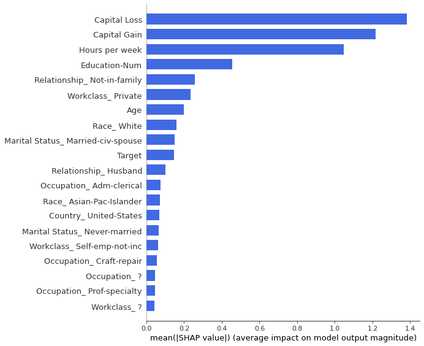


#### **Prototypical Examples**

Prototypes along with their (non-negative) importance weights. The algorithm minimizes the maximum mean discrepancy metric. To protect against these, you can also normalise by rows and follow through with the removal process. I recommend that this technique should also be followed.


```python
# Accuracy Test
from aix360.algorithms.protodash import ProtodashExplainer

explainer = ProtodashExplainer()
(W, S, setValues) = explainer.explain(df_gen_out[X].head(1).values,pd.concat((df_org_out[X],df_gen_out[X].head(1)),axis=0).values, m=1)
prt = pd.concat((df_org_out[X],df_gen_out[X].head(1)),axis=0).iloc[S,:]
print(df_gen_out[X].head(1))
print(prt)
```

       Age  Education-Num  ...  Country_ United-States  Country_Other
    0   24              8  ...                       0              0
    
    [1 rows x 52 columns]
        Age  Education-Num  ...  Country_ United-States  Country_Other
    0  24.0            8.0  ...                       0              0
    
    [1 rows x 52 columns]


```python
%%capture
# Larger Sample Prototypes
from aix360.algorithms.protodash import ProtodashExplainer

def frame_similar(df_org_out, df_gen_out,  X, index_check=0):
  explainer = ProtodashExplainer()
  (W, S, setValues) = explainer.explain(df_gen_out[X].iloc[index_check,:].to_frame().T.values,df_org_out[X].values, m=1)
  prt = df_org_out.iloc[S,:]
  prots = (prt[X].T*W).sum(axis=1)

  indas = df_gen_out[X].iloc[index_check,:].to_frame().mean(axis=1)
  inds = df_gen_out[X].iloc[index_check,:].to_frame().T
  #multiplication with a constant
  print("multiplication array: ")
  print(W)
  df = pd.DataFrame([inds[X].iloc[0],prt[X].iloc[0], prots[X].round(0)])
  df =df.T
  df.columns = ["Query Individual", "Top Prototype Example","Weighted Average Prototype"]; df

  return df
```

There is some memorisation here, where a multiple of a constant can get you pretty close.


```python
## Close but no exact match (in each case capital gain seems to be the difference)
df_sim = frame_similar(df_org_out, df_gen_out, df_gen_out.columns.to_list(),index_check=0); df_sim.head(10)
```

    multiplication array: 
    [1.10702579]


<div>
<style scoped>
    .dataframe tbody tr th:only-of-type {
        vertical-align: middle;
    }

    .dataframe tbody tr th {
        vertical-align: top;
    }

    .dataframe thead th {
        text-align: right;
    }
</style>
<table border="1" class="dataframe">
  <thead>
    <tr style="text-align: right;">
      <th></th>
      <th>Query Individual</th>
      <th>Top Prototype Example</th>
      <th>Weighted Average Prototype</th>
    </tr>
  </thead>
  <tbody>
    <tr>
      <th>Age</th>
      <td>81</td>
      <td>73</td>
      <td>81</td>
    </tr>
    <tr>
      <th>Education-Num</th>
      <td>10</td>
      <td>9</td>
      <td>10</td>
    </tr>
    <tr>
      <th>Capital Gain</th>
      <td>0</td>
      <td>0</td>
      <td>0</td>
    </tr>
    <tr>
      <th>Capital Loss</th>
      <td>0</td>
      <td>0</td>
      <td>0</td>
    </tr>
    <tr>
      <th>Hours per week</th>
      <td>44</td>
      <td>40</td>
      <td>44</td>
    </tr>
    <tr>
      <th>Workclass_ ?</th>
      <td>0</td>
      <td>0</td>
      <td>0</td>
    </tr>
    <tr>
      <th>Workclass_ Federal-gov</th>
      <td>0</td>
      <td>0</td>
      <td>0</td>
    </tr>
    <tr>
      <th>Workclass_ Local-gov</th>
      <td>0</td>
      <td>0</td>
      <td>0</td>
    </tr>
    <tr>
      <th>Workclass_ Never-worked</th>
      <td>0</td>
      <td>0</td>
      <td>0</td>
    </tr>
    <tr>
      <th>Workclass_ Private</th>
      <td>0</td>
      <td>0</td>
      <td>0</td>
    </tr>
  </tbody>
</table>
</div>


#### **Observation Scaling for Privacy**


```python
df_priv_gen.columns
```


    Index(['Age', 'Education-Num', 'Capital Gain', 'Capital Loss',
           'Hours per week', 'Workclass_ ?', 'Workclass_ Federal-gov',
           'Workclass_ Local-gov', 'Workclass_ Never-worked', 'Workclass_ Private',
           'Workclass_ Self-emp-inc', 'Workclass_ Self-emp-not-inc',
           'Workclass_ State-gov', 'Workclass_ Without-pay',
           'Marital Status_ Divorced', 'Marital Status_ Married-AF-spouse',
           'Marital Status_ Married-civ-spouse',
           'Marital Status_ Married-spouse-absent',
           'Marital Status_ Never-married', 'Marital Status_ Separated',
           'Marital Status_ Widowed', 'Occupation_ ?', 'Occupation_ Adm-clerical',
           'Occupation_ Craft-repair', 'Occupation_ Exec-managerial',
           'Occupation_ Farming-fishing', 'Occupation_ Handlers-cleaners',
           'Occupation_ Machine-op-inspct', 'Occupation_ Other-service',
           'Occupation_ Prof-specialty', 'Occupation_ Protective-serv',
           'Occupation_ Sales', 'Occupation_ Tech-support',
           'Occupation_ Transport-moving', 'Occupation_Other',
           'Relationship_ Husband', 'Relationship_ Not-in-family',
           'Relationship_ Other-relative', 'Relationship_ Own-child',
           'Relationship_ Unmarried', 'Relationship_ Wife',
           'Race_ Amer-Indian-Eskimo', 'Race_ Asian-Pac-Islander', 'Race_ Black',
           'Race_ Other', 'Race_ White', 'Sex_ Female', 'Sex_ Male', 'Country_ ?',
           'Country_ Mexico', 'Country_ United-States', 'Country_Other', 'Target'],
          dtype='object')


```python
df_org_out_mm.columns
```


    Index(['Age', 'Education-Num', 'Capital Gain', 'Capital Loss',
           'Hours per week', 'Workclass_ ?', 'Workclass_ Federal-gov',
           'Workclass_ Local-gov', 'Workclass_ Never-worked', 'Workclass_ Private',
           'Workclass_ Self-emp-inc', 'Workclass_ Self-emp-not-inc',
           'Workclass_ State-gov', 'Workclass_ Without-pay',
           'Marital Status_ Divorced', 'Marital Status_ Married-AF-spouse',
           'Marital Status_ Married-civ-spouse',
           'Marital Status_ Married-spouse-absent',
           'Marital Status_ Never-married', 'Marital Status_ Separated',
           'Marital Status_ Widowed', 'Occupation_ ?', 'Occupation_ Adm-clerical',
           'Occupation_ Craft-repair', 'Occupation_ Exec-managerial',
           'Occupation_ Farming-fishing', 'Occupation_ Handlers-cleaners',
           'Occupation_ Machine-op-inspct', 'Occupation_ Other-service',
           'Occupation_ Prof-specialty', 'Occupation_ Protective-serv',
           'Occupation_ Sales', 'Occupation_ Tech-support',
           'Occupation_ Transport-moving', 'Occupation_Other',
           'Relationship_ Husband', 'Relationship_ Not-in-family',
           'Relationship_ Other-relative', 'Relationship_ Own-child',
           'Relationship_ Unmarried', 'Relationship_ Wife',
           'Race_ Amer-Indian-Eskimo', 'Race_ Asian-Pac-Islander', 'Race_ Black',
           'Race_ Other', 'Race_ White', 'Sex_ Female', 'Sex_ Male', 'Country_ ?',
           'Country_ Mexico', 'Country_ United-States', 'Country_Other', 'Target'],
          dtype='object')


Now lets do the same with priv_gen


```python
## just use org, no need scale for that
df_priv_gen_df = pd.DataFrame(scaler_gen.inverse_transform(df_priv_gen.values), columns=df_priv_gen.columns)
```

*Removing those 5000 had no effect, we need to use observational scaling.*


```python
## Close but no exact match (in each case capital gain seems to be the difference)
del df_org_out["Fake"]
df_sim = frame_similar(df_org_out, df_priv_gen_df, X, index_check=0); df_sim.head(10)
```

    multiplication array: 
    [1.09561697]


<div>
<style scoped>
    .dataframe tbody tr th:only-of-type {
        vertical-align: middle;
    }

    .dataframe tbody tr th {
        vertical-align: top;
    }

    .dataframe thead th {
        text-align: right;
    }
</style>
<table border="1" class="dataframe">
  <thead>
    <tr style="text-align: right;">
      <th></th>
      <th>Query Individual</th>
      <th>Top Prototype Example</th>
      <th>Weighted Average Prototype</th>
    </tr>
  </thead>
  <tbody>
    <tr>
      <th>Age</th>
      <td>81.0</td>
      <td>74.0</td>
      <td>81.0</td>
    </tr>
    <tr>
      <th>Education-Num</th>
      <td>10.0</td>
      <td>9.0</td>
      <td>10.0</td>
    </tr>
    <tr>
      <th>Capital Gain</th>
      <td>0.0</td>
      <td>0.0</td>
      <td>0.0</td>
    </tr>
    <tr>
      <th>Capital Loss</th>
      <td>0.0</td>
      <td>0.0</td>
      <td>0.0</td>
    </tr>
    <tr>
      <th>Hours per week</th>
      <td>44.0</td>
      <td>40.0</td>
      <td>44.0</td>
    </tr>
    <tr>
      <th>Workclass_ ?</th>
      <td>0.0</td>
      <td>0.0</td>
      <td>0.0</td>
    </tr>
    <tr>
      <th>Workclass_ Federal-gov</th>
      <td>0.0</td>
      <td>0.0</td>
      <td>0.0</td>
    </tr>
    <tr>
      <th>Workclass_ Local-gov</th>
      <td>0.0</td>
      <td>0.0</td>
      <td>0.0</td>
    </tr>
    <tr>
      <th>Workclass_ Never-worked</th>
      <td>0.0</td>
      <td>0.0</td>
      <td>0.0</td>
    </tr>
    <tr>
      <th>Workclass_ Private</th>
      <td>0.0</td>
      <td>0.0</td>
      <td>0.0</td>
    </tr>
  </tbody>
</table>
</div>


There is a need to perform instance scaling to maintain privacy. 


```python
# %reset_selective -f _347 
# %reset_selective -f _356 
# %reset_selective -f distances 
```


```python
scaler_gen_inst = MinMaxScaler()

df_gen_out_mm_inst = pd.DataFrame(scaler_gen_inst.fit_transform(df_priv_gen_df.T).T, columns=df_priv_gen_df.columns)
```


```python
scaler_org_inst = MinMaxScaler()

df_org_out_mm_inst = pd.DataFrame(scaler_org_inst.fit_transform(df_org_out_mm.T).T, columns=df_org_out_mm.columns)
```


```python
mean, std, distances_ins = instance_distance(df_org_out_mm_inst, df_gen_out_mm_inst, frac=1)
print("Nearest neighbour mean: {:.4f} and standard deviation {:.4f}".format(mean, std))
```

    Nearest neighbour mean: 2.9626 and standard deviation 0.7538


```python
rem = np.unique(np.where(distances_ins<2.7)[1]).copy(); print(rem.shape)
```

    (21712,)


```python
distances_ins.shape
```


    (32561, 27310)


```python
df_priv_gen_inst = pd.DataFrame(np.delete(df_gen_out_mm_inst.values,rem , axis=0), columns=df_gen_out_mm_inst.columns)
```


```python
df_priv_gen_inst.T.values.shape
```


    (53, 5598)


```python
df_priv_gen_df.T.shape
```


    (53, 27310)


```python
scaler_gen_inst.inverse_transform(df_priv_gen_inst.T.values)
```


```python
## invere transform and recuperate values later
df_priv_gen_inst_df = pd.DataFrame(scaler_gen_inst.inverse_transform(df_gen_out_mm_inst.T.values).T, columns=df_priv_gen_inst.columns)
```


```python
## seems like transform worked
df_priv_gen_inst_mm_df = df_priv_gen_inst_df.drop(rem, axis=0)
```


```python
## at least the perfect matches have dissapeared
df_sim_inst = frame_similar(df_org_out, df_priv_gen_inst_mm_df, X, index_check=6); df_sim_inst.head(10)
```

    multiplication array: 
    [0.59616298]


<div>
<style scoped>
    .dataframe tbody tr th:only-of-type {
        vertical-align: middle;
    }

    .dataframe tbody tr th {
        vertical-align: top;
    }

    .dataframe thead th {
        text-align: right;
    }
</style>
<table border="1" class="dataframe">
  <thead>
    <tr style="text-align: right;">
      <th></th>
      <th>Query Individual</th>
      <th>Top Prototype Example</th>
      <th>Weighted Average Prototype</th>
    </tr>
  </thead>
  <tbody>
    <tr>
      <th>Age</th>
      <td>41.0</td>
      <td>73.0</td>
      <td>44.0</td>
    </tr>
    <tr>
      <th>Education-Num</th>
      <td>3.0</td>
      <td>11.0</td>
      <td>7.0</td>
    </tr>
    <tr>
      <th>Capital Gain</th>
      <td>14978.0</td>
      <td>25124.0</td>
      <td>14978.0</td>
    </tr>
    <tr>
      <th>Capital Loss</th>
      <td>0.0</td>
      <td>0.0</td>
      <td>0.0</td>
    </tr>
    <tr>
      <th>Hours per week</th>
      <td>39.0</td>
      <td>60.0</td>
      <td>36.0</td>
    </tr>
    <tr>
      <th>Workclass_ ?</th>
      <td>0.0</td>
      <td>0.0</td>
      <td>0.0</td>
    </tr>
    <tr>
      <th>Workclass_ Federal-gov</th>
      <td>0.0</td>
      <td>0.0</td>
      <td>0.0</td>
    </tr>
    <tr>
      <th>Workclass_ Local-gov</th>
      <td>0.0</td>
      <td>0.0</td>
      <td>0.0</td>
    </tr>
    <tr>
      <th>Workclass_ Never-worked</th>
      <td>0.0</td>
      <td>0.0</td>
      <td>0.0</td>
    </tr>
    <tr>
      <th>Workclass_ Private</th>
      <td>0.0</td>
      <td>1.0</td>
      <td>1.0</td>
    </tr>
  </tbody>
</table>
</div>


Now no privacy concerns, plus an increase in performance. 


```python
roc_auc = model(df_priv_gen_inst_mm_df, target="Target")
roc_auc
```


    0.8680122732258666


```python
roc_auc = model(df_org_out, target="Target")
roc_auc
```


    0.9296990538670287


```python
# df_org_out["Fake"] = 0
# df_priv_gen_inst_mm_df["Fake"] = 1
# df_final = pd.concat((df_org_out,df_priv_gen_inst_mm_df), axis=0).reset_index(drop=True)
# roc_auc = model(df_final, target="Fake")
# roc_auc
```

Small Drop (potentially better on generalisable data, if some data was not included in generation step, still to be seen)


```python
_,_,_, gen_train_auc_cov = model_full(df_gen_out, df_org_out); gen_train_auc_cov
```


    0.8792742302617268


```python
_,_,_, gen_train_auc_cov = model_full(df_priv_gen_inst_mm_df, df_org_out); gen_train_auc_cov
```


    0.8755301514444239


